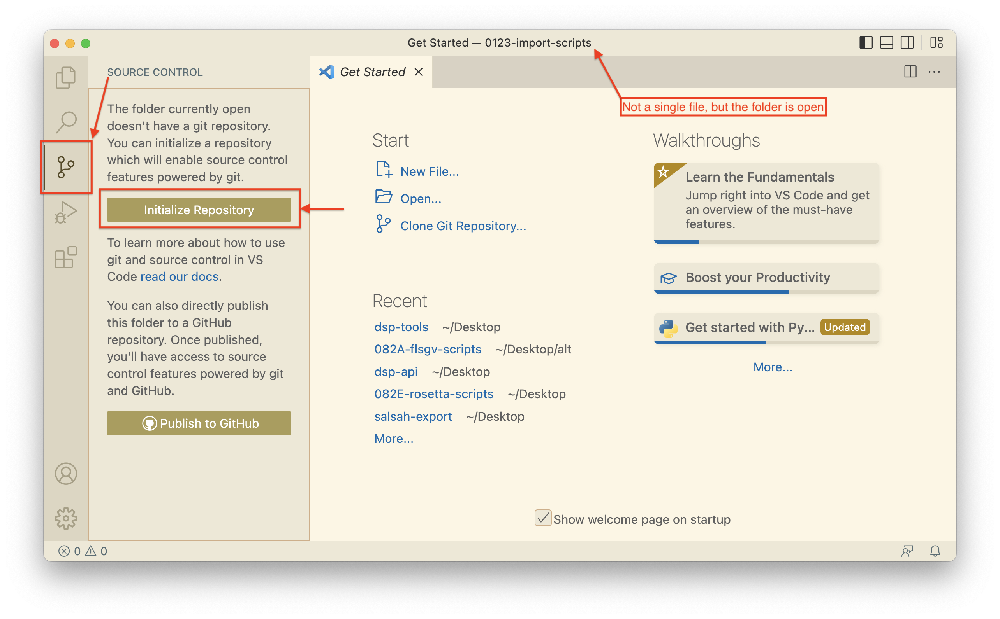

# Welcome to 0123-import-scripts!

This is a template repository that can be used for the archiving process of a big dataset at the end of a research 
project's lifetime. After having downloaded and unpacked this repository, you can open it in Visual Studio Code, change
to the "Source Control" tab, and click on "Inizialize Repository":

Stage all changes, write "init" as commit message, and commit all changes:

You now have the option to "Publish Branch". This is to synchronize your local work with a GitHub repository on 
[https://github.com/dasch-swiss/](https://github.com/dasch-swiss/). For this purpose, replace `0123` by your project's 
shortcode, and `import` by your project's shortname. This is especially recommended for big projects where you spend 
weeks/months on, when you might want to have a backup. 

Open `import-script.py`. You can now choose a Python interpreter. 
