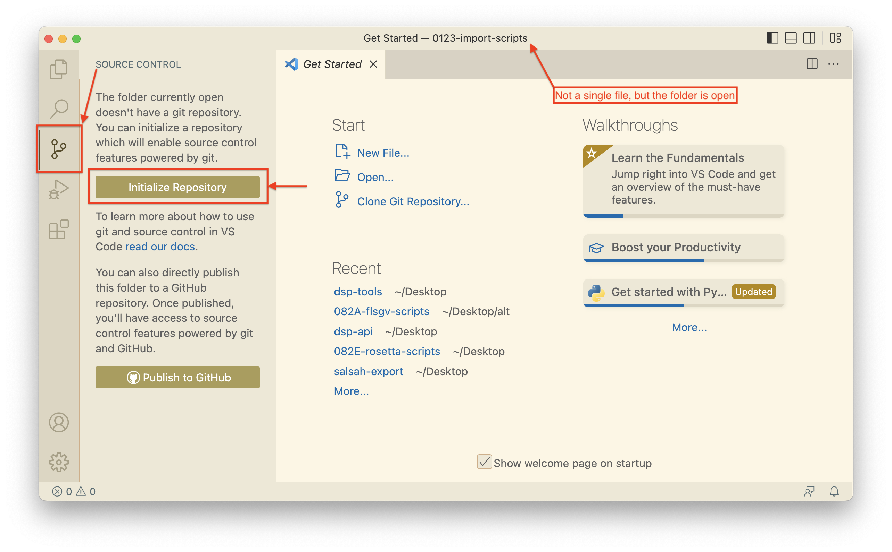
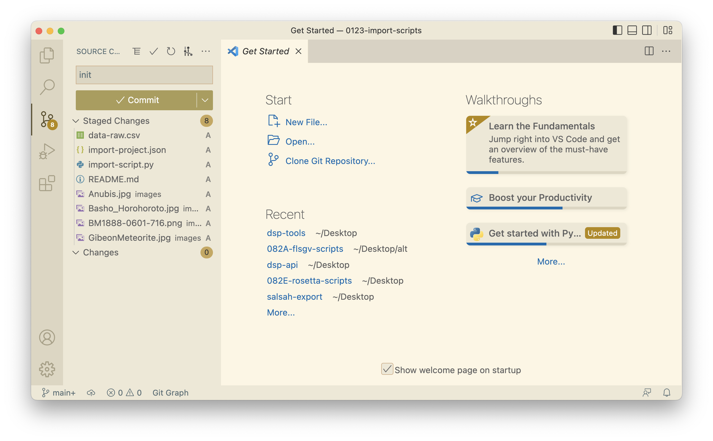
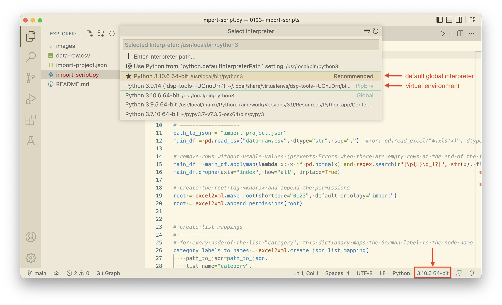
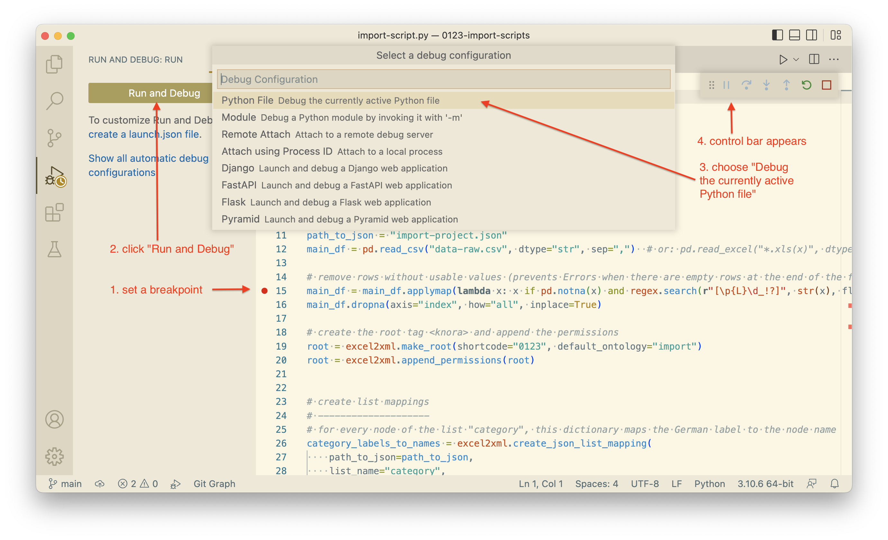
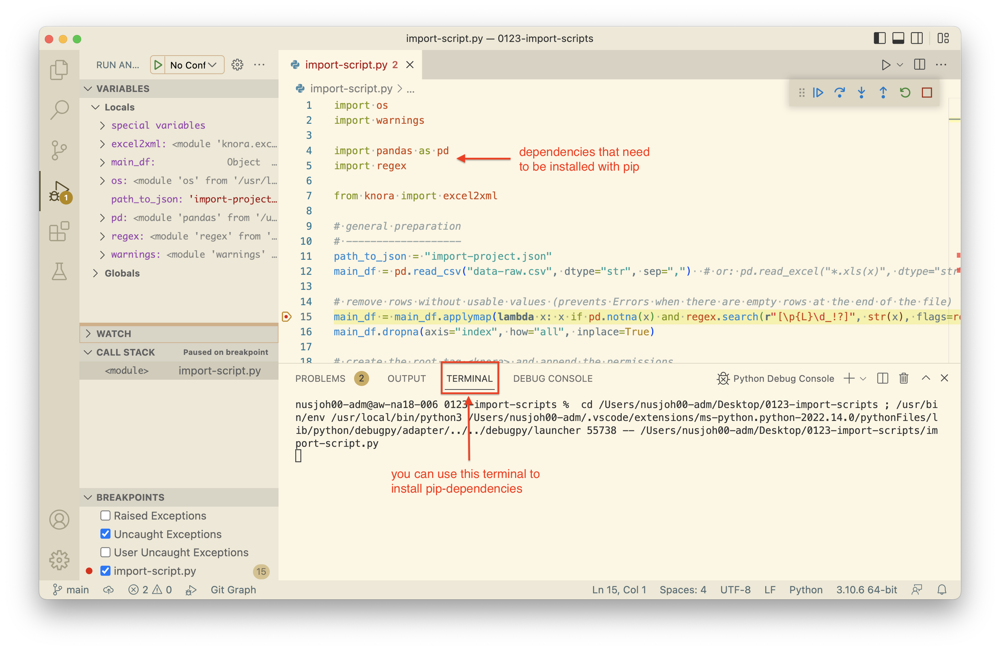
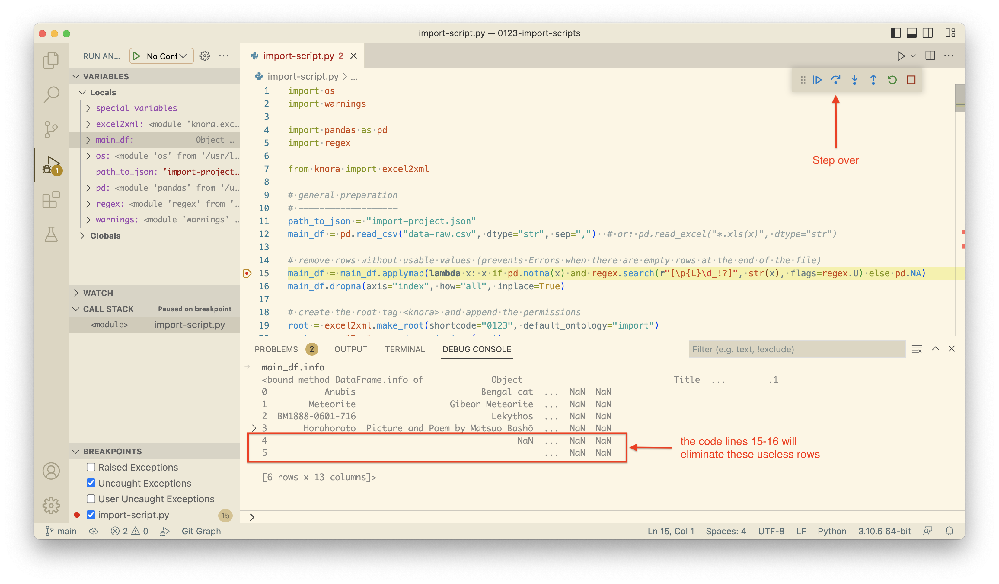
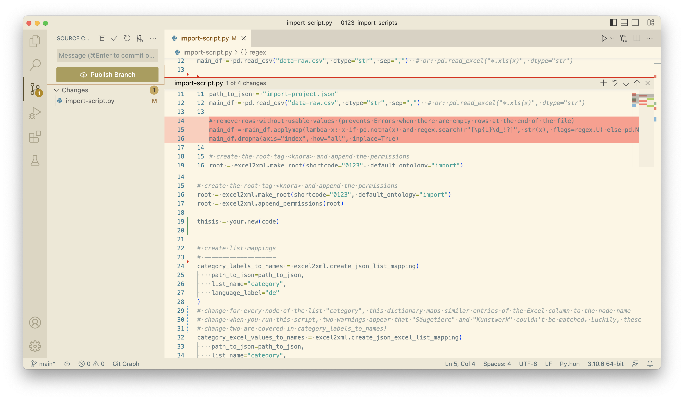

# Welcome to import_scripts!

This is a template repository that can be used for the archiving process of a big dataset at the end of a research 
project's lifetime. Download and unpack this repository from the 
[excel2xml documentation page](https://docs.dasch.swiss/latest/DSP-TOOLS/dsp-tools-excel2xml/).  

In this README, you will learn how to write a Python script for preparing data for an import into DSP.  

Featuring: 

- first steps with Visual Studio Code
- the module `excel2xml` of dsp-tools
- the benefits of Version Control with Git
- the benefits of the Debugging Mode
- extras: OpenRefine, Git GUIs, regexr


## Initialize Git
Open this repository in Visual Studio Code, change to the "Source Control" tab, and click on "Inizialize Repository":



Stage all changes, write "init" as commit message, and commit all changes:



You now have the option "Publish Branch". This is to synchronize your local work with a GitHub repository on 
[https://github.com/dasch-swiss/](https://github.com/dasch-swiss/). For this purpose, name the repository according to 
the scheme `[project_shortcode]-[project_shortname]-scripts`. This is especially recommended for big projects where you  
spend weeks/months on, when you might want to have a backup, or when you want to invite colleagues for collaboration or 
a code review.


## Choose a Python interpreter
Open `import_script.py`. You can now choose a Python interpreter by clicking on the Version number on the bottom right.
You can either work with the global (system-wide) Python, or you can create a 
[virtual environment](https://python.land/virtual-environments) for your project.  
DaSCH employees who have installed Python via Homebrew can choose the one located in `/usr/local/Cellar`. Probably you 
already have a symlink (`/usr/local/bin/python3` or `/usr/bin/python3`) that redirects to `/usr/local/Cellar`.  
The only thing that you shouldn't do is selecting a virtual environment of another project.




## The benefits of the debugging mode
To start the debugging process, switch to the "Run and Debug" tab.

1. set a break point
2. click "Run and Debug"
3. choose "Debug the currently active Python file"
4. The control bar appears, and debugging starts.



Code execution will interrupt at your break point, that means, before the line of the break point is executed. Use 
this opportunity to inspect what has been done until now in the "Variables" area on the left, where the current state of
the program is shown.  

If one of the dependencies is not installed, code execution will not reach your break point, but stop at the missing
dependency. In this case, install the missing dependency with `pip install package` in the Terminal of Visual Studio 
Code.



If you want to experiment with different scenarios how to proceed, go to the "Debug Console" where you can execute 
code. For example, let's inspect the Pandas Dataframe by typing `main_df.info`.  
You see that there are some empty rows at the end which don't contain useful data. The next two lines of code will 
eliminate them. Click on "Step Over" two times, or set a new break point two lines further down and click on "Continue".
Now, type again `main_df.info` in the Debug Console. You will see that the empty rows are gone.  




You see that the debugging mode is a useful tool to understand code and to inspect it for correctness. 

| **Tip**                                                                                                   |
|-----------------------------------------------------------------------------------------------------------|
| **Make regular use of the debugging mode to check if your code really does what you think it should do!** | 


## The benefits of version control
One of the big benefits of version control is the diff viewer. Visual Studio Code highlights the changes you have 
introduced since your last commit. 

- Deletions are shown as red triangle.
- Additions are shown as green bars.
- Changed lines are shown as striped bars.

Click on these visual elements to see a small popup that shows you the difference. In the popup, you can stage the 
change, revert it, or jump to the next/previous change.



Once you have a bunch of code changes that can be meaningfully grouped together, you should make a commit (and perhaps
push it to a GitHub repo).


| **Tips**                                                                |
|-------------------------------------------------------------------------|
| **Test your code (e.g. with the debugging mode) before committing it.** | 
| **Make small commits that contain only one new feature.**               | 


## Some extras
### Data cleaning with OpenRefine
[**OpenRefine**](https://openrefine.org/) is a tool for working with messy data. Once downloaded and installed, it runs 
as a local server, accessed by your browser. So, all data remains on your own machine. If you work on a Mac and have 
Homebrew installed, you can simply type: 
```
brew install openrefine
```

The potentials for the everyday work of the Research Data Unit at DaSCH are twofold:
1. Data cleaning (recommended): For this purpose, you can think of OpenRefine as a much better version of Excel. You 
   can perform operations which would be very tiresome in Excel.
2. Conversion to our dps-customised xml format for bulk upload (not recommended)

Read more in [this report](https://docs.google.com/document/d/1Y_hZV8UV-Irw-7PLdhm0BGKnGfXJs8JO).


### Git GUIs
Git can be complicated, so you will appreciate to work with one of these GUIs:

 - [**GitHub Desktop**](https://desktop.github.com/)
 - [**SourceTree**](https://www.sourcetreeapp.com/)

### Learn, build and test RegEx
[https://regexr.com](https://regexr.com)
