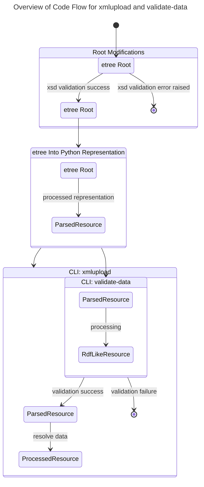
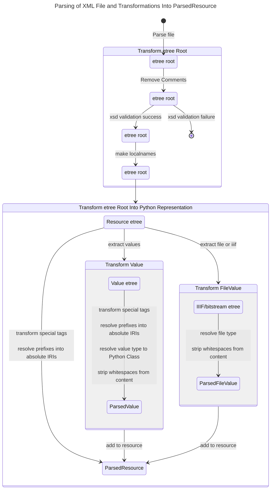
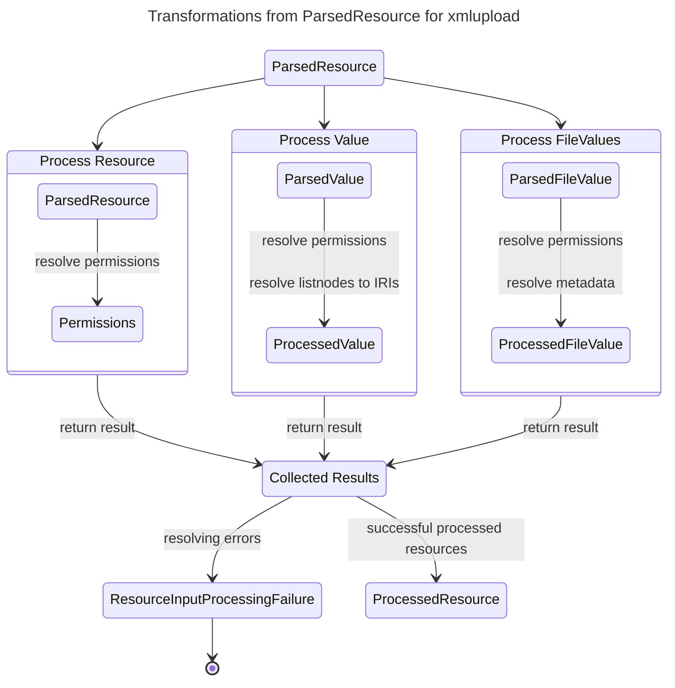

# Architectural Design

## Parsing XML Files and Transformations for `xmlupload` and `validate-data`

### Overview

### Parsing XML Files

<!-- markdownlint-disable MD013 -->

<!-- markdownlint-enable MD013 -->

### From `ParsedResource` to `ProcessedResource` in `xmlupload`

