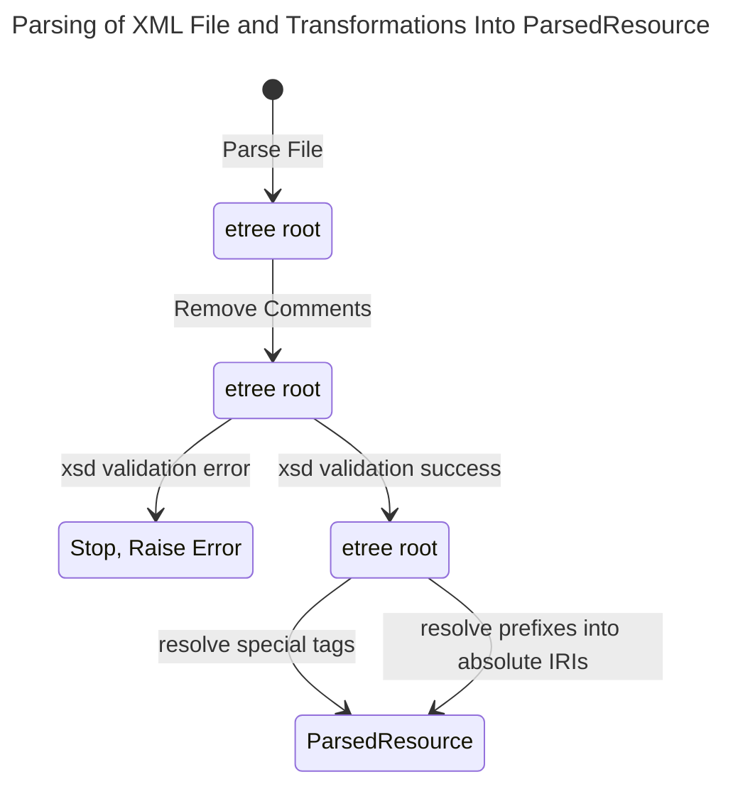

# Architectural Design

## Parsing XML Files and Transformations for `xmlupload` and `validate-data`

### Parsing XML Files

```mermaid
---
title: Parsing of XML File and Transformations Into ParsedResource
---
stateDiagram-v2
    state "etree root" as r1
    state "etree root" as r2
    state "Stop, Raise Error" as raiseerr
    state "etree root" as r3
    state "ParsedResource" as parsedres
    [*]-->r1: Parse File
    r1-->r2: Remove Comments
    r2-->r3: xsd validation success
    r2-->raiseerr: xsd validation error
    r3-->parsedres: resolve special tags
    r3-->parsedres: resolve prefixes into absolute IRIs
```

