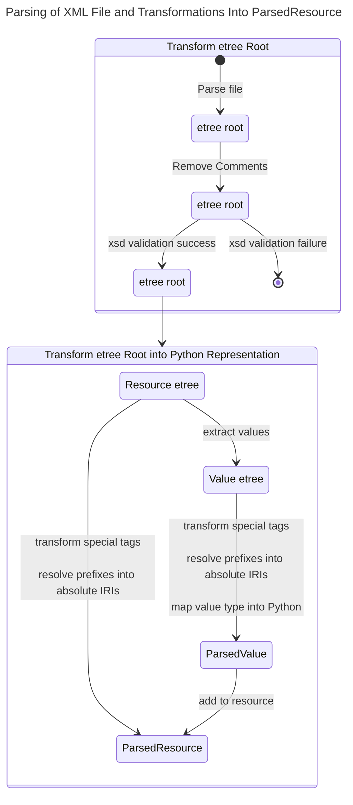
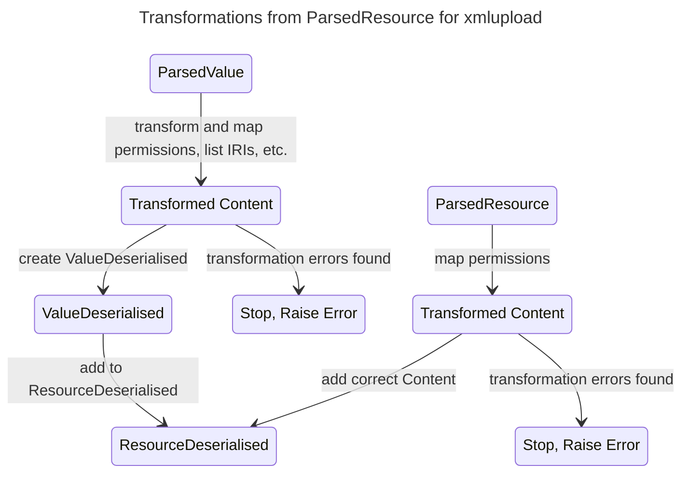

# Architectural Design

## Parsing XML Files and Transformations for `xmlupload` and `validate-data`

### Parsing XML Files

```mermaid
---
title: Parsing of XML File and Transformations Into ParsedResource
---
stateDiagram-v2

state "Transform etree Root" as eroot
state "Transform etree Root into Python Representation" as transpy


r3-->transpy

    state eroot {
        state "etree root" as r1
        state "etree root" as r2
        state "etree root" as r3
        [*]-->r1: Parse file
        r1-->r2: Remove Comments
        r2-->[*]: xsd validation failure
        r2-->r3: xsd validation success
    }

    state transpy {
        state "Resource etree" as resetree
        state "ParsedResource" as respars
        state "Value etree" as valtree
        state "ParsedValue" as valpars
        resetree-->valtree: extract values
        valtree-->valpars: transform special tags</br></br>resolve prefixes into absolute IRIs</br></br>map value type into Python
        resetree-->respars: transform special tags</br></br>resolve prefixes into absolute IRIs
        valpars-->respars: add to resource
    }
```

### From `ParsedResource` to `ResourceDeserialised` in `xmlupload`

```mermaid
---
title: Transformations from ParsedResource for xmlupload
---
stateDiagram-v2
    state "ParsedValue" as valp
    state "Transformed Content" as transformcontval
    state "ValueDeserialised" as valdes
    state "Stop, Raise Error" as raiseerrval
    state "ParsedResource" as resp
    state "Transformed Content" as transformcontres
    state "Stop, Raise Error" as raiseerrres
    state "ResourceDeserialised" as resdes
    valp-->transformcontval: transform and map permissions, list IRIs, etc.
    resp-->transformcontres: map permissions
    transformcontres-->raiseerrres: transformation errors found
    transformcontval-->raiseerrval: transformation errors found
    transformcontval-->valdes: create ValueDeserialised
    valdes-->resdes: add to ResourceDeserialised
    transformcontres-->resdes: add correct Content
```

