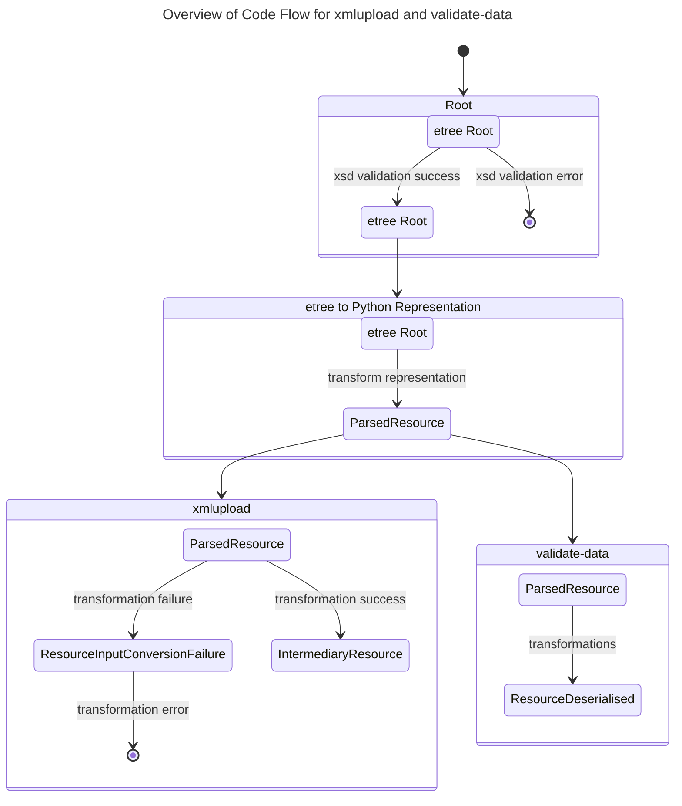
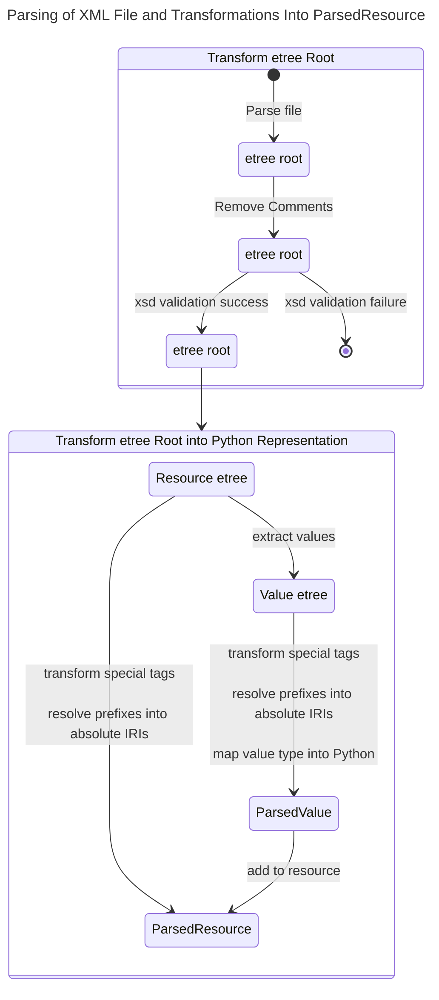
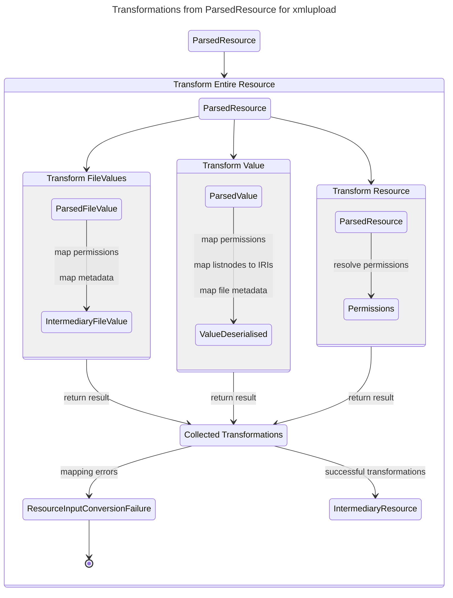

# Architectural Design

## Parsing XML Files and Transformations for `xmlupload` and `validate-data`

### Overview

### Parsing XML Files

### From `ParsedResource` to `IntermediaryResource` in `xmlupload`

