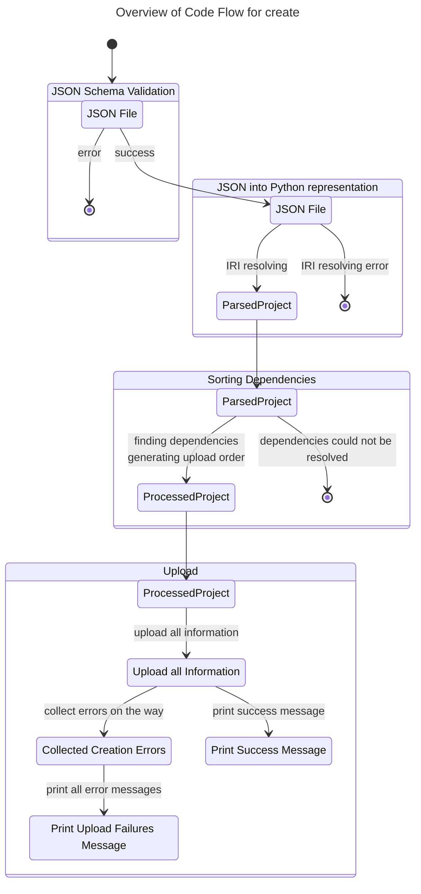
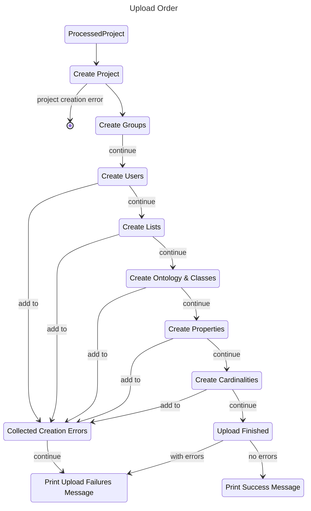
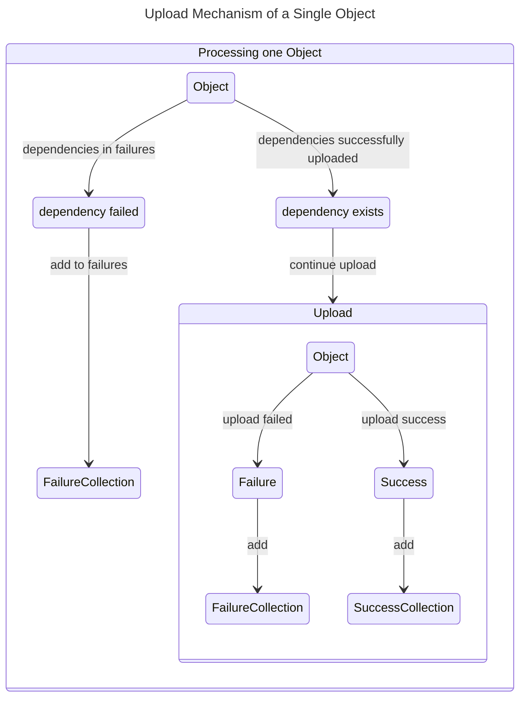
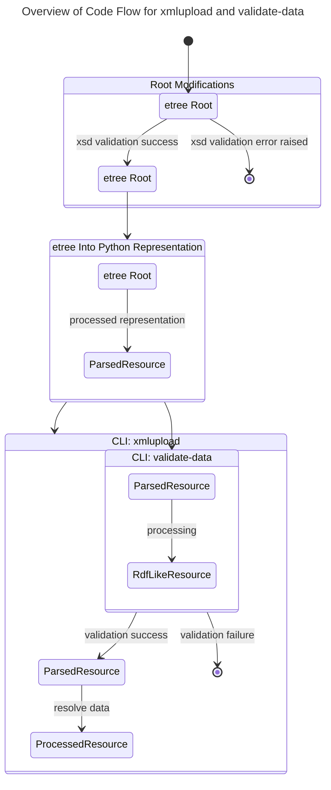
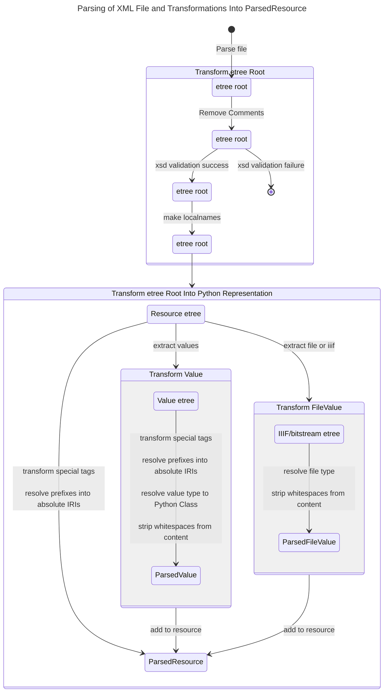
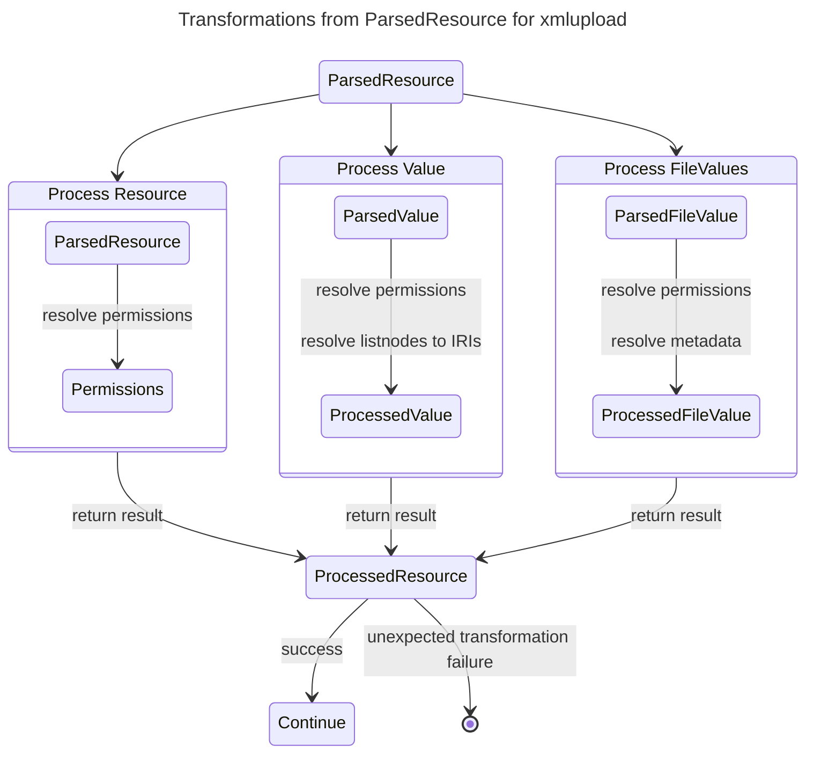
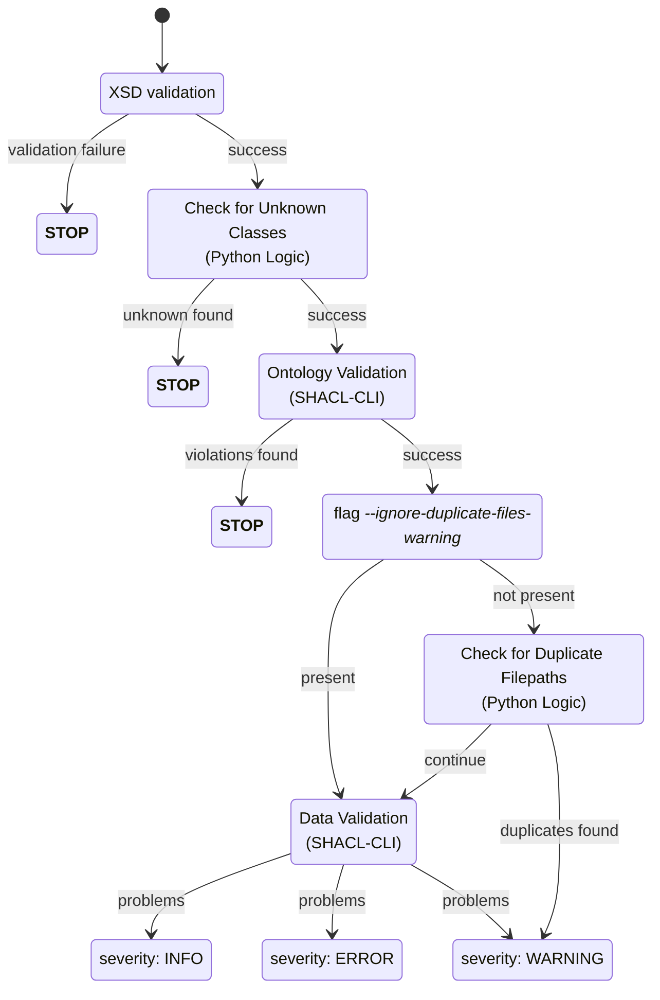

# Architectural Design

## Code Flow For the `create` Command

The JSON schema validation takes over a lot of validation,
therefore there are only minimal errors we may encounter a successful validation,
primarily relating to inexistent references to other objects that can be caused by typos.

If the user provided incorrect input we do not try and extrapolate a fix but communicate the problem precisely
so that the user may easily fix it themselves.

We aim for a fast-fail approach before we begin with the upload.
If we have upload failures during the upload we will not stopp the entire process but continue to create as much of
the project and ontologies as possible.
The upload failures should be communicated at the end of an upload in a precise and user-friendly message.

### Upload Order to API

Within one project we have several dependencies that dictate the upload order.

While the Groups, Users, Lists and Cardinalities to do not have to be sorted "within",
the order of Classes and Properties are relevant as they may have dependencies on others.

The following table contains the possible dependencies, the first column is the object type we are looking at,
the other columns indicate how they may depend on other object types.

| Object Type     | List            | Class                             | Propery                 | Group     | User |
|-----------------|-----------------|-----------------------------------|-------------------------|-----------|------|
| **List**        |                 |                                   |                         |           |      |
| **Class**       |                 | super-classes                     |                         |           |      |
| **Property**    | list properties | object / subject class constraint | super-properties        |           |      |
| **Cardinality** |                 | cardinality on class              | cardinality on property |           |      |
| **Group**       |                 |                                   |                         |           |      |
| **User**        |                 |                                   |                         | if custom |      |

Note, that one project may have more than one ontology,
in that case it is permissible to reference classes and properties from the other ontologies.
Therefore, we need to handle the classes of all ontologies first, before we may move on to the properties.

Unless the upload stopped which is indicated by a circle,
a failure in a previous step does not prevent the upload of the next object categories.
The following section explains how we deal with dependencies that were not created.

### Dependency Checks During an Upload

Properties, Classes and Cardinalities may depend on the existence of other Classes, Properties and Lists.
If these dependencies were not successfully created, we do not need to an upload and generate additional errors.

See the table above for the dependencies one object type may have, and consequently which checks are required.

## Parsing XML Files and Transformations for `xmlupload` and `validate-data`

### Overview

### Parsing XML Files

<!-- markdownlint-disable MD013 -->

<!-- markdownlint-enable MD013 -->

### From `ParsedResource` to `ProcessedResource` in `xmlupload`

## `validate-data` Validation Logic

### Validation Process

### Determine Validation Success

The validation success, i.e. if an `xmlupload` would be possible and is allowed to continue, is dependent on the server.

Some validation problems are allowed on test environments (including localhost),
while the "prod-like" servers are stricter.
Prod like servers include prod, ls-prod, stage, and rdu-stage.

|         | TEST ENVIRONMENTS | PROD-LIKE ENVIRONMENTS |
|---------|-------------------|------------------------|
| INFO    | success           | success                |
| WARNING | success           | failure                |
| ERROR   | failure           | failure                |
