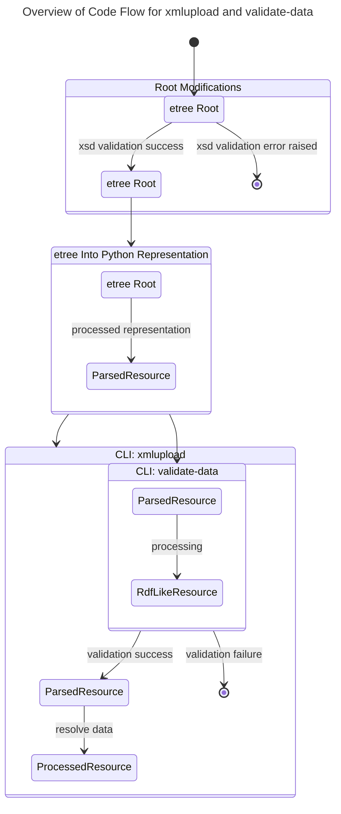
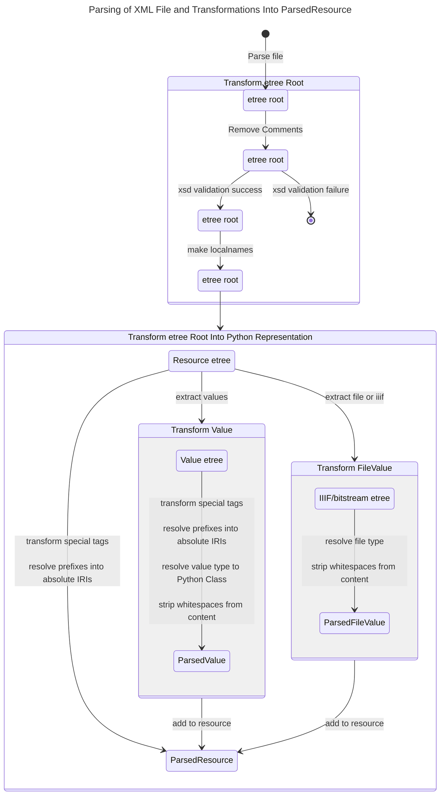
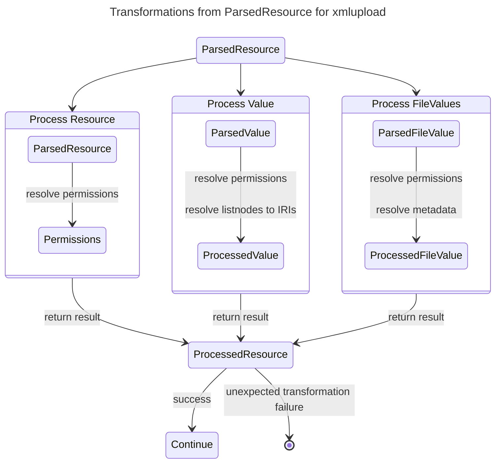
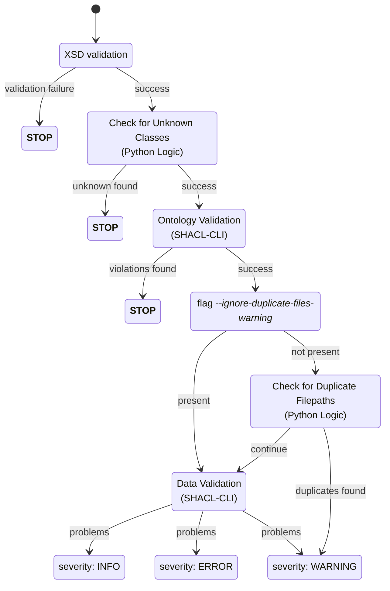

# Architectural Design

## Parsing XML Files and Transformations for `xmlupload` and `validate-data`

### Overview

### Parsing XML Files

<!-- markdownlint-disable MD013 -->

<!-- markdownlint-enable MD013 -->

### From `ParsedResource` to `ProcessedResource` in `xmlupload`

## `validate-data` Validation Logic

### Validation Process

### Determine Validation Success

The validation success, i.e. if an `xmlupload` would be possible and is allowed to continue, is dependent on the server.

Some validation problems are allowed on test environments (including localhost), 
while the "prod-like" servers are stricter.
Prod like servers include prod, ls-prod, stage, and rdu-stage.

|         | TEST ENVIRONMENTS | PROD-LIKE ENVIRONMENTS |
|---------|-------------------|------------------------|
| INFO    | success           | success                |
| WARNING | success           | failure                |
| ERROR   | failure           | failure                |
