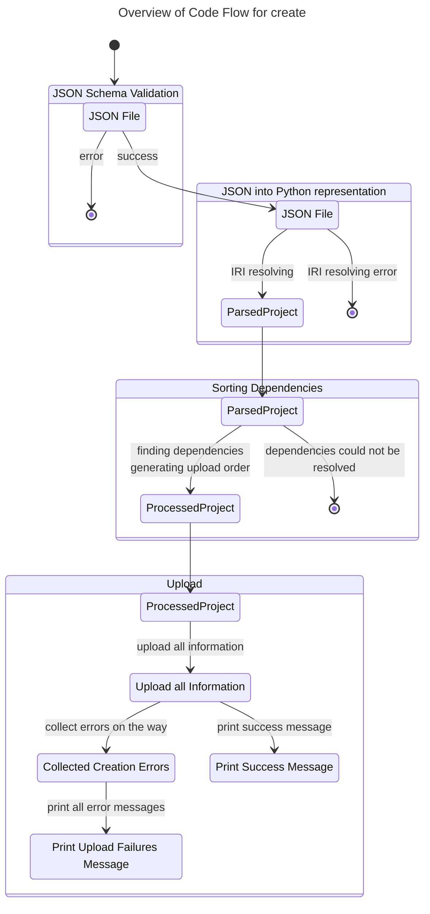
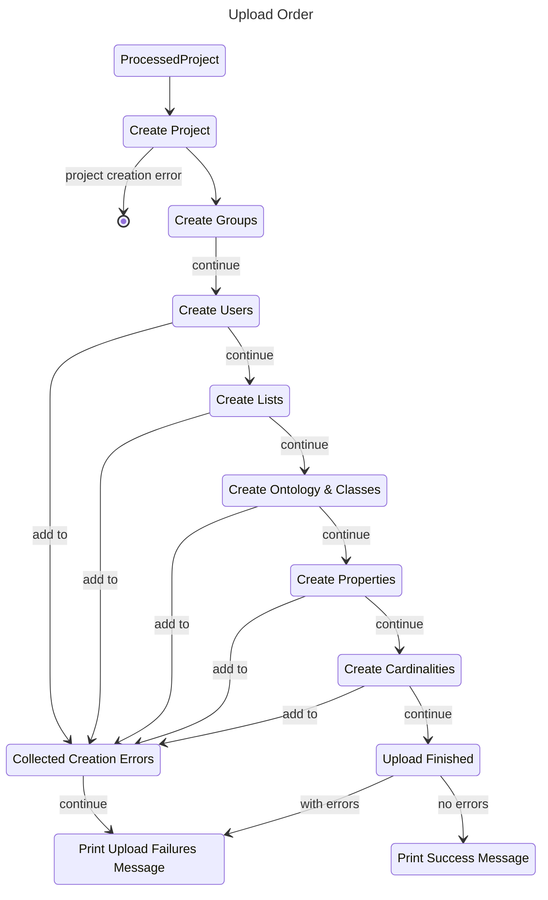
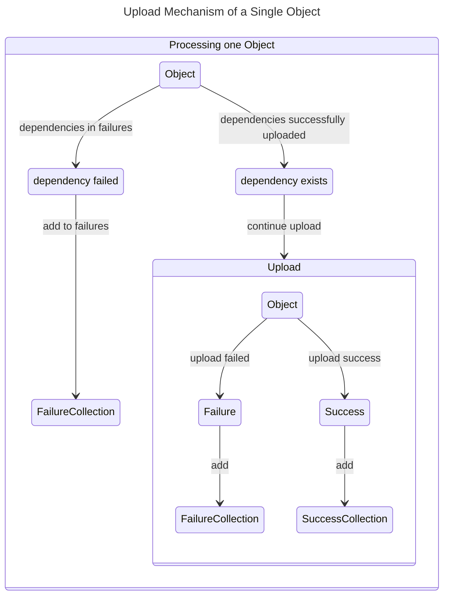

# `create` Command

The JSON schema validation takes over a lot of validation,
therefore there are only minimal errors we may encounter after a successful validation,
primarily relating to inexistent references to other objects that can be caused by typos.

If the user provided incorrect input, we do not try and extrapolate a fix, but communicate the problem precisely
so that the user may easily fix it themselves.

We aim for a fast-fail approach before we begin with the upload.
If we have upload failures during the upload, we will not stop the entire process, but continue to create as much of
the project and ontologies as possible.
The upload failures should be communicated at the end of an upload in a precise and user-friendly message.

## Upload Order to API

Within one project we have several dependencies that dictate the upload order.

While the Groups, Users, Lists and Cardinalities do not have to be sorted "within",
the order of Classes and Properties are relevant as they may have dependencies on others.

The following table contains the possible dependencies. The first column is the object type we are looking at,
the other columns indicate how they may depend on other object types.

| Object Type     | List            | Class                             | Propery                 | Group     | User |
|-----------------|-----------------|-----------------------------------|-------------------------|-----------|------|
| **List**        |                 |                                   |                         |           |      |
| **Class**       |                 | super-classes                     |                         |           |      |
| **Property**    | list properties | object / subject class constraint | super-properties        |           |      |
| **Cardinality** |                 | cardinality on class              | cardinality on property |           |      |
| **Group**       |                 |                                   |                         |           |      |
| **User**        |                 |                                   |                         | if custom |      |

Note, that one project may have more than one ontology,
in that case it is permissible to reference classes and properties from the other ontologies.
Therefore, we need to handle the classes of all ontologies first, before we may move on to the properties.

Unless the upload stopped (which is indicated by a circle),
a failure in a previous step does not prevent the upload of the next object categories.
The following section explains how we deal with dependencies that were not created.

## Dependency Checks During an Upload

Properties, Classes and Cardinalities may depend on the existence of other Classes, Properties and Lists.
If the dependencies of an object were not successfully created, we should not upload the object and generate additional
errors.

See the table above for the dependencies one object type may have, and consequently which checks are required.

