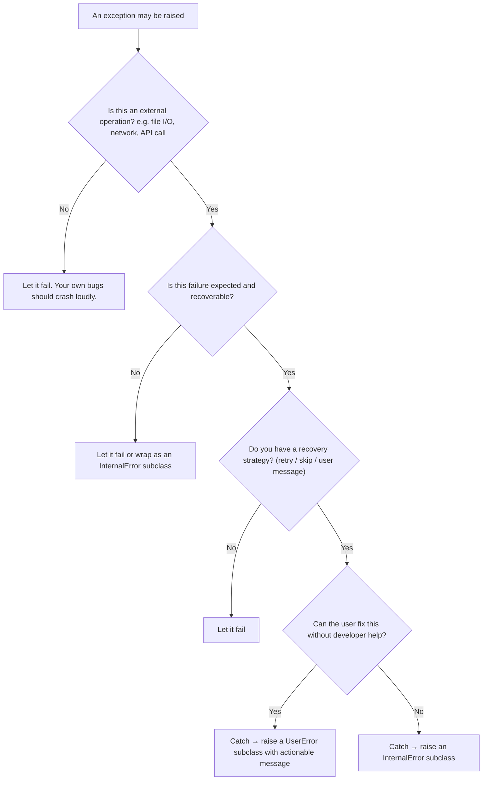

# Error Handling Guideline

This guideline defines when and how to raise, catch, and report exceptions in DSP-TOOLS.
It covers the exception hierarchy, the two command groups with different error handling needs,
and concrete patterns for consistent, debuggable error handling.

## Command Groups

Commands fall into two groups with different error handling requirements.
In both groups, unhandled bugs escalate to the top-level handler in `entry_point.py`.

### Group A — Fail-fast acceptable

These commands are run in controlled environments (local stacks, staging) before production use.
Developer assistance is acceptable when something goes wrong.
Errors may escalate with a traceback.

Commands: `create`, `get`, `xmlupload`, `upload-files`, `ingest-files`, `ingest-xmlupload`, `resume-xmlupload`

### Group B — Must be fixable by the user

These commands run locally against user-owned files.
Users must be able to resolve all problems without contacting developers.
All problems must be reported in an aggregated, user-friendly way.

Commands: `excel2json`, `excel2lists`, `excel2resources`, `excel2properties`,
`old-excel2json`, `old-excel2lists`, `id2iri`, `update-legal`, `validate-data`, `start-stack`, `stop-stack`

**`xmllib`** is also in Group B, but it is a **library**, not a CLI command.
Its errors surface in user scripts rather than in a CLI entry point.
The aggregated reporting requirement applies to `xmllib`'s validation helpers,
which collect all problems before raising a single `UserError` at the end of a call.

**`start-stack` / `stop-stack`** can also fail for reasons outside the user's control
(Docker daemon not running, port conflicts, system resource exhaustion).
These failures present as `InternalError`-grade messages that instruct the user to contact the development team.

### Aggregated error reporting (Group B)

Group B commands must not raise on the first problem — they must collect all problems
and report them together so the user can fix everything in one pass.

Pattern:

1. Represent each problem as a frozen dataclass with an `execute_error_protocol() -> str` method
   that returns a formatted, human-readable description.
2. Collect all problem instances into a list during processing (do not raise immediately).
3. After processing, if the list is non-empty, aggregate the messages into a single `UserError`
   subclass and raise it once.

```python
@dataclass(frozen=True)
class SheetProblem:
    sheet_name: str
    row: int
    message: str

    def execute_error_protocol(self) -> str:
        return f"Sheet '{self.sheet_name}', row {self.row}: {self.message}"


def process_sheet(sheet: Sheet) -> list[SheetProblem]:
    problems: list[SheetProblem] = []
    for row in sheet.rows:
        if not row.is_valid():
            problems.append(SheetProblem(sheet.name, row.index, "Invalid value"))
    return problems


def run(sheets: list[Sheet]) -> None:
    problems = [p for sheet in sheets for p in process_sheet(sheet)]
    if problems:
        msg = "\n".join(p.execute_error_protocol() for p in problems)
        raise InvalidInputError(msg)
```

## Exception Hierarchy

The base classes are in `src/dsp_tools/error/exceptions.py`.
Some subclasses that are used by several commands also live there.
Each command module has its own `exceptions.py` with command-specific subclasses.

```text
BaseError                               # Root. Dataclass with message: str attribute.
├── UserError                           # User can fix this themselves.
│   ├── UserFilepathNotFoundError       # Generic: file does not exist.
│   ├── UserFilepathMustNotExistError   # Generic: file must not already exist.
│   ├── UserDirectoryNotFoundError      # Generic: directory does not exist.
│   └── BadCredentialsError             # DSP-API rejected credentials.
└── InternalError                       # Requires developer assistance. Prints contact info + log file path.
    ├── UnreachableCodeError            # Code path that must never execute.
    ├── PermanentConnectionError        # All reconnection attempts failed.
    └── PermanentTimeOutError           # DSP-API timed out.
```

**Choosing the right class:**

- `UserError`: the user made a mistake (wrong file, bad format, invalid input).
  The message must tell them how to fix it.
- `InternalError`: the user cannot fix this. The message instructs them to contact the development team.
- Do **not** raise `BaseError`, `UserError`, or `InternalError` directly —
  always use the most specific subclass available,
  or create a new one if no appropriate one exists yet.
- `UserError` and `InternalError` are the **only** allowed direct subclasses of `BaseError`.
  All new exception classes must inherit from one of them, never from `BaseError` itself.

## When to Catch vs. Let Fail

### Do NOT catch

Avoid catching exceptions from your own code logic — programming bugs like type errors,
failed assertions, or logic mistakes. Let them crash immediately:

- Standard Python tracebacks pinpoint the root cause
- Try/except blocks can mask bugs and delay discovery
- Test environments exist to surface these before production

### DO catch

Catch exceptions when failure is **expected** and **external** to your logic - 
but only if you have a recovery strategy. If not, let it escalate.
Examples when you should catch:

- File I/O (file not found, permission denied)
- Network requests (connection failures, timeouts)
- External API or library calls that fail in predictable ways
- User input that may be invalid

Catching bare `Exception` is acceptable **only** at top-level boundaries (e.g. `entry_point.py`)
or when wrapping a genuinely unpredictable external library where no specific exception type is documented.
It must be tagged `# noqa: BLE001`.
Anywhere else, catching `Exception` masks real bugs — let them escalate instead.

### Only catch when you have a recovery strategy

- Adding diagnostic context that is not in the traceback
- Implementing retry logic for transient failures
- Gracefully skipping one item in a batch (Group B commands)

### Decision tree

<!-- markdownlint-disable MD013 -->



<!-- markdownlint-enable MD013 -->

## How to Handle Caught Exceptions

### Preserve context

- Use `logger.exception(err)` — this preserves the original stack trace in the logs.
  `logger.error()` does not preserve the stack trace.
- To extract the message text: use `str(err)` for standard Python or third-party exceptions.
  DSP-TOOLS exceptions expose a `.message` attribute.

### Compose messages in the exception class

Put message composition in the `__str__` method of the exception class, not at the call site:

```python
try:
    return json.load(filepath)
except json.JSONDecodeError as err:
    logger.exception(err)  # preserve stack trace in logs
    raise JSONFileParsingError(filepath, str(err)) from None  # prevent duplicate traceback in logs


@dataclass
class JSONFileParsingError(UserError):
    filepath: Path
    orig_err_msg: str

    def __str__(self) -> str:
        return f"The input file '{self.filepath}' cannot be parsed: {self.orig_err_msg}"
```

### Log at the highest level only

Let exceptions bubble up and log once in `entry_point.py`.
The two cases below look similar but have opposite rules — this is an important nuance:

**Converting** — an intermediate handler catches a low-level exception and raises a *different* DSP-TOOLS exception.
Log here to preserve the original traceback; use `from None` to prevent a duplicate when
`entry_point.py` logs it again:

```python
except SomeLowLevelError as err:
    logger.exception(err)                                            # preserve original traceback in logs
    raise DSPErrorSubclass("Message for the user.") from None        # prevent duplicate traceback in entry_point.py
```

**Propagating** — an intermediate handler catches a DSP-TOOLS exception and re-raises the *same* exception.
Do **not** log here; `entry_point.py` will log it exactly once:

```python
except SomeDSPError:
    # add context if needed, but do NOT log
    raise
```

Intermediate handlers should **not** log before re-raising the same exception —
this causes duplicate log entries.

## Anti-patterns

| Anti-pattern                                             | Problem                                                  | Fix                                                                                                       |
| -------------------------------------------------------- | -------------------------------------------------------- | --------------------------------------------------------------------------------------------------------- |
| `class FooError(BaseError)`                              | Bypasses the two-branch hierarchy                        | Inherit from `UserError` or `InternalError` instead                                                       |
| `raise BaseError("...")`                                 | Defeats the hierarchy; callers cannot catch specifically | Use a specific subclass                                                                                   |
| `raise UserError("...")` or `raise InternalError("...")` | Too broad; callers cannot catch specifically             | Use a specific subclass; create one if none exists                                                        |
| `raise FooError("ERROR: ...")`                           | Redundant prefix; the handler adds context               | Remove the `"ERROR:"` prefix from the message                                                             |
| `raise X from None` without logging first                | Drops the exception chain, loses the traceback           | Use `raise X from e`; only use `from None` after logging the original traceback with `logger.exception()` |
| `logger.error(e)` then re-raise                          | The same error gets logged again by `entry_point.py`     | Remove the intermediate log                                                                               |
| `logger.error()` instead of `logger.exception()`         | Loses the stack trace                                    | Replace with `logger.exception()`                                                                         |
| Exceptions for expected control flow                     | Expected outcomes should not be exceptions               | Return a result type instead                                                                              |
| `except Exception` in an intermediate handler            | Masks bugs; catches more than intended                   | Let it escalate; only use `except Exception` at top-level boundaries, tagged `# noqa: BLE001`            |

## Applying this guideline to the codebase

New code and all actively maintained modules must follow this guideline.

Legacy and deprecated modules (e.g. `excel2xml`, `langstring.py`, `datetimestamp.py`, `date_util.py`)
contain `raise BaseError(...)` violations of the hierarchy rule.
These modules are in maintenance mode and are exempt from immediate remediation.
Do not feel obligated to touch stable legacy code solely to bring it into compliance.
