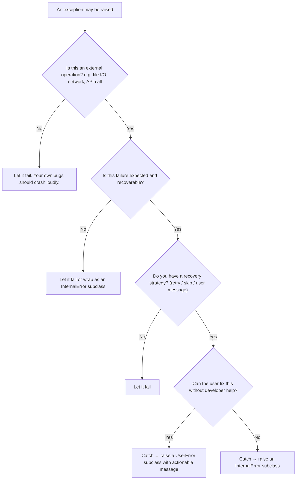

# Error Handling Guideline

This guideline defines when and how to raise, catch, and report exceptions in DSP-TOOLS.
It covers the exception hierarchy, the two command groups with different error handling needs,
and concrete patterns for consistent, debuggable error handling.

## Command Groups

Commands fall into two groups with different error handling requirements.
In both groups, unhandled bugs escalate to the top-level handler in `entry_point.py`.

### Group A — Fail-fast acceptable

These commands are run in controlled environments (local stacks, staging) before production use.
Developer assistance is acceptable when something goes wrong.
Errors may escalate with a traceback.

Commands: `create`, `get`, `xmlupload`, `upload-files`, `ingest-files`, `ingest-xmlupload`, `resume-xmlupload`

### Group B — Must be fixable by the user

These commands run locally against user-owned files.
Users must be able to resolve all problems without contacting developers.
All problems must be reported in an aggregated, user-friendly way.

Commands: `excel2json`, `excel2lists`, `excel2resources`, `excel2properties`,
`old-excel2json`, `old-excel2lists`, `id2iri`, `update-legal`, `validate-data`, `xmllib`, `start-stack`, `stop-stack`

## Exception Hierarchy

The base classes are in `src/dsp_tools/error/exceptions.py`.
Some subclasses that are used by several commands also live there.
Each command module has its own `exceptions.py` with command-specific subclasses.

```text
BaseError                               # Root. Dataclass with message: str attribute.
├── UserError                           # User can fix this themselves.
│   ├── UserFilepathNotFoundError       # Generic: file does not exist.
│   ├── UserFilepathMustNotExistError   # Generic: file must not already exist.
│   ├── UserDirectoryNotFoundError      # Generic: directory does not exist.
│   └── BadCredentialsError             # DSP-API rejected credentials.
└── InternalError                       # Requires developer assistance. Prints contact info + log file path.
    ├── UnreachableCodeError            # Code path that must never execute.
    ├── PermanentConnectionError        # All reconnection attempts failed.
    └── PermanentTimeOutError           # DSP-API timed out.
```

**Choosing the right class:**

- `UserError`: the user made a mistake (wrong file, bad format, invalid input).
  The message must tell them how to fix it.
- `InternalError`: the user cannot fix this. The message instructs them to contact the development team.
- Do **not** raise `BaseError`, `UserError`, or `InternalError` directly —
  always use the most specific subclass available,
  or create a new one if no appropriate one exists yet.
- `UserError` and `InternalError` are the **only** allowed direct subclasses of `BaseError`.
  All new exception classes must inherit from one of them, never from `BaseError` itself.

## When to Catch vs. Let Fail

### Do NOT catch

Avoid catching exceptions from your own code logic — programming bugs like type errors,
failed assertions, or logic mistakes. Let them crash immediately:

- Standard Python tracebacks pinpoint the root cause
- Try/except blocks can mask bugs and delay discovery
- Test environments exist to surface these before production

### DO catch

Catch exceptions when failure is **expected** and **external** to your logic - 
but only if you have a recovery strategy. If not, let it escalate.
Examples when you should catch:

- File I/O (file not found, permission denied)
- Network requests (connection failures, timeouts)
- External API or library calls that fail in predictable ways
- User input that may be invalid

### Only catch when you have a recovery strategy

- Adding diagnostic context that is not in the traceback
- Implementing retry logic for transient failures
- Gracefully skipping one item in a batch (Group B commands)

### Decision tree

<!-- markdownlint-disable MD013 -->



<!-- markdownlint-enable MD013 -->

## How to Handle Caught Exceptions

### Preserve context

- Extract the message from the original exception: `err.msg` / `err.message`
- Use `logger.exception(err.msg)` — this preserves the original stack trace in the logs.
  `logger.error()` does not preserve the stack trace.
- When converting between DSP-TOOLS exceptions, only use `raise X from None`
if the original traceback has already been logged with `logger.exception()`.

### Compose messages in the exception class

Put message composition in the `__str__` method of the exception class, not at the call site:

```python
try:
    return json.load(filepath)
except json.JSONDecodeError as err:
    logger.exception(err.msg)  # preserve stack trace in logs
    raise JSONFileParsingError(filepath, err.msg)


@dataclass
class JSONFileParsingError(UserError):
    filepath: Path
    orig_err_msg: str

    def __str__(self) -> str:
        return f"The input file '{self.filepath}' cannot be parsed: {self.orig_err_msg}"
```

### Log at the highest level only

Let exceptions bubble up and log once in `entry_point.py`.
Intermediate handlers should **not** log before re-raising — this causes duplicate log entries.

The one exception: when an intermediate handler converts a low-level exception to a DSP-TOOLS exception,
use `logger.exception()` to preserve the original traceback in the logs,
then `from None` when re-raising to prevent that traceback from appearing a second time
via `entry_point.py`'s `logger.exception()`:

```python
except SomeLowLevelError as err:
    logger.exception(err)   # preserve in logs
    raise DSPErrorSubclass("Message for the user or contact info.") from None  # prevent duplicate traceback in logs
```

## Anti-patterns

| Anti-pattern                                             | Problem                                                  | Fix                                                 |
| -------------------------------------------------------- | -------------------------------------------------------- | --------------------------------------------------- |
| `class FooError(BaseError)`                              | Bypasses the two-branch hierarchy                        | Inherit from `UserError` or `InternalError` instead |
| `raise BaseError("...")`                                 | Defeats the hierarchy; callers cannot catch specifically | Use a specific subclass                             |
| `raise UserError("...")` or `raise InternalError("...")` | Too broad; callers cannot catch specifically             | Use a specific subclass; create one if none exists  |
| `raise FooError("ERROR: ...")`                           | Redundant prefix; the handler adds context               | Remove the `"ERROR:"` prefix from the message       |
| `raise X from None` (DSP→DSP)                            | Drops the exception chain, loses the traceback           | Use `raise X from e`; only use `from None` when the original traceback was already logged above with `logger.exception()` |
| `logger.error(e)` then re-raise                          | The same error gets logged again by `entry_point.py`     | Remove the intermediate log                         |
| `logger.error()` instead of `logger.exception()`         | Loses the stack trace                                    | Replace with `logger.exception()`                   |
| Exceptions for expected control flow                     | Expected outcomes should not be exceptions               | Return a result type instead                        |
