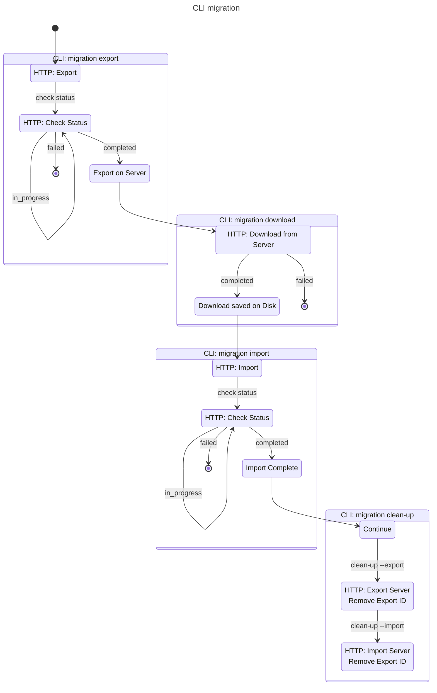

# `migration` Command

## Overview

The command `migration` is an all-in-one command that:

- Prepares the zip file on the source server (CLI `migration export`)
- Downloads the zip file from the source server (CLI `migration download`)
- Uploads the zip file on the target server(CLI `migration import`)
- Contains clean up steps on both servers (CLI `migration clean-up`)

The functionality for the CLI command for the clean-up
is only intended to be used manually if the preparation of the zip file, download or import failed.

To specify servers, users, etc. this command will take a config file
which can be created with the command `migration config`.

## Limitations

- API restriction maximum 2h for preparation, download and import (each)
- Maximum 200 GB size limitation on assets and data
- Currently only able to migrate with assets

## Process

## Cleanup on Failure

**Export Failure:**

- None

**Download Failure:**

- Delete partial download file
- No server-side cleanup (can retry manually)

**Import Failure:**

- Local zip file remains (for manual retry)
- No server-side cleanup (for potential debugging)

**Manual Cleanup:**

- Use `migration clean-up` command
- Specify `--export` or `--import`
