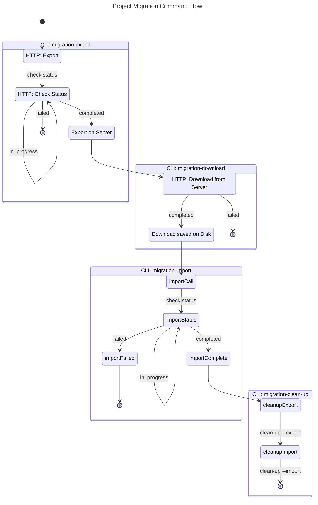

# `project-migration` Command

## Overview

The command `project-migration` is an all-in-one command that:

- exports data from a server (CLI `migration-export`)
- downloads the export (CLI `migration-download`)
- uploads the import (CLI `migration-import`)
- contains clean up steps (CLI `migration-clean-up`)

The functionality for the CLI command for the clean-up
is only intended to be used manually if an export or import failed.

## Limitations

- API restriction maximum 2h for export, download and import (each)
- Maximum 200 GB Assets and Data
- Currently only able to export with assets

## Process

## Cleanup on Failure

**Export Failure:**

- none

**Download Failure:**

- Delete partial download file
- Server-side export remains (can retry manually)

**Import Failure:**

- Local export remains (for manual retry)
- Server-side cleanup remains (for potential debugging)

**Manual Cleanup:**

- Use `migration-clean-up` command
- Specify `--export` or `--import`
