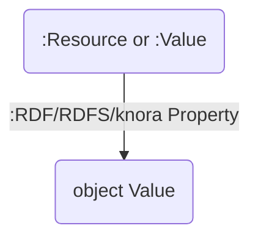
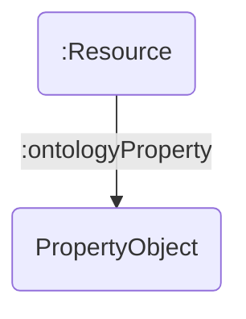

# Decision Log

## Future considerations for `validate-data`

- Validate data is not feature complete.
- It assumes that:
    - `dsp-tools` does its job correctly, i.e. it does not check if the `Values` are correctly structured. 
      If `dsp-tools` started to make mistakes they may not be found or emit very strange validation results.
    - the `xsd` schema validation passed. Some primitive checks that the `xsd` finds are not repeated in the SHACL validation

## Python class structure in `validate-data`

[PR: https://github.com/dasch-swiss/dsp-tools/pull/1360](https://github.com/dasch-swiss/dsp-tools/pull/1360)

Changing the internal Python representation of the data.
A Python dataclass structure between the input XML and the data as an `rdflib` graph is added
that is agnostic to both the specifications of the XML and the data structure required by the API.

The structure of the main Python classes `PropertyObject` and `ValueInformation` are generic
and do not rely on a specific property, object or object data type.
Both of these classes represent a part of an RDF triple,
the subject of the triple is the dataclass which contains the `PropertyObject` and `ValueInformation`.

Below are graphs to illustrate where the information contained in the classes will be located in the final graph.

**`PropertyObject`**

This represents the property and object of a triple.
It may be user facing (e.g. the label) or metadata (e.g. permissions).

With the enum `TripleObjectType` we can specify the data type of the value or if it is an IRI.

**`ValueInformation`**

This represents a reified knora Value, e.g. `BooleanValue`.
A knora value itself contains further `PropertyObject`s,
containing user-facing data (e.g. the boolean itself) or metadata (e.g. permissions).

With the enum class `KnoraValueType` we can specify the knora value type.
