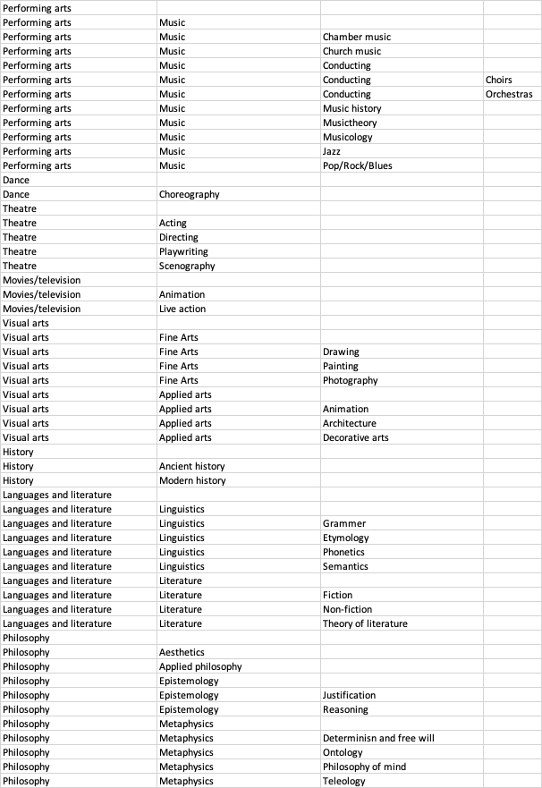

[](https://badge.fury.io/py/dsp-tools)

# JSON data model definition format

## Introduction

This document contains all the information you need to create a data model that can be used by DSP. According to Wikipedia,
the [data model](https://en.wikipedia.org/wiki/Data_model) is "_an abstract model that organizes elements of data and standardizes
how they relate to one another and to the properties of real-world entities._"  Further it states: "_A data model explicitly
determines the structure of data. Data models are typically specified by a data specialist, data librarian, or a digital
humanities scholar in a data modeling notation_".

In this section, we will describe one of the notations that is used by dsp-tools to create a data model in the DSP repository. The
DSP repository is loosely based on [Linked Data](https://en.wikipedia.org/wiki/Linked_data) where also the term _ontology_ is
used.

In the first section you find a rough overview of the data model definition, all the necessary components with a definition and a
short example of the definition.

## A short overview

In the following section, you find all the mentioned parts with a detailed explanation. Right at the beginning we look at the
basic fields that belong to an ontology definition. This serves as an overview for you to which you can return at any time while
you read the description.

A complete data model definition looks like this:

```json
{
  "prefixes": {
    "foaf": "http://xmlns.com/foaf/0.1/",
    "dcterms": "http://purl.org/dc/terms/"
  },
  "project": {
    "shortcode": "0123",
    "shortname": "BiZ",
    "longname": "Bildung in Zahlen",
    "descriptions": {
      ...
    },
    "keywords": [
      ...
    ],
    "lists": [
      ...
    ],
    "groups": [
      ...
    ],
    "users": [
      ...
    ],
    "ontologies": [
      ...
    ]
  }
}
```

As you can see, only two umbrella terms define our ontology: the "prefixes" object and the "project" object. In the following we
take a deeper look into both of them since, as you can see in the example above, both objects have further fine-grained definition
levels.

### "Prefixes" object

`"prefixes": { "prefix": "<iri>", ...}`

The "prefixes" object contains - as you may already have guessed by the name - the `prefixes` of *external* ontologies that are
also used in the current project. All prefixes are composed of a keyword, followed by its iri. This is used as a shortcut for
later so that you don't always have to specify the full qualified iri but can use the much shorter keyword instead. That means
that e.g. instead of addressing a property called "familyname" via
`http://xmlns.com/foaf/0.1/familyName` you can simply use foaf:familyName.

As you can see in the example below, you can have more than one prefix too. In the example we have "foaf" as well as
"dcterms" as our prefixes.

```json
{
  "prefixes": {
    "foaf": "http://xmlns.com/foaf/0.1/",
    "dcterms": "http://purl.org/dc/terms/"
  }
}
```

### "Project" object

`"project": {"key": "<value>", ...}`

Right after the "prefix" object the "project" object has to follow, which contains all resources and properties of the ontology.
The "project" object is the bread and butter of the ontology. All its important properties are specified therein.

As you saw in the complete ontology definition in the beginning, the project definitions requires all the following data fields:

- shortcode
- shortname
- longname
- keywords
- ontologies

Whereas the following fields are optional (if one or more of these fields are not used, it must be omitted):

- descriptions
- lists
- groups
- users

So, a simple example definition of the "project" object could look like this:

```json
{
  "project": {
    "shortcode": "0809",
    "shortname": "test",
    "longname": "Test Example",
    "descriptions": {
      "en": "This is a simple example project",
      "de": "Dies ist ein einfaches Beispielprojekt"
    },
    "keywords": [
      "example",
      "simple"
    ],
    "lists": [
      ...
    ],
    "groups": [
      ...
    ],
    "users": [
      ...
    ],
    "ontologies": [
      ...
    ]
  }
}
```

## Simple key/value pairs

At that point we will go through all of this step by step and take a more in depth view on the individual fields of the
"project" object. The first four fields of the "project" object are "key"/"value" pairs. Therefore, they are quite simple.

### Shortcode

`"shortcode": "<4-hex-characters>"`

It's a hexadecimal string in the range between "0000" and "FFFF" that's used to uniquely identify the project. The shortcode has
to be provided by the DaSCH.

### Shortname

`"shortname": "<string>"`

This is a short name (string) for the project. It's meant to be like a nickname. If the name of the project is e.g.
"Albus Percival Wulfric Dumbledore", then the shortname for it could be "Albi". It should be in the form of a
[xsd:NCNAME](https://www.w3.org/TR/xmlschema11-2/#NCName), that is a name without blanks and special characters like
`:`, `;`, `&`, `%` etc., but `-` and `_` are allowed.

### Longname

`"longname": "<string>"`

A longer string that provides the full name of the project. In our example, the longname would be "Albus Percival Wulfric
Dumbledore".

### Descriptions

`"descriptions": {"<lang>": "<string>", ...}`

The descriptions specify the content of the project in *exactly* one or more strings. These descriptions can be supplied in
several languages (currently _"en"_, _"de"_, _"fr"_ and _"it"_ are supported). The descriptions have to be given as a JSON object
with the language as "key", and the description as "value". See the example above inside the curly brackets after "descriptions"to
see what that means.

## Key/object pairs

The following fields are **not** simple "key"/"value" pairs. They do have a key, the value however is another object and therefore
has an internal structure. Due to the increased complexity of these objects, they are looked at in more detail.

### Keywords

`"keywords": ["<string>", "<string>", ...]`

An array of keywords is used to roughly describe the project in single words. A project that deals e.g. with old monastery
manuscripts could possess the keywords "monastery", "manuscripts", "medieval", (...). The array can be empty as well e.i. "
keywords": [].

### Lists

`"lists": [<list-definition>,<list-definition>,...]`

Often in order to characterize or classify a real world object, we use a sequential or hierarchical list of terms. For example a
classification of disciplines in the Humanities might look like follows:

- Performing arts
    - Music
        - Chamber music
        - Church music
        - Conducting
            - Choirs
            - Orchestras
        - Music history
        - Music theory
        - Musicology
        - Jazz
        - Pop/Rock
    - Dance
        - Choreography
    - Theatre
        - Acting
        - Directing
        - Playwriting
        - Scenography
    - Movies/Television
        - Animation
        - Live action
- Visual arts
    - Fine arts
        - Drawing
        - Painting
        - Photography
    - Applied Arts
        - Animation
        - Architecture
        - Decorative arts
- History
    - Ancient history
    - Modern history
- Languages and literature
    - Linguistics
        - Grammar
        - Etymology
        - Phonetics
        - Semantics
    - Literature
        - Fiction
        - Non-fiction
        - Theory of literature
- Philosophy
    - Aesthetics
    - Applied philosophy
    - Epistemology
        - Justification
        - Reasoning
    - Metaphysics
        - Determinism and free will
        - Ontology
        - Philosophy of mind
        - Teleology

DSP allows to define such controlled vocabularies or thesauri. They can be arranged "flat" or in "hierarchies" (as the given
example about the disciplines in Humanities is). The definition of these entities are called "lists" in the DSP. Thus, the list
object is used to give the resources of the ontology a taxonomic quality. A taxonomy makes it possible to categorize a resource.
The big advantage of a taxonomic structure as it is implemented by the DSP is that the user can sub-categorize the objects. This
allows the user to formulate his search requests more or less specifically as desired. Thus, in the example above a search for "
Vocal music" would result in all works that are characterized by a sub-element of "Vocal music". However, a search for "Masses"
would return only works that have been characterized as such. The number of hierarchy levels is not limited, but for practical
reasons it should not exceed 3-4 levels.

Thus, a taxonomy is a hierarchical list of categories in a tree-like structure. The taxonomy must be complete. This means that the
entire set of resources must be mappable to the sub-categorization of the taxonomy. To come back to the previous example: It must
not occur that a musical work within our resource set cannot be mapped to a subcategory of our taxonomy about classical music. The
taxonomic-hierarchical structure is mapped using JSON. This is because JSON inherently implements a tree structure as well. The
root of the taxonomy tree is always the name of the taxonomy. The root always stands alone at the top of the tree. It is followed
by any number of levels, on which any number of subcategories can be placed.

Suppose you want to build a taxonomy of the classical musical genres as above. The root level would be the name of the taxonomy
e.g. "classicalmusicgenres". The next level on the hierarchy would be the basic genres, in our example
"Orchestral music", "Chamber music", "Solo instrumental", "Vocal Music" and "Opera". Each if these categories may have
subcategories. In our example "Opera" would have the subcategories "Comic opera", "Serious Opera",
"Opera Semiseria", "Opera Cornique", "Grand opera" and "Opera verismo". Each of these could again have subcategories, and so
forth.

It is important to note that a flat taxonomy is also allowed. This means that a taxonomy from exactly two levels is allowed. We
have a root level, with the name of the taxonomy, followed by a single level. Within this second level, any number of categories
can coexist equally, but since they are on the same level, they are not hierarchically dependent on each other. For example, you
could define a taxonomy "soccer clubs", which have the categories "FCB",
"FCZ", (...) in the second level. FC Basel has no hierarchical connection to FC Zürich. Their taxonomic structure is therefore
flat.

A resource can be assigned to a taxonomic node within its properties. So a resource of type "musical work" with the title "La
Traviata" would have the property/attribute "musical-genre" with the value "Grand opera". Within the DSP, each property or
attribute has an assigned cardinality. Sometimes, a taxonomy allows that an object may belong to different categories at the same
time (e.g. an image which depicts several categories at the same time). In these cases, a cardinality greater than 1 allows adding
multiple attributes of the same time. See further below the description of the
[cardinalities](#cardinalities).

A node of the Taxonomy may have the following elements:

- _name_: Name of the node. This should be unique within the given list. The name-element is optional but highly recommended.
- _labels_: Language dependent labels in the form `{ "<lang>": "<label>", ... }`. The labels element is mandatory. It needs to
  specify at least one language.
- _comments_: Language dependent comments in the form `{ "<lang>": "<comment>", ... }`. The comments element is optional.
- _nodes_: Array of sub-nodes. If you have a non-hierarchical taxonomy (i.e. a taxonomy with only 2 levels, the root level and
  another level), you don't have child nodes. Therefore, the nodes element can be omitted in case of a flat taxonomy.

Here is an example on how to build a taxonomic structure in JSON:

```json
{
  "lists": [
    {
      "name": "my_list",
      "labels": {
        "en": "Disciplines of the Humanities"
      },
      "comments": {
        "en": "This is just an example.",
        "fr": "C'est un example."
      },
      "nodes": [
        {
          "name": "node_1_1",
          "labels": {
            "en": "Performing arts"
          },
          "comments": {
            "en": "Arts that are events",
            "de": "Künste mit performativem Character"
          },
          "nodes": [
            {
              "name": "node_2_2",
              "labels": {
                "en": "Music"
              },
              "nodes": [
                {
                  "name": "node_3_3",
                  "labels": {
                    "en": "Chamber music"
                  }
                },
                {
                  "name": "node_4_3",
                  "labels": {
                    "en": "Church music"
                  }
                },
                {
                  "name": "node_5_3",
                  "labels": {
                    "en": "Conducting"
                  },
                  "nodes": [
                    {
                      "name": "node_6_4",
                      "labels": {
                        "en": "Choirs"
                      }
                    },
                    {
                      "name": "node_7_4",
                      "labels": {
                        "en": "Orchestras"
                      }
                    }
                  ]
                },
                {
                  "name": "node_8_3",
                  "labels": {
                    "en": "Music history"
                  }
                },
                {
                  "name": "node_9_3",
                  "labels": {
                    "en": "Musictheory"
                  }
                },
                {
                  "name": "node_10_3",
                  "labels": {
                    "en": "Musicology"
                  }
                },
                {
                  "name": "node_11_3",
                  "labels": {
                    "en": "Jazz"
                  }
                },
                {
                  "name": "node_12_3",
                  "labels": {
                    "en": "Pop/Rock/Blues"
                  }
                }
              ]
            }
          ]
        },
        {
          ...
        },
        {
          ...
        }
      ]
    }
  ]
}
```

#### Lists from Excel

A list can be directly imported from one or several Excel files. The Excel sheet must have the following format:



If there are several languages, a separate Excel file for each language has to be provided. The folder with the Excel file(s) can
directly be referenced inside the list definition by defining it as new list node:

```json
{
  "name": "List-from-excel",
  "labels": {
    "en": "List from an Excel file",
    "de": "Liste von einer Excel-Datei"
  },
  "nodes": {
    "folder": "excel-lists"
  }
}
```

The nodes section must contain the field:

- _folder_: Path to the folder where the Excel files are stored

Further details to this functionality can be read
[here](dsp-tools-excel#create-a-json-list-file-from-one-or-several-excel-files.md).

The lists element is optional. If there are no lists, this element has to be omitted.

### Groups

`"groups": [<group-definition>, <group-definition>,...]`

This object contains groups definitions. This is (only) used to specify the permissions a user gets. A project may define user
groups such as "project-admins", "students" etc. and give the members of each group individual permissions.

A group definition has the following elements:

- _name_: name of the group
- _description_: description of the purpose of the group
- _selfjoin_: true if users are able to join the group; false if an administrator must add the users
- _status_: true if the group is active; false if the group is inactive

Example:

```json
{
  "groups": [
    {
      "name": "biz-editors",
      "description": "Editors for the BiZ-project",
      "selfjoin": false,
      "status": true
    }
  ]
}
```

The groups element is optional.

### Users

`"users": [<user-definition>, <user-definition>,...]`

This object contains user definitions. You can set user traits here. A user has the following elements:

- _username_: short username used for the login, similar to a nickname
- _email_: unique email that identifies the user
- _givenName_: firstname of the user
- _familyName_: surname of the user
- _password_: password of the user
- _lang_: the preferred language of the user: "en", "de", "fr", "it" (optional, default: "en")
- _projects_: List of projects the user belongs to. The project name has to be followed by a ":" and either "member" or "admin".
  This indicates if the new user has admin rights in the given project or is an ordinary user. `myproject:admin` would add the
  user as admin to the project "myproject". The given project defined in the same ontology file has no name, so only ":admin"or ":
  member" is required. A user must be member of at least one project.

Example:

```json
{
  "users": [
    {
      "username": "bizedit",
      "email": "bizedit@test.org",
      "givenName": "biz-given",
      "familyName": "biz-family",
      "password": "biz1234",
      "lang": "en",
      "groups": [
        ":biz-editors"
      ],
      "projects": [
        ":admin",
        "anything:member"
      ]
    }
  ]
}
```

The users element is optional and can therefore be omitted.

### Ontologies

`"ontologies": [<ontology-definition>, <ontology-definition>, ...]`

Most of the definitions for our ontology will be done under the category `"ontologies": [{...}, {...}]` inside of the curly
brackets. A project may have multiple ontologies, where the second may depend on the first, the third on the second and first,
etc. The core of the ontology definition is within the {} brackets. We know, you've already read a lot of text so far, but this
section is probably the most important one.

First, lets talk about what an ontology actually is. This will make it much easier to understand the different fields of the
ontology definition.

An ontology is a formal representation of a set of terminologies which finally represent real world objects. Dependencies,
attributes and relations of and between the individual components of the set are recorded in a logical, formal language. In
contrast to a taxonomy, which defines a mere hierarchical structure within a range of terms, an ontology is much more a network of
information of logical dependencies of term elements. Or, in other words, an ontology defines a strict, formal "data model" for
real world _concepts_ such as "Person", "Work", "Artist" etc.

A full-fledged ontology thus has to offer at least *two* things: a set of _concepts_ or terms (called _resources_, actually "
resource classes", but we use somehow inconsistently the term resource inhere) - that represent _concepts_
of real world objects - as well as attributes or _properties_ describing these resources. These properties are linked either to a
final value or may define a relationship to another resource (-class). Let's assume that we define a resource called "Person" and
two properties called "hasBirthday" and "hasParent". For a specific incarnation of a
"Person" (we call this an _instance_), "hasBirthday" will have a final value such as "1960-05-21", whereas
"hasParent" will link to another instance of a Person.

Within DSP, properties may be re-used for different resources. E.g. a property "description" may be used for a resource called "
image" as well as "movie". Therefore, the list of properties is separated from the list of resources. The properties are assigned
to the resources by defining "_cardinalities_". A cardinality indicates, if a property is mandatory or can be omitted (e.g. if
unknown), and if a property may be used several times on the same instance of a resource. The latter may make sense for resources
that are known under several names. In such a case, a
"hasName"-property would have a cardinality that allows multiple use on the same instance of a resource. The cardinality
definitions are explained [further below](#cardinalities).

To fully capture everything an ontology has to provide, we use *four* different elements that describe the resources as well as
the dependencies inside our ontology. They are:

- _name_
- _label_
- _properties_
- _resources_

Example:

```json
{
  "ontologies": [
    {
      "name": "seworon",
      "label": "Secrets of the world ontology",
      "properties": [
        ...
      ],
      "resources": [
        ...
      ]
    },
    {
      ...
    },
    {
      ...
    }
  ]
}
```

Now lets see what each field does.

#### Name

`"name": "<string>"`

First of all, our overall ontology needs a name. After all, we want to create an ontology about a specific subject or set of
terms.

As a "speciality", the *name of the ontology* has to be a [xsd:NCNAME](https://www.w3.org/TR/xmlschema11-2/#NCName)
compliant name that can be used as prefix. [xsd:NCNAME](https://www.w3.org/TR/xmlschema11-2/#NCName)
means that it has to be a single word without any special characters (like e.g. " . : ! ? # + (...) ") and without any blanks.

#### Label

`"label": "<string>"`

Since the "name" of your ontology needs to be in this special format, we like to have a human-readable and understandable name of
the ontology. This is done in the "label".

#### Properties

`"properties": [<property-definition>, <property-definition>, ...]`

At first, it seems a bit illogical to have to define the properties *before* the resources. After all, a property always describes
the characteristics of a *resource*. However, it is necessary to define the properties *before* the resources. The reason for that
is that a property - a dependency between resources - can be used in our ontology not only for a single resource but for several.
If we would e.g. have a property that describes "is descendent of", we can use this property not only to describe the family
relations of a human family but at the same time use the same property to describe the relations of e.g. an animal family.

A properties-array describes all the properties that are used for our terminology space. It's all the properties that describe all
the possible connections and dependencies between our entire set of terms.

The following should also be mentioned: We are restricted to a given list of *data types* we can choose from for our properties.
We can't create our own "new" data types. However, the list of value types should cover all the needs.

A property has mandatory and optional fields. The following fields are mandatory:

- _name_
- _labels_
- _object_
- _gui_element_

Please note that _object_ is used to define the data type. The reason is that internally each data type is again represented by a
resource that holds a lot of additional information, notable a complete change history. The
_gui_element_ depends on the object.

The following fields are optional (can be omitted):

- _super_
- _gui_attributes_

The _gui_attributes_ depends on the _gui_element_ chosen!

##### Name

`"name": "<NCNAME>"`

A name for the property e.g. "pageOf", "hasBirthdate", "createdBy".

##### Labels

`"labels": {"<language>": "<string>", ...}`

Similar to the name property, the label describes the property. In contrast to the name, which serves as a pure abbreviation, the
label is human-readable. Thus, use language dependent, human-readable names e.g. "is descendant of". The labels field has the
following form: `{ "<lang>": "<value>", ...}` where `<lang>` is either "en", "de", "fr" or
"it", and `<value>` is a string.

##### Object / gui_element / gui_attribute

`"object": "<data-type-object>"`

The "object" defines the data type of the value that the property will store. The following object types are allowed:

###### TextValue

`"object": "TextValue"`

Represents a text that may contain standoff markup.

*gui\_elements / gui\_attributes*:

- `SimpleText`: A GUI element for _TextValue_. A simple text entry box (one line only). The attributes are:
    - _gui_attributes_:
        - `maxlength=integer` (optional): maximal length (number of characters accepted)
        - `size=integer` (optional): size (width) of widget
- `Textarea`: A GUI element for _TextValue_. Presents a multiline text entry box. The optional attributes are:
    - _gui_attributes_:
        - `cols=integer` (optional): number of columns of the textarea
        - `rows=integer` (optional): number of rows of the textarea
        - `width=percent` (optional): width of the textarea on screen
        - `wrap=soft|hard` (optional): wrapping of text
- `Richtext`: A GUI element for _TextValue_. Provides a richtext editor.
    - _gui_attributes_: No attributes

*Example:*

```json
{
  "name": "hasPictureTitle",
  "super": [
    "hasValue"
  ],
  "object": "TextValue",
  "labels": {
    "en": "Title"
  },
  "gui_element": "SimpleText",
  "gui_attributes": {
    "maxlength": "255",
    "size": 80
  }
}
```

###### ColorValue

`"object": "ColorValue"`

A string representation of the color in the hexadecimal form e.g. "#ff8000".

*gui-elements / gui_attributes*:

- `Colorpicker`: The only GUI element for _ColorValue_. It's used to choose a color.
    - _gui_attributes_:
        - `ncolors=integer` (optional): Number of colors the color picker should present.

*Example:*

```json
{
  "name": "hasColor",
  "super": [
    "hasValue"
  ],
  "object": "ColorValue",
  "labels": {
    "en": "Color"
  },
  "gui_element": "Colorpicker"
}
```

###### DateValue

`object": "DateValue"`  
Represents a date. It's a string with the format `calendar:start:end`

Please note that the DateValue is an extremely flexible data type. It can represent an exact date or a date with a given
uncertainty, and the date can be given in several calendars (currently the Gregorian and the Julian calendars are supported, with
the Jewish and Islamic coming soon). Internally, a date is always represented as a start and end date. If start and end date
match, it's an exact date. A value like "1893" will automatically be expanded to a range from January 1st 1893 to December 31st

1893.

- _calendar_ is either _GREGORIAN_ or _JULIAN_
- _start_ has the form _yyyy_-_mm_-_dd_. If only the year is given, the precision is to the year. If only the year and month is
  given, the precision is to the month.
- _end_ is optional if the date represents a clearly defined period or uncertainty.

In total, a DateValue has the following form: "GREGORIAN:1925:1927-03-22"
which means anytime in between 1925 and the 22nd March 1927.

*gui-elements / gui_attributes*:

- `Date`: The only GUI element for _DateValue_. A date picker gui.
- _gui_attributes_: No attributes

*Example:*

```json
{
  "name": "hasDate",
  "super": [
    "hasValue"
  ],
  "object": "DateValue",
  "labels": {
    "en": "Date"
  },
  "gui_element": "Date"
}
```

###### DecimalValue

`"object": "DecimalValue"`

A number with decimal point.

*gui-elements / gui_attributes*:

- `Slider`: A GUI element for _DecimalValue_. Provides a slider to select a decimal value.
    - _gui_attributes_:
        - `max=decimal` (mandatory): maximal value
        - `min=decimal` (mandatory): minimal value
- `SimpleText`: A GUI element for _TextValue_. A simple text entry box (one line only). The attributes
  "maxlength=integer" and "size=integer" are optional.
    - _gui_attributes_:
        - `maxlength=integer` (optional): maximum number of characters accepted
        - `size=integer"` (optional): size of the input field

*Example:*

```json
{
  "name": "hasDecimal",
  "super": [
    "hasValue"
  ],
  "object": "DecimalValue",
  "labels": {
    "en": "Decimal number"
  },
  "gui_element": "SimpleText",
  "gui_attributes": {
    "maxlength": "255",
    "size": 80
  }
}
```  

###### GeomValue

`"object": "GeomValue"`

Represents a geometrical shape as JSON. Geometrical shapes are used to define regions of interest (ROI) on still images or moving
images.

*gui-elements / gui_attributes*:

- `Geometry`: not yet implemented.
    - _gui_attributes_: No attributes
- `SimpleText`: A GUI element for _TextValue_. A simple text entry box (one line only). The attributes
  "maxlength=integer" and "size=integer" are optional.
    - _gui_attributes_:
        - `maxlength=integer` (optional): The maximum number of characters accepted
        - `size=integer` (optional): The size of the input field

*Example*:

```json
{
  "name": "hasGeometry",
  "super": [
    "hasValue"
  ],
  "object": "GeomValue",
  "labels": "Geometry",
  "gui_element": "SimpleText"
}
```

###### GeonameValue

Represents a location ID in geonames.org. The DSP platform uses identifiers provided by
[geonames.org](https://geonames.orgs) to identify geographical locations.

*gui-elements / gui_attributes*:

- `Geonames`: The only valid GUI element for _GeonameValue_. It interfaces are with geonames.org and it allows to select a
  location.
    - _gui_attributes_: No attributes

*Example:*

```json
{
  "name": "hasGeoname",
  "super": [
    "hasValue"
  ],
  "object": "GeonameValue",
  "labels": {
    "en": "Geoname"
  },
  "gui_element": "Geonames"
}
```

###### IntValue

`"object": "IntValue"`

Represents an integer value.

*gui-elements / gui_attributes*:

- `SimpleText`: A GUI element for _TextValue_. A simple text entry box (one line only). The attributes
  "maxlength=integer" and "size=integer" are optional.
    - _gui_attributes_:
        - `maxlength=integer` (optional): The maximum number of characters accepted
        - `size=integer"` (optional): The size of the input field
- `Spinbox`: A GUI element for _IntegerValue_. A text field with and "up"- and "down"-button for increment/decrement. The
  attributes "max=decimal" and "min=decimal" are optional.
    - _gui_attributes_:
        - `max=integer` (optional): Maximal value
        - `min=integer` (optional): Minimal value

*Example:*

```json
{
  "name": "hasInteger",
  "super": [
    "hasValue"
  ],
  "object": "IntValue",
  "labels": {
    "en": "Integer"
  },
  "gui_element": "Spinbox",
  "gui_attributes": {
    "max": 10.0,
    "min": 0.0
  }
}
```

###### BooleanValue

`"object": "BooleanValue"`

Represents a Boolean ("true" or "false).

*gui-elements / gui_attributes*:

- `Checkbox`: A GUI element for _BooleanValue_.
    - _gui_attributes_: No attributes

*Example:*

```json
{
  "name": "hasBoolean",
  "super": [
    "hasValue"
  ],
  "object": "BooleanValue",
  "labels": {
    "en": "Boolean value"
  },
  "gui_element": "Checkbox"
}
```

###### UriValue

`"object": "UriValue"`

Represents an URI

*gui-elements / gui_attributes*:

- `SimpleText`: A GUI element for _TextValue_. A simple text entry box (one line only). The attributes
  "maxlength=integer" and "size=integer" are optional.
    - _gui_attributes_:
        - `maxlength=integer` (optional): The maximum number of characters accepted
        - `size=integer"` (optional): The size of the input field

*Example:*

```json
{
  "name": "hasUri",
  "super": [
    "hasValue"
  ],
  "object": "UriValue",
  "labels": {
    "en": "URI"
  },
  "gui_element": "SimpleText",
  "gui_attributes": {
    "maxlength": "255",
    "size": 80
  }
}
```

###### IntervalValue

`"object": "IntervalValue"`

Represents a time-interval

*gui-elements / gui_attributes*:

- `SimpleText`: A GUI element for _TextValue_. A simple text entry box (one line only). The attributes
  "maxlength=integer" and "size=integer" are optional.
    - _gui_attributes_:
        - `maxlength=integer` (optional): The maximum number of characters accepted
        - `size=integer"` (optional): The size of the input field
- `Interval`: not yet implemented.
    - _gui_attributes_: No attributes

*Example:*

```json
{
  "name": "hasInterval",
  "super": [
    "hasValue"
  ],
  "object": "IntervalValue",
  "labels": {
    "en": "Time interval"
  },
  "gui_element": "Interval"
}
```

###### ListValue

`"object": "ListValue"`

Represents a node of a (possibly hierarchical) list

*gui-elements / gui_attributes*:

- `Radio`: A GUI element for _ListValue_. A set of radio buttons. This works only with flat lists!
    - _gui_attributes_:
        - `hlist=<list-name>` (mandatory): The reference of a [list](#lists) root node
- `List`: A GUI element for _ListValue_. A list of values to select one from.
    - _gui_attributes_:
        - `hlist=<list-name>` (mandatory): The reference of a [list](#lists) root node
- `Pulldown`: A GUI element for _ListValue_. Pulldown for list values. Works also for hierarchical lists.
    - _gui_attributes_:
        - `hlist=<list-name>` (mandatory): The reference of a [list](#lists) root node

*Example:*

```json
{
  "name": "hasListItem",
  "super": [
    "hasValue"
  ],
  "object": "ListValue",
  "labels": {
    "en": "List element"
  },
  "gui_element": "List",
  "gui_attributes": {
    "hlist": "treelistroot"
  }
}
```

###### LinkValue

`"object": ":<resource-name>"`

LinkValues do not follow the pattern of the previous data types, because they do not connect to a final value but to another
resource which has to be defined. Thus, the "object" denomiates the resource class the link will point to. If the resource is
defined in the same ontology, the name has to be prepended by a ":", if the resource is defined in another (previously defined)
ontology, the ontology name has to be prepended separated by a colon ":", e.g.
"other-onto:MyResource". The "super"-element has to be "hasLinkTo" or at least derived from "hasLinkTo" (how to derive a resource
or property from another one is not part of this documentation).

*gui-elements/gui_attributes*:

- `Searchbox`: Must be used with _hasLinkTo_ properties. Allows to search and enter a resource that the given resource should link
  to. It has one gui_attribute that indicates how many properties of the found resources should be indicated. It's mandatory!
    - _gui_attributes_:
        - `numprops=integer` (optional): While dynamically displaying the search result, the number of properties that should be
          displayed.

*Example:*

```json
{
  "name": "hasOtherThing",
  "super": [
    "hasLinkTo"
  ],
  "object": ":Thing",
  "labels": "Another thing",
  "gui_element": "Searchbox"
}
```

Like already mentioned before: The following two fields are optional (can be omitted), with the notable exception of the "super"
clause in case of LinkValues where the super clause is mandatory:

##### Super

`"super": ["<super-property>", "<super-property>, ...]`

A property ***must*** be derived from at least one base property. The most generic base property that the DSP offers is
_hasValue_. In addition, the property may be a subproperty of properties defined in external or other ontologies. External
ontologies like `dcterms` or `foaf` must be defined in the "prefix" section.

In this case the qualified name - including the prefix of the external or internal ontology - has to be given.

The following base properties are defined by DSP:

- `hasValue`: This is the most generic base.
- `hasLinkTo`: This value represents a link to another resource. You have to indicate the "_object_" as a prefixed name that
  identifies the resource class this link points to (a ":" prepended to the name is sufficient if the resource is defined in the
  current ontology).
- `hasColor`: Defines a color value (_ColorValue_)
- `hasComment`: Defines a "standard" comment
- `hasGeometry`: Defines a geometry value (a JSON describing a polygon, circle or rectangle), see _ColorValue_
- `isPartOf`: A special variant of _hasLinkTo_. It says that an instance of the given resource class is an integral part of
  another resource class. E.g. a "page" is part of a "book".
- `isRegionOf`: A special variant of _hasLinkTo_. It means that the given resource class is a "region" of another resource class.
  This is typically used to describe regions of interest in images.
- `isAnnotationOf`: A special variant of _hasLinkTo_. It denotes the given resource class as an annotation to another resource
  class.
- `seqnum`: An integer that is used to define a sequence number in an ordered set of instances, e.g. the ordering of the pages in
  a bokk (independent of the page naming)

To sum the `properties` section up, here we have an example for a complete properties definition:

```json
{
  "properties": [
    {
      "name": "schulcode",
      "object": "TextValue",
      "labels": {
        "de": "Schulcode"
      },
      "gui_element": "SimpleText",
      "gui_attributes": {
        "size": 32,
        "maxlength": 128
      }
    },
    {
      "name": "schulname",
      "object": "TextValue",
      "labels": {
        "de": "Name der Schule"
      },
      "gui_element": "SimpleText",
      "gui_attributes": {
        "size": 32,
        "maxlength": 128
      }
    }
  ]
}
```

#### Resources

`"resources": [<resource-definition>, <resource-definition>, ...]`

The resource classes are the primary entities of the data model. They are the actual objects/terms inside our terminology space. A
resource class is a template for the representation of a real object that is represented in the DaSCH database. A resource class
defines properties (aka _data fields_). For each of these properties a data type as well as the cardinality have to be defined.

A resource needs to have the following fields:

##### Name

`"name": "<NCNAME>"`

A name for the resource.

##### Labels

`"labels": {"<lang>": "<string>", ...}`

The string displayed of the resource is being accessed.

##### Super

`"super": ["<super-resource>", "<super-resource>", ...]`

A resource is always derived from at least one other resource. The most generic resource class DSP offers is _"Resource"_. A
resource may additionally also be derived from resources defined in external ontologies.

The following parent predefined resources are provided by DSP:

- `Resource` A generic "thing" that represents an item from the real world
- `StillImageRepresentation`: An object that is connected to a still image
- `TextRepresentation`: An object that is connected to an (external) text (not yet implemented)
- `AudioRepresentation`: An object representing audio data (not yet implemented)
- `DDDRepresentation`: An object representing a 3-D representation (not yet implemented)
- `DocumentRepresentation`: An object representing an opaque document (e.g. a PDF)
- `MovingImageRepresentation`: An object representing a moving image (video, film)
- `Annotation`: A predefined annotation object. It has automatically the following predefined properties defined:
    - `hasComment` (1-n)
    - `isAnnotationOf` (1)
- `LinkObj`: A resource class linking together several other, generic, resource classes. The class has the following properties:
- `hasComment` (1-n)
- `hasLinkTo` (1-n)
- `Region`: Represents a simple region. The class has the following properties:
    - `hasColor` (1)
    - `isRegionOf` (1)
    - `hasGeometry` (1)
    - `isRegionOf` (1)
    - `hasComment` (0-n)

##### Cardinalities

`"cardinalities": [...]`

Cardinalities is an array that contains the information about the connections between resources. It tells what type of connections
a single resource has as well as how many times the connection is established. Thus, the actual "network" is saved in this array.

- `cardinalities`: Array of references to the properties that the resource may hold including the cardinality. A cardinality has
  the following properties:
    - `propname`: The name of the property. If it's used in the form ":"propname, the current ontology is referenced. If the ":"is
      omitted, a DSP standard ontology is referenced, otherwise the full prefix of the ontology has to be used.
    - `gui_order`: An integer number which will help the GUI to display the properties in the desired order
    - `cardinality`: Indicates how often a given property may occur. The possible values are:
        - `"1"`: exactly once (mandatory one value and only one)
        - `"0-1"`: The value may be omitted, but can occur only once.
        - `"1-n"`: At least one value must be present, but multiple values may be present.
        - `"0-n"`: The value may be omitted, but may also occur multiple times.

Example for a resource definition:

```json
{
  "resources": [
    {
      "name": "Schule",
      "super": "Resource",
      "labels": {
        "de": "Schule"
      },
      "cardinalities": [
        {
          "propname": ":schulcode",
          "gui_order": 1,
          "cardinality": "1"
        },
        {
          "propname": ":schulname",
          "gui_order": 2,
          "cardinality": "1"
        },
        {
          "propname": ":bildungsgang",
          "gui_order": 3,
          "cardinality": "1"
        }
      ]
    }
  ]
}
```

## Fully fleshed out example ontology

Finally, here is a complete example of an ontology definition:

```json
{
  "prefixes": {
    "foaf": "http://xmlns.com/foaf/0.1/",
    "dcterms": "http://purl.org/dc/terms/"
  },
  "project": {
    "shortcode": "0170",
    "shortname": "teimp",
    "longname": "Test Import",
    "descriptions": {
      "en": "This is a project for testing the creation of ontologies and data",
      "de": "Dies ist ein Projekt, um die Erstellung von Ontologien und Datenimport zu testen"
    },
    "keywords": [
      "test",
      "import"
    ],
    "lists": [
      {
        "name": "orgtpye",
        "labels": {
          "de": "Roganisationsart",
          "en": "Organization Type"
        },
        "nodes": [
          {
            "name": "business",
            "labels": {
              "en": "Commerce",
              "de": "Handel"
            },
            "comments": {
              "en": "no comment",
              "de": "kein Kommentar"
            },
            "nodes": [
              {
                "name": "transport",
                "labels": {
                  "en": "Transportation",
                  "de": "Transport"
                }
              },
              {
                "name": "finances",
                "labels": {
                  "en": "Finances",
                  "de": "Finanzen"
                }
              }
            ]
          },
          {
            "name": "society",
            "labels": {
              "en": "Society",
              "de": "Gesellschaft"
            }
          }
        ]
      }
    ],
    "ontologies": [
      {
        "name": "teimp",
        "label": "Test import ontology",
        "properties": [
          {
            "name": "firstname",
            "super": [
              "hasValue",
              "foaf:givenName"
            ],
            "object": "TextValue",
            "labels": {
              "en": "Firstname",
              "de": "Vorname"
            },
            "gui_element": "SimpleText",
            "gui_attributes": {
              "size": 24,
              "maxlength": 32
            }
          },
          {
            "name": "lastname",
            "super": [
              "hasValue",
              "foaf:familyName"
            ],
            "object": "TextValue",
            "labels": {
              "en": "Lastname",
              "de": "Nachname"
            },
            "gui_element": "SimpleText",
            "gui_attributes": {
              "size": 24,
              "maxlength": 64
            }
          },
          {
            "name": "member",
            "super": [
              "hasLinkTo"
            ],
            "object": "teimp:organization",
            "labels": {
              "en": "member of",
              "de": "Mitglied von"
            },
            "gui_element": "Searchbox"
          },
          {
            "name": "name",
            "super": [
              "hasValue"
            ],
            "object": "TextValue",
            "labels": {
              "en": "Name",
              "de": "Name"
            },
            "gui_element": "SimpleText",
            "gui_attributes": {
              "size": 64,
              "maxlength": 64
            }
          },
          {
            "name": "orgtype",
            "super": [
              "hasValue"
            ],
            "object": "ListValue",
            "labels": {
              "en": "Organizationtype",
              "de": "Organisationstyp"
            },
            "comments": {
              "en": "Type of organization",
              "de": "Art der Organisation"
            },
            "gui_element": "Pulldown",
            "gui_attributes": {
              "hlist": "orgtype"
            }
          }
        ],
        "resources": [
          {
            "name": "person",
            "super": "Resource",
            "labels": {
              "en": "Person",
              "de": "Person"
            },
            "comments": {
              "en": "Represents a human being",
              "de": "Repräsentiert eine Person/Menschen"
            },
            "cardinalities": [
              {
                "propname": ":firstname",
                "gui_order": 1,
                "cardinality": "1"
              },
              {
                "propname": ":lastname",
                "gui_order": 2,
                "cardinality": "1"
              },
              {
                "propname": ":member",
                "gui_order": 3,
                "cardinality": "0-n"
              }
            ]
          },
          {
            "name": "organization",
            "super": "Resource",
            "labels": {
              "en": "Organization",
              "de": "Organisation"
            },
            "comments": {
              "en": "Denotes an organizational unit",
              "de": "Eine Institution oder Trägerschaft"
            },
            "cardinalities": [
              {
                "propname": ":name",
                "gui_order": 1,
                "cardinality": "1-n"
              },
              {
                "propname": ":orgtype",
                "gui_order": 2,
                "cardinality": "1-n"
              }
            ]
          }
        ]
      }
    ]
  }
}
```
