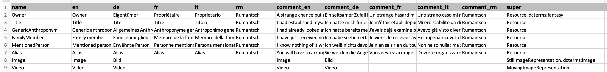
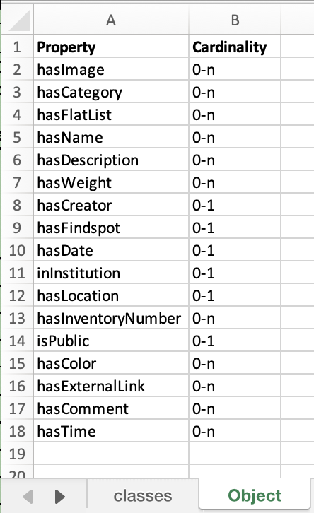
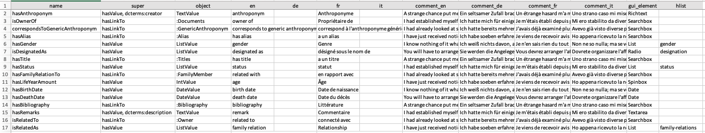
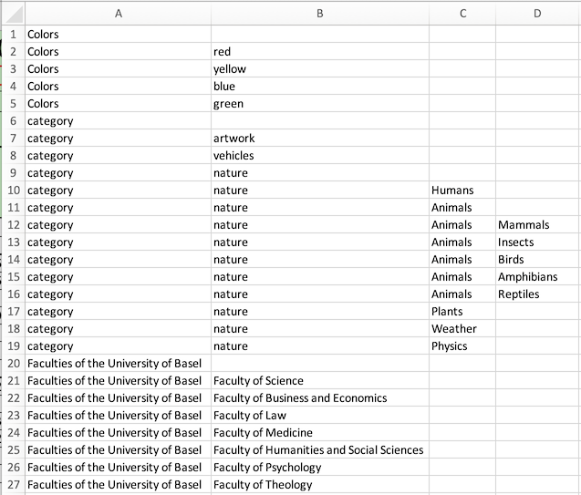
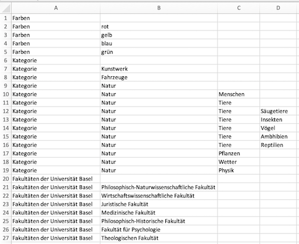

[](https://badge.fury.io/py/dsp-tools)

# excel2json

With dsp-tools, a JSON project file can be created from Excel files. The command for this is documented 
[here](./dsp-tools-usage.md#create-a-json-project-file-from-excel-files). 

To put it simple, a JSON project consists of

 - 0-1 "lists" sections
 - 1-n ontologies, each containing
     - 1 "properties" section
     - 1 "resources" section

For each of these 3 sections, one or several Excel files are necessary. The Excel files and their format are described 
below. If you want to convert the Excel files to JSON, it is possible to invoke a command for each of these sections 
separately (as described below). 

But it is more convenient to use the command that creates the entire JSON project file. In order to do so, put all 
involved files into a folder with the following structure:
```
data_model_files
|-- lists
|   |-- de.xlsx
|   `-- en.xlsx
`-- onto_name (onto_label)
    |-- properties.xlsx
    `-- resources.xlsx
```

Conventions for the folder names:

 - The "lists" folder must have exactly this name, if it exists. It can also be omitted.
 - Replace "onto_name" by your ontology's name, and "onto_label" by your ontology's label.
 - The only name that can be chosen freely is the name of the topmost folder ("data_model_files" in this example). 

Then, use the following command:
```
dsp-tools excel2json data_model_files project.json
```

This will create a file `project.json` with the lists, properties, and resources from the Excel files. 

**Please note that the "header" of the resulting JSON file is empty and thus invalid. It is necessary to add the project
shortcode, shortname, longname, descriptions, and keywords by hand. Likewise, there will be no prefixes, no groups and 
no users in the resulting JSON file.**

Continue reading the following paragraphs to learn more about the expected structure of the Excel files.


## "resources" section

With dsp-tools, the `resources` section used in a data model (JSON) can be created from an Excel file. The command for 
this is documented [here](./dsp-tools-usage.md#create-the-resources-section-of-a-json-project-file-from-an-excel-file). 
Only `XLSX` files are allowed. The `resources` section can be inserted into the ontology file and then be uploaded onto 
a DSP server.

**An Excel file template can be found [here](assets/data_model_templates/rosetta (rosetta)/resources.xlsx) or also in the 
[`data_model_files` folder of `0123-import-scripts`](https://github.com/dasch-swiss/0123-import-scripts/tree/main/data_model_files).
It is recommended to work from the template.** 

The expected worksheets of the Excel file are:

- `classes`: a table with all resource classes intended to be used in the resulting JSON
- `class1`, `class2`,...: a table for each resource class named after its name

The worksheet called `classes` must have the following structure:  


The expected columns are:

- `name` (mandatory): The name of the resource
- `en`, `de`, `fr`, `it`, `rm`: The labels of the resource in different languages, at least one language has to be provided
- `comment_en`, `comment_de`, `comment_fr`, `comment_it`, `comment_rm` (optional): comments in the respective language 
- `super` (mandatory): The base class(es) of the resource, separated by commas

The optional columns may be omitted in the Excel.

All other worksheets, one for each resource class, have the following structure:  
{ width=30% }

The expected columns are:

- `Property` (mandatory): The name of the property
- `Cardinality` (mandatory): The cardinality, one of: `1`, `0-1`, `1-n`, `0-n`

The GUI order is given by the order in which the properties are listed in the Excel sheet.

For further information about resources, see [here](./dsp-tools-create-ontologies.md#resources).


## "properties" section

With dsp-tools, the `properties` section used in a data model (JSON) can be created from an Excel file. The command for 
this is documented [here](./dsp-tools-usage.md#create-the-properties-section-of-a-json-project-file-from-an-excel-file). 
Only the first worksheet of the Excel file is considered and only XLSX files are allowed. The `properties` section can 
be inserted into the ontology file and then be uploaded onto a DSP server.

**An Excel file template can be found [here](assets/data_model_templates/rosetta (rosetta)/properties.xlsx) or also in the 
[`data_model_files` folder of `0123-import-scripts`](https://github.com/dasch-swiss/0123-import-scripts/tree/main/data_model_files). 
It is recommended to work from the template.**

The Excel sheet must have the following structure:  


The expected columns are:

- `name` (mandatory): The name of the property
- `super` (mandatory): The base property/ies of the property, separated by commas
- `object` (mandatory): If the property is derived from `hasValue`, the type of the property must be further specified by the 
object it takes, e.g. `TextValue`, `ListValue`, or `IntValue`. If the property is derived from `hasLinkTo`, 
the `object` specifies the resource class that this property refers to.
- `en`, `de`, `fr`, `it`, `rm`: The labels of the property in different languages, at least one language has to be provided
- `comment_en`, `comment_de`, `comment_fr`, `comment_it`, `comment_rm` (optional): comments in the respective language 
- `gui_element` (mandatory): The GUI element for the property
- `gui_attributes` (optional): The gui_attributes in the form "attr: value, attr: value". 

The optional columns may be omitted in the Excel.  
For backwards compatibility, files containing a column `hlist` are valid, but deprecated.

For further information about properties, see [here](./dsp-tools-create-ontologies.md#properties).


## "lists" section

With dsp-tools, the `lists` section of a JSON project file can be created from one or several Excel files. The lists can 
then be inserted into a JSON project file and uploaded to a DSP server. The command for this is documented 
[here](./dsp-tools-usage.md#create-the-lists-section-of-a-json-project-file-from-excel-files). 

The following example shows how to create the "lists" section from the two Excel files `de.xlsx` and `en.xlsx` which are located
in a directory called `listfolder`:

```bash
dsp-tools excel2lists listfolder lists.json
```

The Excel sheets must have the following structure:  
{ width=60% }  
{ width=60% }

Some notes:

- The data must be in the first worksheet of each Excel file.
- It is important that all Excel files have the same structure. So, the translation of a label in the second Excel 
  file has to be in the exact same cell as the one in the first Excel file.
- Only Excel files with file extension `.xlsx` are considered. 
- The file name must consist of the language label, e.g. `de.xlsx` / `en.xlsx`. 
- The language has to be one of {de, en, fr, it, rm}.
- As node name, a simplified version of the English label is taken. If English is not available, one of the other 
  languages is taken.
- If there are two nodes with the same name, an incrementing number is appended to the name.
- After the creation of the list, a validation against the JSON schema for lists is performed. An error message is 
  printed out if the list is not valid.

**It is recommended to work from the following templates:**  

 - [en.xlsx](assets/data_model_templates/lists/en.xlsx): File with the English labels  
 - [de.xlsx](assets/data_model_templates/lists/de.xlsx): File with the German labels
 - or alternatively from the [`data_model_files` folder of `0123-import-scripts`](https://github.com/dasch-swiss/0123-import-scripts/tree/main/data_model_files)

The output of the above command, with the template files, is:

```JSON
{
    "lists": [
        {
            "name": "colors",
            "labels": {
                "de": "Farben",
                "en": "colors"
            },
            "comments": {
                "de": "Farben",
                "en": "colors"
            },
            "nodes": [
                {
                    "name": "red",
                    "labels": {
                        "de": "rot",
                        "en": "red"
                    }
                },
                "..."
            ]
        },
        {
            "name": "category",
            "labels": {
                "de": "Kategorie",
                "en": "category"
            },
            "comments": {
                "de": "Kategorie",
                "en": "category"
            },
            "nodes": [
                {
                    "name": "artwork",
                    "labels": {
                        "de": "Kunstwerk",
                        "en": "artwork"
                    }
                },
                "..."
            ]
        },
        {
            "name": "faculties-of-the-university-of-basel",
            "labels": {
                "de": "Fakultäten der Universität Basel",
                "en": "Faculties of the University of Basel"
            },
            "comments": {
                "de": "Fakultäten der Universität Basel",
                "en": "Faculties of the University of Basel"
            },
            "nodes": [
                {
                    "name": "faculty-of-science",
                    "labels": {
                        "de": "Philosophisch-Naturwissenschaftliche Fakultät",
                        "en": "Faculty of Science"
                    }
                },
                "..."
            ]
        }
    ]
}
```
