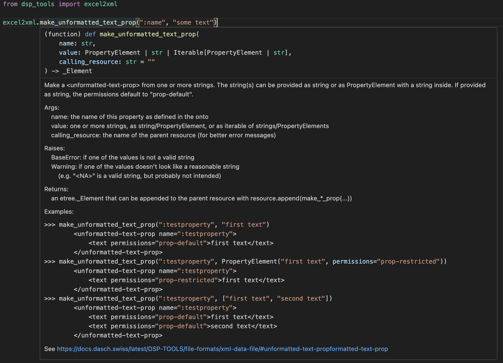

[](https://badge.fury.io/py/dsp-tools)

# `excel2xml`: Convert a data source to XML
dsp-tools assists you in converting a data source in CSV/XLS(X) format to an XML file. There are two use cases for a 
transformation from Excel/CSV to XML: 

 - The CLI command `dsp-tools excel2xml` creates an XML file from an Excel/CSV file which is already structured 
   according to the DSP specifications. This is mostly used for DaSCH-interal data migration. **The CLI command is 
   documented [here](dsp-tools-excel.md#cli-command-excel2xml).**
 - The module `excel2xml` can be imported into a custom Python script that transforms any tabular data into an XML. This
   use case is more frequent, because data from research projects have a variety of formats/structures. **The 
   `excel2xml` module is documented on this page.**


# How to use the module excel2xml
Save the following files into a directory, and run the Python script: 

 - sample data: [excel2xml_sample_data.csv](./assets/templates/excel2xml_sample_data.csv)
 - sample ontology: [excel2xml_sample_onto.json](./assets/templates/excel2xml_sample_onto.json)
 - sample script: [excel2xml_sample_script.py](./assets/templates/excel2xml_sample_script.py)

This is the simplified pattern how the Python script works:

```python
1  main_df = pd.read_csv("excel2xml_sample_data.csv", dtype="str", sep=",")
2  root = excel2xml.make_root(...)
3  root = excel2xml.append_permissions(root)
4  # if necessary: create list mappings, according to explanation below
5  for index, row in main_df.iterrows():
6      resource = excel2xml.make_resource(...)
7      resource.append(excel2xml.make_text_prop(...))
8      root.append(resource)
9  excel2xml.write_xml(root, "data.xml")
```
```
1 read in your data source with the pandas library (https://pandas.pydata.org/)  
2 create the root element `<knora>`  
3 append the permissions  
4 if necessary: create list mappings (see below)  
5 iterate through the rows of your data source:  
6   create the `<resource>` tag  
7   append properties to it  
8   append the resource to the root tag `<knora>`  
9 save the finished XML file  
```

<br>
In the following, these steps are explained in-depth.


## Read data source, create root element `<knora>`, append permissions
In the first paragraph of the sample script, insert your ontology name, project shortcode, and the path to your data 
source. If necessary, activate one of the lines that are commented out.  

Then, the root element is created, which represents the `<knora>` tag of the XML document. As first children of 
`<knora>`, some standard permissions are added. At the end, please carefully check the permissions of the finished XML
file if they meet your requirements, and adapt them if necessary.  

The standard permission of a resource is `res-default`, and of a property `prop-default`. If you don't specify it 
otherwise, all resources and properties get these permissions. 

With `excel2xml`, it is not possible to create resources/properties that don't have permissions, because they would be 
invisible for all users except project admins and system admins. [Read more about permissions 
here](./dsp-tools-xmlupload.md#how-to-use-the-permissions-attribute-in-resourcesproperties).


## Create list mappings
Let's assume that your data source has a column containing list values named after the "label" of the JSON project list, 
instead of the "name" which is needed for the `dsp-tools xmlupload`. You need a way to get the names from the labels.
If your data source uses the labels correctly, this is an easy task: The method `create_json_list_mapping()` creates a
dictionary that maps the labels to the names.  
If, however, your data source has spelling variants, you need the more sophisticated approach of 
`create_json_excel_list_mapping()`: This method creates a dictionary that maps the list values in your data source to their 
correct JSON project node name. This happens based on string similarity. Please carefully check the result if there are
no false matches!


## Iterate through the rows of your data source
With the help of Pandas, you can then iterate through the rows of your Excel/CSV, and create resources and properties. 
This works as follows:


### Create the ID of a resource
The method `make_xsd_id_compatible(string)` makes a string compatible with the constraints of xsd:ID, so that it can be 
used as ID of a resource.


### Create a property
For every property, there is a helper function that explains itself when you hover over it. So you don't need to worry 
any more how to construct a certain XML value for a certain property. 

Here's how the Docstrings assist you:

 - method signature: names of the parameters and accepted types
 - short explanation how the method behaves
 - usage examples
 - link to the dsp-tools documentation of this property
 - a short description for every parameter
 - short description of the returned object. `etree.Element` is a type annotation of the underlying library. You don't 
   have to care about it, as long as you proceed as described (append the returned object to the parent resource).




### `PropertyElement`
There are two possibilities how to create a property: The value can be passed as it is, or as `PropertyElement`. If it
is passed as it is, the `permissions` are assumed to be `prop-default`, texts are assumed to be encoded as `utf8`, and 
the value won't have a comment:
```
make_text_prop(":testproperty", "first text")
```
```
    <text-prop name=":testproperty">
        <text encoding="utf8" permissions="prop-default">first text</text>
    </text-prop>
```

If you want to change these defaults, you have to use a `PropertyElement` instead:
```
make_text_prop(
    ":testproperty", 
    PropertyElement(
        value="first text", 
        permissions="prop-restricted", 
        encoding="xml",
        comment="some comment"
    )
)
```
```
    <text-prop name=":testproperty">
        <text encoding="xml" permissions="prop-restricted" comment="some comment">first text</text>
    </text-prop>
```


### Supported boolean formats
For `make_boolean_prop(cell)`, the following formats are supported:

 - true: True, "true", "True", "1", 1, "yes", "Yes"
 - false: False, "false", "False", "0", 0, "no", "No"


### Check if a cell contains a usable value
The method `check_notna(cell)` checks a value if it is usable in the context of data archiving. A value is considered 
usable if it is

 - a number (integer or float, but not numpy.nan)
 - a boolean
 - a string with at least one Unicode letter (`\p{L}`), underscore, ?, !, or number, but not "None", "<NA>", "N/A", or "-"
 - a PropertyElement whose "value" fulfills the above criteria


### Calendar date parsing
The method `find_date_in_string(string)` tries to find a calendar date in a string. If successful, it 
returns the DSP-formatted date string.

Notes:

 - The date can be embedded in text. 
 - Only the first date found is returned.
 - By default, dates are interpreted as CE (Christian era) in the Gregorian calendar.
 - The years 0000-2999 are supported, in 4-digit form.
 - Dates written with slashes are always interpreted in a European manner: 5/11/2021 is the 5th of November.

Currently supported date formats:

| Input             | Output                                |
|-------------------|---------------------------------------|
| 0476_09_04        | GREGORIAN:CE:0476-09-04:CE:0476-09-04 |
| 0476-09-04        | GREGORIAN:CE:0476-09-04:CE:0476-09-04 |
| 30.4.2021         | GREGORIAN:CE:2021-04-30:CE:2021-04-30 |
| 5/11/2021         | GREGORIAN:CE:2021-11-05:CE:2021-11-05 |
| Jan 26, 1993      | GREGORIAN:CE:1993-01-26:CE:1993-01-26 |
| February26,2051   | GREGORIAN:CE:2051-02-26:CE:2051-02-26 |
| 28.2.-1.12.1515   | GREGORIAN:CE:1515-02-28:CE:1515-12-01 |
| 25.-26.2.0800     | GREGORIAN:CE:0800-02-25:CE:0800-02-26 |
| 1.9.2022-3.1.2024 | GREGORIAN:CE:2022-09-01:CE:2024-01-03 |
| 1848              | GREGORIAN:CE:1848:CE:1848             |
| 1849/1850         | GREGORIAN:CE:1849:CE:1850             |
| 1849/50           | GREGORIAN:CE:1849:CE:1850             |
| 1845-50           | GREGORIAN:CE:1845:CE:1850             |
