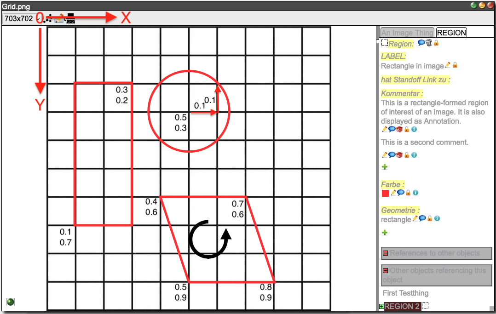

[](https://badge.fury.io/py/dsp-tools)

# DSP XML file format for importing data

With dsp-tools, data can be imported into a DSP repository (on a DSP server) from an XML file. The import file is a
standard XML file as described on this page. After a successful upload of the data, an output file is written (called 
`id2iri_mapping_[timstamp].json`) with the mapping from the internal IDs used inside the XML to their corresponding IRIs which
uniquely identify them inside DSP. This file should be kept if data is later added with the `--incremental` [option](#incremental-xml-upload).

The command to import an XML file on a DSP server is described [here](./dsp-tools-usage.md#upload-data-to-a-dsp-server).

The import file must start with the standard XML header:

```
<?xml version='1.0' encoding='utf-8'?>
```


## The root element &lt;knora&gt;

The `<knora>` element describes all resources that should be imported. It has the following attributes:

- `xmlns`: `"https://dasch.swiss/schema"` (required)
- `xmlns:xsi`: `"http://www.w3.org/2001/XMLSchema-instance"` (required)
- `xsi:schemaLocation`: `"https://dasch.swiss/schema https://raw.githubusercontent.com/dasch-swiss/dsp-tools/main/knora/dsplib/schemas/data.xsd"` (
  required)
- `shortcode`: project shortcode, e.g. "0801" (required)
- `default-ontology`: name of the ontology (required)

The `<knora>` element may look as follows:

```xml
<knora
    xmlns="https://dasch.swiss/schema"
    xmlns:xsi="http://www.w3.org/2001/XMLSchema-instance"
    xsi:schemaLocation="https://dasch.swiss/schema https://raw.githubusercontent.com/dasch-swiss/dsp-tools/main/knora/dsplib/schemas/data.xsd"
    shortcode="0806"
    default-ontology="webern">
 ...
</knora>
```

The `<knora>` element can only contain the following sub-elements:

- `<permissions>` (optional)
- `<resource>`


## Describing permissions with &lt;permissions&gt; elements

The DSP server provides access control for each resource and each field of a resource through permissions. For a
thorough explanation of the permission and access system of DSP, see
[DSP permissions](https://docs.dasch.swiss/latest/DSP-API/02-knora-ontologies/knora-base/#permissions).

It is optional to define permissions in the XML. If not defined, default permissions are applied, so that only project and 
system administrators can view and edit resources. All other users have no rights at all, not even view or restricted view permissions.

The following access rights are defined by DSP:

- (no right): If no permission is defined for a certain group of users, these users cannot view any resources/values.
- `RV` _restricted view permission_: Same as `V`, but if it is applied to an image, the image is shown with a reduced resolution or with a watermark overlay.
- `V` _view permission_: The user can view a resource or a value, but cannot modify it.
- `M` _modifiy permission_: The user can modify the element, but cannot mark it as deleted. The original resource or value will be preserved.
- `D` _delete permission_: The user is allowed to mark an element as deleted. The original resource or value will be preserved.
- `CR` _change right permission_: The user can change the permission of a resource or value. The user is also allowed to permanently delete (erase) a resource.

The user does not hold the permissions directly, but belongs to an arbitrary number of groups which hold the
permissions. By default, the following groups always exist, and each user belongs to at least one of them:

- `UnknownUser`: The user is not known to DSP (not logged in).
- `KnownUser`: The user is known (logged in), but is not a member of the project the data element belongs to.
- `ProjectMember`: The user belongs to the same project as the data element.
- `ProjectAdmin`: The user is project administrator in the project the data element belongs to.
- `Creator`: The user is the owner of the element (created the element).
- `SystemAdmin`: The user is a system administrator.

In addition, more groups with arbitrary names can be created by a project admin. See [here](dsp-tools-create.md#groups) 
how to create a group in an ontology JSON file. For referencing a group, the project name has to be prepended to the 
group name, separated by a colon, e.g. `dsp-test:MlsEditors`.

A `<permissions>` element contains the permissions given to the selected groups and is called a _permission set_. It has
a mandatory attribute `id` and must contain at least one `<allow>` element:

```xml
<permissions id="res-default">
  <allow group="UnknownUser">RV</allow>
  <allow group="KnownUser">V</allow>
  <allow group="ProjectAdmin">CR</allow>
  <allow group="Creator">CR</allow>
  <allow group="dsp-test:MlsEditors">D</allow>
</permissions>
```

If you don't want a group to have access at all, leave it out. In the following example, resources or properties with 
permission `special-permission` can only be viewed by `ProjectAdmin`s:

```xml
<permissions id="special-permission">
  <allow group="ProjectAdmin">CR</allow>
</permissions>
```

Note: The permissions defined in the XML are applied to resources that are created. But only project or system 
administrators have the permission to create resources via the XML upload.


### The &lt;allow&gt; sub-element

The `<allow>` element is used to define the permission for a specific group. It is of the following form:

```xml
<allow group="ProjectAdmin">CR</allow>
```

The values `CR` etc. are described above.

The `group` attribute is mandatory. It defines the group which the permission is applied to. In addition to the DSP 
system groups, project specific groups are supported as well. A project specific group name has the form 
`project-shortname:groupname`. The available system groups are described above. 

There are no sub-elements allowed for the `<allow>` element.


### Example of a permissions section

A complete `<permissions>` section may look as follows:

```xml
<knora
    xmlns="https://dasch.swiss/schema"
    xmlns:xsi="http://www.w3.org/2001/XMLSchema-instance"
    xsi:schemaLocation="https://dasch.swiss/schema https://raw.githubusercontent.com/dasch-swiss/dsp-tools/main/knora/dsplib/schemas/data.xsd"
    shortcode="0806"
    default-ontology="webern">
  
  <permissions id="res-default">
    <allow group="UnknownUser">RV</allow>
    <allow group="KnownUser">V</allow>
    <allow group="Creator">CR</allow>
    <allow group="ProjectAdmin">CR</allow>
  </permissions>
  
  <permissions id="res-restricted">
    <allow group="KnownUser">V</allow>
    <allow group="Creator">CR</allow>
    <allow group="ProjectAdmin">CR</allow>
  </permissions>
  
  <permissions id="prop-default">
    <allow group="UnknownUser">V</allow>
    <allow group="KnownUser">V</allow>
    <allow group="Creator">CR</allow>
    <allow group="ProjectAdmin">CR</allow>
  </permissions>
  
  <permissions id="prop-restricted">
    <allow group="KnownUser">RV</allow>
    <allow group="Creator">CR</allow>
    <allow group="ProjectAdmin">CR</allow>
  </permissions>
  ...
</knora>
```


### How to use the `permissions` attribute in resources/properties

Based on the permissions section of the above example, there are different ways how to grant permissions to a resource
and its properties. It is important to note that a resource doesn't inherit its permissions to its properties. Each 
property must have its own permissions. So, in the following example, the bitstreams don't inherit the permissions from their 
resource:

```
<resource ...>
    <bitstream permissions="prop-default">
        postcards/images/EURUS015a.jpg
    </bitstream>
</resource>
<resource ...>
    <bitstream permissions="prop-restricted">
        postcards/images/EURUS015a.jpg
    </bitstream>
</resource>
<resource ...>
    <bitstream>
        postcards/images/EURUS015a.jpg
    </bitstream>
</resource>
```

To take `KnownUser` as example:

 - With `permissions="prop-default"`, a logged-in user who is not member of the project (`KnownUser`) has `V` rights 
   on the image: Normal view.
 - With `permissions="prop-restricted"`, a logged-in user who is not member of the project (`KnownUser`) has `RV` 
   rights on the image: Blurred image.
 - With a blank `<bitstream>` tag, a logged-in user who is not member of the project (`KnownUser`) has no rights on 
   the image: No view possible. Only users from `ProjectAdmin` upwards are able to look at the image.


## Describing resources with the &lt;resource&gt; element

A `<resource>` element contains all necessary information to create a resource. It has the following attributes:

- `label` (required): a human-readable, preferably meaningful short name of the resource
- `restype` (required): the resource type as defined within the ontology 
- `id` (required): a unique, arbitrary string providing a unique ID to the resource in order to be referencable by other 
  resources; the ID is only used during the import process and later replaced by the IRI used internally by DSP 
- `permissions` (optional, but if omitted, users who are lower than a `ProjectAdmin` have no permissions at all, not 
  even view rights): a reference to a permission set; the permissions will be applied to the created resource 
- `iri` (optional): a custom IRI, used when migrating existing resources (DaSCH-internal only)
- `ark` (optional): a version 0 ARK, used when migrating existing resources. It is not possible 
  to use `iri` and `ark` in the same resource. When `ark` is used, it overrides `iri` (DaSCH-internal only).
- `creation_date` (optional): the creation date of the resource, used when migrating existing resources
  . It must be formatted according to the constraints of [xsd:dateTimeStamp](https://www.w3.org/TR/xmlschema11-2/#dateTimeStamp), 
  which means that the timezone is required, e.g.: `2005-10-23T13:45:12.502951+02:00` (DaSCH-internal only)

A complete `<resource>` element may look as follows:

```xml
<resource label="EURUS015a"
          restype=":Postcard"
          id="238807"
          permissions="res-def-perm">
   ...
</resource>
```

For every property that the ontology requires, the `<resource>` element contains one property 
element (e.g. `<integer-prop name="property_name>`). The property element contains one or more values.

Example of a property element of type integer with two values:
```xml
<integer-prop name=":hasInteger">
    <integer permissions="prop-default">4711</integer>
    <integer permissions="prop-default">1</integer>
</integer-prop>
```

The following property elements exist:

- `<bitstream>`: contains a path to a file (if the resource is a multimedia resource)
- `<boolean-prop>`: contains a boolean value
- `<color-prop>`: contains color values
- `<date-prop>`: contains date values
- `<decimal-prop>`: contains decimal values
- `<geometry-prop>`: contains JSON geometry definitions for a region
- `<geoname-prop>`: contains [geonames.org](https://www.geonames.org/) location codes
- `<list-prop>`: contains list element labels
- `<integer-prop>`: contains integer values
- `<interval-prop>`: contains interval values
- `<period-prop>`: contains time period values (not yet implemented)
- `<resptr-prop>`: contains links to other resources
- `<text-prop>`: contains text values
- `<time-prop>`: contains time values
- `<uri-prop>`: contains URI values


### &lt;bitstream&gt;

The `<bitstream>` element is used for bitstream data. It contains the path to a bitstream object like an image file, a
ZIP container, an audio file etc. It must only be used if the resource is a `StillImageRepresentation`, an
`AudioRepresentation`, a `DocumentRepresentation` etc.

Note:

- There is only _one_ `<bitstream>` element allowed per representation!
- The `<bitstream>` element must be the first element!

Supported file extensions:

| Representation              | Supported formats                      |
|-----------------------------|----------------------------------------|
| `ArchiveRepresentation`     | ZIP, TAR, GZ, Z, TAR.GZ, TGZ, GZIP, 7Z |
| `AudioRepresentation`       | MP3, WAV                               |
| `DocumentRepresentation`    | PDF, DOC, DOCX, XLS, XLSX, PPT, PPTX   |
| `MovingImageRepresentation` | MP4                                    |
| `StillImageRepresentation`  | JPG, JPEG, PNG, TIF, TIFF, JP2         |
| `TextRepresentation`        | TXT, CSV, XML, XSL, XSD                |

For more details, please consult the [API docs](https://docs.dasch.swiss/latest/DSP-API/01-introduction/file-formats/).

Attributes:

- `permissions` : Permission ID (optional, but if omitted, users who are lower than a `ProjectAdmin` have no permissions at all, not even view rights)

Example of a public image inside a `StillImageRepresentation`:
```xml
<resource restype=":Image" id="image_1" label="image_1" permissions="res-default">
    <bitstream permissions="prop-default">postcards/images/EURUS015a.jpg</bitstream>
</resource>
```


### &lt;boolean-prop&gt;

The `<boolean-prop>` element is used for boolean values. It must contain exactly one `<boolean>` element.

Attributes:

- `name`: name of the property as defined in the ontology (required)


#### &lt;boolean&gt;

The `<boolean>` element must contain the string "true" or "false", or the numeral 1 (true) or 0 (false).

Attributes:

- `permissions`: Permission ID (optional, but if omitted, users who are lower than a `ProjectAdmin` have no permissions at all, not even view rights)
- `comment`: a comment for this specific value (optional)

Example of a public and a hidden boolean property:
```
<boolean-prop name=":hasBoolean">
  <boolean permissions="prop-default">true</boolean>
</boolean-prop>
<boolean-prop name=":hasHiddenBoolean">
  <boolean>0</boolean>
</boolean-prop>
```


### &lt;color-prop&gt;

The `<color-prop>` element is used for color values. It must contain at least one `<color>` element.

Attributes:

- `name`: name of the property as defined in the ontology (required)


#### &lt;color&gt;

The `<color>` element is used to indicate a color value. The color has to be given in web-notation, that is a `#`
followed by 3 or 6 hex numerals.

Attributes:

- `permissions`: Permission ID (optional, but if omitted, users who are lower than a `ProjectAdmin` have no permissions at all, not even view rights)
- `comment`: a comment for this specific value (optional)

Example of a property with a public and a hidden color value:
```xml
<color-prop name=":hasColor">
    <color permissions="prop-default">#00ff66</color>
    <color>#ff00ff</color>
</color-prop>
```


### &lt;date-prop&gt;

The `<date-prop>` element is used for date values. It must contain at least one `<date>` element.

Attributes:

- `name`: name of the property as defined in the ontology (required)


#### &lt;date&gt;

the `<date>` element contains a DSP-specific date value. It has the following format:

```
calendar:epoch:yyyy-mm-dd:epoch:yyyy-mm-dd
```

- `calendar`: either "JULIAN" or "GREGORIAN" (optional, default: GREGORIAN)
- `epoch`: either "BCE" or "CE" (optional, default CE)
- `yyyy`: year with four digits (required)
- `mm`: month with two digits (optional, e.g. 01, 02, ..., 12)
- `dd`: day with two digits (optional, e.g. 01, 02, ..., 31)

Notes:

- If the day is omitted, then the precision is month, if also the month is omitted, the precision is year.
- Internally, a date is always represented as a start and end date. 
- If start and end date match, it's an exact date. 
- If start and end date don't match, it's a range.
- If the end date is omitted, it's a range from the earliest possible beginning of the start date to the latest possible 
  end of the start date. For example:
    - "1893" will be expanded to a range from January 1st 1893 to December 31st 1893.
    - "1893-01" will be expanded to a range from January 1st 1893 to January 31st 1893.
    - "1893-01-01" will be expanded to the exact date January 1st 1893 to January 1st 1893 (technically also a range).

Attributes:

- `permissions`: Permission ID (optional, but if omitted, users who are lower than a `ProjectAdmin` have no permissions at all, not even view rights)
- `comment`: a comment for this specific value (optional)

Example of a property with a public and a hidden date value:
```xml
<date-prop name=":hasDate">
  <date permissions="prop-default">GREGORIAN:CE:2014-01-31</date>
  <date>GREGORIAN:CE:1930-09-02:CE:1930-09-03</date>
</date-prop>
```


### &lt;decimal-prop&gt;

The `<decimal-prop>` element is used for decimal values. It must contain at least one `<decimal>` element.

Attributes:

- `name`: name of the property as defined in the ontology (required)


#### &lt;decimal&gt;

The `<decimal>` element contains a decimal number.

Attributes:

- `permissions`: Permission ID (optional, but if omitted, users who are lower than a `ProjectAdmin` have no permissions at all, not even view rights)
- `comment`: a comment for this specific value (optional)

Example of a property with a public and a hidden decimal value:
```xml
<decimal-prop name=":hasDecimal">
    <decimal permissions="prop-default">3.14159</decimal>
    <decimal>2.71828</decimal>
</decimal-prop>
```


### &lt;geometry-prop&gt;

The `<geometry-prop>` element is used for a geometric definition of a 2-D region (e.g. a region on an image). It must
contain at least one `<geometry>` element. A `<geometry-prop>` can only be used inside a [`<region>` tag](#region). 

Attributes:

- `name`: the only allowed name is `hasGeometry`, because this property is a DSP base property that can only be used in 
  the [`<region>` tag](#region).


#### &lt;geometry&gt;

A geometry value is defined as a JSON object. It contains the following data:

- `status`: "active" or "deleted"
- `type`: "circle", "rectangle" or "polygon" (only the rectangle can be displayed in DSP-APP. The others can be 
  looked at in another frontend, e.g. in TANGOH.)
- `lineColor`: web-color
- `lineWidth`: integer number (in pixels)
- `points`: array of coordinate objects of the form `{"x": decimal, "y": decimal}`
- `radius`: coordinate object of the form `{"x": decimal, "y": decimal}`
- In the SALSAH data, there is also a key named `original_index` in the JSON format of all three shapes, but it doesn't 
  seem to have an influence on the shapes that TANGOH displays, so it can be omitted. 

Attributes:

- `permissions`: Permission ID (optional, but if omitted, users who are lower than a `ProjectAdmin` have no permissions at all, not even view rights)
- `comment`: a comment for this specific value (optional)

Example:
```
<geometry-prop name="hasGeometry">
    <geometry permissions="prop-default">
        {
            "status": "active",
            "type": "rectangle",
            "lineColor": "#ff1100",
            "lineWidth": 5,
            "points": [
                {"x":0.1,"y":0.7},
                {"x":0.3,"y":0.2}
            ]
        }
    </geometry>
    <geometry permissions="prop-default">
        {
            "status": "active",
            "type": "circle",
            "lineColor": "#ff1100",
            "lineWidth": 5,
            "points": [{"x":0.5,"y":0.3}],
            "radius": {"x":0.1,"y":0.1}     // vector (0.1, 0.1)
        }
    </geometry>
    <geometry permissions="prop-default">
        {
            "status": "active",
            "type": "polygon",
            "lineColor": "#ff1100",
            "lineWidth": 5,
            "points": [{"x": 0.4, "y": 0.6},
                       {"x": 0.5, "y": 0.9},
                       {"x": 0.8, "y": 0.9},
                       {"x": 0.7, "y": 0.6}]
        }
    </geometry>
</geometry-prop>
```

The underlying grid is a 0-1 normalized top left-anchored grid. The following coordinate system shows the three shapes
that were defined above:



### &lt;geoname-prop&gt;

The `<geoname-prop>` element is used for values that contain a [geonames.org](http://geonames.org) ID. It must contain
at least one `<geoname>` element.

Attributes:

- `name`: name of the property as defined in the ontology (required)


#### &lt;geoname&gt;

Contains a valid [geonames.org](http://geonames.org) ID.

Attributes:

- `permissions`: Permission ID (optional, but if omitted, users who are lower than a `ProjectAdmin` have no permissions at all, not even view rights)
- `comment`: a comment for this specific value (optional)

Example of a property with a public link to Vienna and a hidden link to Basel:
```xml
<geoname-prop name=":hasLocation">
    <geoname permissions="prop-default">2761369</geoname>
    <geoname>2661604</geoname>
</geoname-prop>
```


### &lt;integer-prop&gt;

The `<integer-prop>` element is used for integer values. It must contain at least one `<integer>` element.

Attributes:

- `name`: name of the property as defined in the ontology (required)


#### &lt;integer&gt;

The `<integer>` element contains an integer value.

Attributes:

- `permissions`: Permission ID (optional, but if omitted, users who are lower than a `ProjectAdmin` have no permissions at all, not even view rights)
- `comment`: a comment for this specific value (optional)

Example of a property with a public and a hidden integer value:
```xml
<integer-prop name=":hasInteger">
    <integer permissions="prop-default">4711</integer>
    <integer>1</integer>
</integer-prop>
```


### &lt;interval-prop&gt;

The `<interval-prop>` element is used for intervals with a start and an end point on a timeline, e.g. relative to the beginning of an audio or video file. 
An `<interval-prop>`  must contain at least one `<interval>` element.

Attributes:

- `name`: name of the property as defined in the ontology (required)


#### &lt;interval&gt;

A time interval is represented by plain decimal numbers (=seconds), without a special notation for minutes and hours. 
The `<interval>` element contains two decimals separated by a colon (`:`). The places before the decimal point are 
seconds, and the places after the decimal points are fractions of a second.

Attributes:

- `permissions`: Permission ID (optional, but if omitted, users who are lower than a `ProjectAdmin` have no permissions at all, not even view rights)
- `comment`: a comment for this specific value (optional)

Example of a property with a public and a hidden interval value:
```xml
<interval-prop name=":hasInterval">
    <interval permissions="prop-default">60.5:120.5</interval>   <!-- 0:01:00.5 - 0:02:00.5 -->
    <interval>61:3600</interval>                                 <!-- 0:01:01 - 1:00:00 -->
</interval-prop>
```


### &lt;list-prop&gt;

The `<list-prop>` element is used as entry point into a list (list node). List nodes are identified by their `name`
attribute that was given when creating the list nodes (which must be unique within each list!). It must contain at least
one `<list>` element.

Attributes:

- `name`: name of the property as defined in the ontology (required)
- `list`: name of the list as defined in the ontology (required)


#### &lt;list&gt;

The `<list>` element references a node in a (pull-down or hierarchical) list.

Attributes:

- `permissions`: Permission ID (optional, but if omitted, users who are lower than a `ProjectAdmin` have no permissions at all, not even view rights)
- `comment`: a comment for this specific value (optional)

Example of a property with a public and a hidden list value:
```xml
<list-prop list="category" name=":hasCategory">
    <list permissions="prop-default">physics</list>
    <list>nature</list>
</list-prop>
```


### &lt;resptr-prop&gt;

The `<resptr-prop>` element is used to link other resources within DSP. It must contain at least one `<resptr>` element.

Attributes:

- `name`: name of the property as defined in the ontology (required)


#### &lt;resptr&gt;

The `<resptr>` element contains either the internal ID of another resource inside the XML or the IRI of an already
existing resource on DSP. Inside the same XML file, a mixture of the two is not possible. If referencing existing
resources, `xmlupload --incremental` has to be used.

Attributes:

- `permissions`: Permission ID (optional, but if omitted, users who are lower than a `ProjectAdmin` have no permissions at all, not even view rights)
- `comment`: a comment for this specific value (optional)

Example of a property with a public link to `<resource id="res_1" ...>` and a hidden link to and `<resource id="res_2" ...>`:
```xml
<resptr-prop name=":hasReferenceTo">
    <resptr permissions="prop-default">res_1</resptr>
    <resptr>res_2</resptr>
</resptr-prop>
```


### &lt;text-prop&gt;

The `<text-prop>` element is used for text values. It must contain at least one `<text>` element.

Attributes:

- `name`: name of the property as defined in the ontology (required)


#### &lt;text&gt;

The `<text>` element has the following attributes:

- `encoding`: either "utf8" or "xml" (required)
    - `utf8`: simple text without markup
    - `xml`: complex text with markup. It must follow the XML format as defined by the
    [DSP standard mapping](https://docs.dasch.swiss/latest/DSP-API/03-apis/api-v2/xml-to-standoff-mapping/).
- `permissions`: Permission ID (optional, but if omitted, users who are lower than a `ProjectAdmin` have no permissions at all, not even view rights)
- `comment`: a comment for this specific value (optional)

Within a text property, multiple simple (UTF8) and complex (XML) text values may be mixed.  
Both simple and complex text values can be used inside all `gui_element`s that are defined in an ontology (`SimpleText`, 
`Richtext`, `Textarea`, see [here](dsp-tools-create-ontologies.md#textvalue)). But typically, you would use UTF8 in a 
`SimpleText`, and XML in `Richtext` or `Textarea`.

Example of a public simple text and a hidden complex text:
```xml
<text-prop name=":hasComment">
    <text encoding="utf8" permissions="prop-default">Probe bei "Wimberger". Lokal in Wien?</text>
    <text encoding="xml">
        <strong>Bold text</strong> and a <a class="salsah-link" href="IRI:obj_0003:IRI">link to an ID</a>
        and a <a class="salsah-link" href="http://rdfh.ch/4123/nyOODvYySV2nJ5RWRdmOdQ">link to an IRI</a>
    </text>
</text-prop>
```

The complex text above contains a link to the resource `obj_0003`, which is defined in the same XML file. 
It also contains a link to  the resource `http://rdfh.ch/4123/nyOODvYySV2nJ5RWRdmOdQ`, which already exists on the DSP server.

For simple texts, it is not advised to add XML-"pretty-print" whitespaces or line breaks, because they will be taken 
into the text field as they are. 


### &lt;time-prop&gt;

The `<time-prop>` element is used for time values in the Gregorian calendar. It must contain at least one `<time>` element.

Attributes:

- `name`: name of the property as defined in the ontology (required)


#### &lt;time&gt;

The `<time>` element represents an exact datetime value in the form [xsd:dateTimeStamp](https://www.w3.org/TR/xmlschema11-2/#dateTimeStamp), 
which is defined as `yyyy-mm-ddThh:mm:ss.sssssssssssszzzzzz`. The following abbreviations describe this form:

- `yyyy`: a four-digit numeral that represents the year. The value cannot start with a minus (-) or a plus (+) sign.
  0001 is the lexical representation of the year 1 of the Common Era (also known as 1 AD). The value cannot be 0000. The
  calendar is always the Gregorian calendar.
- `mm`: a two-digit numeral that represents the month
- `dd`: a two-digit numeral that represents the day
- `hh`: a two-digit numeral representing the hours. Must be between 0 and 23
- `mm`: a two-digit numeral that represents the minutes
- `ss`: a two-digit numeral that represents the seconds
- `ssssssssssss`: If present, a 1-to-12-digit numeral that represents the fractional seconds (optional)
- `zzzzzz`: represents the time zone (required).

Each part of the datetime value that is expressed as a numeric value is constrained to the maximum value within the 
interval that is determined by the next higher part of the datetime value.
For example, the day value can never be 32 and cannot be 29 for month 02 and year 2002 (February 2002).

The timezone is defined as follows:

- A plus (+) or minus (-) sign that is followed by hh:mm:
    - `+`: Indicates that the specified time instant is in a time zone that is ahead of the UTC time by hh hours and mm
      minutes.
    - `-`: Indicates that the specified time instant is in a time zone that is behind UTC time by hh hours and mm
      minutes.
    - `hh`: a two-digit numeral (with leading zeros as required) that represents the hours. The value must be between
      -14 and +14, inclusive.
    - `mm`: a two-digit numeral that represents the minutes. The value must be zero when hh is equal to 14.
- Z: The literal Z, which represents the time in UTC (Z represents Zulu time, which is equivalent to UTC). Specifying Z
  for the time zone is equivalent to specifying +00:00 or -00:00.

Attributes:

- `permissions`: Permission ID (optional, but if omitted, users who are lower than a `ProjectAdmin` have no permissions at all, not even view rights)
- `comment`: a comment for this specific value (optional)

Example of a property with a public and a hidden time value:
```xml
<time-prop name=":hasTime">
    <time permissions="prop-default">2019-10-23T13:45:12Z</time>
    <time>2009-10-10T12:00:00-05:00</time>
</time-prop>
```


### &lt;uri-prop&gt;

The `<uri-prop>` represents a [Uniform Resource Identifier](https://en.wikipedia.org/wiki/Uniform_Resource_Identifier).
It must contain at least one `<uri>` element.

Attributes:

- `name`: name of the property as defined in the ontology (required)


#### &lt;uri&gt;

The `<uri>` element contains a syntactically valid URI.

Attributes:

- `permissions`: Permission ID (optional, but if omitted, users who are lower than a `ProjectAdmin` have no permissions at all, not even view rights)
- `comment`: a comment for this specific value (optional)

Example of a property with a public and a hidden URI:
```xml
<uri-prop name=":hasURI">
    <uri permissions="prop-default">http://www.groove-t-gang.ch</uri>
    <uri>http://dasch.swiss</uri>
</uri-prop>
```


## DSP base resources / base properties to be used directly in the XML file
There is a number of base resources and base properties that must not be subclassed in a project ontology. They are 
directly available in the XML data file. Please have in mind that built-in names of the knora-base ontology must be used 
without prepended colon.  
See also [the related part of the ontology documentation](dsp-tools-create-ontologies.md#dsp-base-resources--base-properties-to-be-used-directly-in-the-xml-file)

### `<annotation>`
`<annotation>` is an annotation to another resource of any class. It must have the following predefined properties:

- `hasComment` (1-n)
- `isAnnotationOf` (1)

Example:
```xml
<annotation label="Annotation to another resource" id="annotation_0" permissions="res-default">
    <text-prop name="hasComment">
        <text encoding="utf8" permissions="prop-default">This is an annotation to a resource.</text>
    </text-prop>
    <resptr-prop name="isAnnotationOf">
        <resptr permissions="prop-default">img_1</resptr>
    </resptr-prop>
</annotation>
```

Technical note: An `<annotation>` is in fact a `<resource restype="Annotation">`. But it is mandatory to use the 
shortcut, so that the XML file can be validated more precisely.

### `<region>`
A `<region>` resource defines a region of interest (ROI) in an image. It must have the following predefined properties:

- `hasColor` (1)
- `isRegionOf` (1)
- `hasGeometry` (1)
- `hasComment` (1-n)

Example:
```xml
<region label="Rectangle in image" id="region_0" permissions="res-default">
    <color-prop name="hasColor">
        <color permissions="prop-default">#5d1f1e</color>
    </color-prop>
    <resptr-prop name="isRegionOf">
        <resptr permissions="prop-default">img_1</resptr>
    </resptr-prop>
    <geometry-prop name="hasGeometry">
        <geometry permissions="prop-default">
            {
                "status": "active",
                "type": "rectangle",
                "lineColor": "#ff1100",
                "lineWidth": 5,
                "points": [
                    {"x":0.1,"y":0.7},
                    {"x":0.3,"y":0.2}
                ]
            }
        </geometry>
    </geometry-prop>
    <text-prop name="hasComment">
        <text encoding="utf8" permissions="prop-default">This is a rectangle-formed region of interest.</text>
    </text-prop>
</region>
```

More details about the `<geometry-prop>` are documented [here](#geometry-prop).

Technical note: A `<region>` is in fact a `<resource restype="Region">`. But it is mandatory to use the 
shortcut, so that the XML file can be validated more precisely.
 


### `<link>`
`<link>` is a resource linking together several other resources of different classes. It must have the following 
predefined properties:

- `hasComment` (1-n)
- `hasLinkTo` (1-n)

Example:
```xml
<link label="Link between three resources" id="link_obj_0" permissions="res-default">
    <text-prop name="hasComment">
        <text permissions="prop-default" encoding="utf8">
            A link object can link together an arbitrary number of resources from any resource class.
        </text>
    </text-prop>
    <resptr-prop name="hasLinkTo">
        <resptr permissions="prop-default">doc_001</resptr>
        <resptr permissions="prop-default">img_obj_5</resptr>
        <resptr permissions="prop-default">audio_obj_0</resptr>
    </resptr-prop>
</link>
```

Technical note: A `<link>` is in fact a `<resource restype="LinkObj">`. But it is mandatory to use the 
shortcut, so that the XML file can be validated more precisely.


## Incremental XML Upload

After a successful upload of the data, an output file is written (called `id2iri_mapping_[timstamp].json`) with the 
mapping of internal IDs used inside the XML and their corresponding IRIs which uniquely identify them inside DSP. This 
file should be kept if data is later added with the `--incremental` option. 

To do an incremental XML upload, one of the following procedures is recommended.

- Incremental XML upload with use of internal IDs:

1. Initial XML upload with internal IDs.
2. The file `id2iri_mapping_[timestamp].json` is created.
3. Create new XML file(s) with resources referencing other resources by their internal IDs in `<resptr>` (using the same IDs as in the initial XML upload).
4. Run `dsp-tools id2iri new_data.xml id2iri_mapping_[timestamp].json` to replace the internal IDs in `new_data.xml` with IRIs. Only internal IDs inside the `<resptr>` tag are replaced.
5. Run `dsp-tools xmlupload --incremental new_data.xml` to upload the data to DSP.

- Incremental XML Upload with the use of IRIs: Use IRIs in the XML to reference existing data on the DSP server.


## Complete example

```xml
<?xml version='1.0' encoding='utf-8'?>
<knora 
    xmlns="https://dasch.swiss/schema"
    xmlns:xsi="http://www.w3.org/2001/XMLSchema-instance"
    xsi:schemaLocation="https://dasch.swiss/schema https://raw.githubusercontent.com/dasch-swiss/dsp-tools/main/knora/dsplib/schemas/data.xsd"
    shortcode="0001"
    default-ontology="anything">

    <!-- permissions: see https://docs.dasch.swiss/latest/DSP-API/02-knora-ontologies/knora-base/#permissions -->
    <permissions id="res-default">
        <allow group="UnknownUser">V</allow>
        <allow group="KnownUser">V</allow>
        <allow group="Creator">CR</allow>
        <allow group="ProjectAdmin">CR</allow>
        <allow group="anything:Thing searcher">D</allow>
    </permissions>
    <permissions id="res-restricted">
        <allow group="UnknownUser">RV</allow>
        <allow group="KnownUser">V</allow>
        <allow group="Creator">CR</allow>
        <allow group="ProjectAdmin">CR</allow>
        <allow group="anything:Thing searcher">M</allow>
    </permissions>
    <permissions id="prop-default">
        <allow group="UnknownUser">V</allow>
        <allow group="KnownUser">V</allow>
        <allow group="Creator">CR</allow>
        <allow group="ProjectAdmin">CR</allow>
        <allow group="anything:Thing searcher">D</allow>
    </permissions>
    <permissions id="prop-restricted">
        <allow group="UnknownUser">RV</allow>
        <allow group="KnownUser">V</allow>
        <allow group="Creator">CR</allow>
        <allow group="ProjectAdmin">CR</allow>
        <allow group="anything:Thing searcher">M</allow>
    </permissions>
    <resource label="obj_inst1"
              restype=":BlueThing"
              id="obj_0001"
              permissions="res-default">
        <list-prop list="treelistroot" name=":hasListItem">
            <list permissions="prop-default">Tree list node 02</list>
        </list-prop>
        <list-prop list="treelistroot" name=":hasOtherListItem">
            <list permissions="prop-default">Tree list node 03</list>
        </list-prop>
        <text-prop name=":hasRichtext">
            <text permissions="prop-default" encoding="xml" >The <strong>third</strong> object and a <a class="salsah-link" href="IRI:obj_0003:IRI">link</a> to.</text>
        </text-prop>
        <text-prop name=":hasRichtext">
            <text permissions="prop-default" encoding="xml" >The <strong>third</strong> object and a <a class="salsah-link" href="IRI:obj_0003:IRI">link</a> to.</text>
        </text-prop>
        <text-prop name=":hasText">
            <text permissions="prop-default" encoding="utf8">Dies ist ein einfacher Text ohne Markup</text>
            <text permissions="prop-restricted" encoding="utf8">Nochmals ein einfacher Text</text>
        </text-prop>
        <date-prop name=":hasDate">
            <date permissions="prop-default">JULIAN:CE:1401-05-17:CE:1402-01</date>
        </date-prop>
        <integer-prop name=":hasInteger">
            <integer permissions="prop-default">4711</integer>
        </integer-prop>
        <decimal-prop name=":hasDecimal">
            <decimal permissions="prop-default" comment="Eulersche Zahl">2.718281828459</decimal>
        </decimal-prop>
        <boolean-prop name=":hasBoolean">
            <boolean permissions="prop-default">true</boolean>
        </boolean-prop>
        <uri-prop name=":hasUri">
            <uri permissions="prop-default">http://dasch.swiss/gaga</uri>
        </uri-prop>
        <interval-prop name=":hasInterval">
            <interval permissions="prop-default">12.5:14.2</interval>
        </interval-prop>
        <color-prop name=":hasColor">
            <color permissions="prop-default">#00ff00</color>
        </color-prop>
        <geoname-prop name=":hasGeoname">
            <geoname permissions="prop-default" comment="A sacred place for railroad fans">5416656</geoname>
        </geoname-prop>
        <resptr-prop name=":hasBlueThing">
            <resptr permissions="prop-default">obj_0002</resptr>
        </resptr-prop>
    </resource>

    <resource label="obj_inst2"
              restype=":BlueThing"
              id="obj_0002"
              permissions="res-default">
        <list-prop list="treelistroot" name=":hasListItem">
            <list permissions="prop-default">Tree list node 10</list>
        </list-prop>
        <list-prop list="treelistroot" name=":hasOtherListItem">
            <list permissions="prop-default">Tree list node 11</list>
        </list-prop>
        <text-prop name=":hasRichtext">
            <text permissions="prop-default" encoding="xml">What is this <em>bold</em> thing?</text>
        </text-prop>
        <text-prop name=":hasText">
            <text permissions="prop-default" encoding="utf8">aa bbb cccc ddddd</text>
        </text-prop>
        <date-prop name=":hasDate">
            <date permissions="prop-default">1888</date>
        </date-prop>
        <integer-prop name=":hasInteger">
            <integer permissions="prop-default">42</integer>
        </integer-prop>
        <decimal-prop name=":hasDecimal">
            <decimal permissions="prop-default" comment="Die Zahl PI">3.14159</decimal>
        </decimal-prop>
        <boolean-prop name=":hasBoolean">
            <boolean permissions="prop-default">false</boolean>
        </boolean-prop>
        <uri-prop name=":hasUri">
            <uri permissions="prop-default">http://unibas.ch/gugus</uri>
        </uri-prop>
        <interval-prop name=":hasInterval">
            <interval permissions="prop-default">24:100.075</interval>
        </interval-prop>
        <color-prop name=":hasColor">
            <color permissions="prop-default">#33ff77</color>
        </color-prop>
        <geoname-prop name=":hasGeoname">
            <geoname permissions="prop-default" comment="A sacred place for railroad fans">5416656</geoname>
        </geoname-prop>
        <resptr-prop name=":hasBlueThing">
            <resptr permissions="prop-default">obj_0003</resptr>
        </resptr-prop>
    </resource>

    <resource label="obj_inst3"
              restype=":BlueThing"
              id="obj_0003"
              permissions="res-default">
        <list-prop list="treelistroot" name=":hasListItem">
            <list permissions="prop-default">Tree list node 01</list>
        </list-prop>
        <list-prop list="treelistroot" name=":hasOtherListItem">
            <list permissions="prop-default">Tree list node 02</list>
        </list-prop>
        <text-prop name=":hasRichtext">
            <text permissions="prop-default" encoding="xml">This is <em>bold and <strong>strong</strong></em> text!</text>
        </text-prop>
        <text-prop name=":hasText">
            <text permissions="prop-default" encoding="utf8">aa bbb cccc ddddd</text>
        </text-prop>
        <date-prop name=":hasDate">
            <date permissions="prop-default">1888</date>
        </date-prop>
        <integer-prop name=":hasInteger">
            <integer permissions="prop-default">42</integer>
        </integer-prop>
        <decimal-prop name=":hasDecimal">
            <decimal permissions="prop-default" comment="Die Zahl PI">3.14159</decimal>
        </decimal-prop>
        <boolean-prop name=":hasBoolean">
            <boolean permissions="prop-default">false</boolean>
        </boolean-prop>
        <uri-prop name=":hasUri">
            <uri permissions="prop-default">http://unibas.ch/gugus</uri>
        </uri-prop>
        <interval-prop name=":hasInterval">
            <interval permissions="prop-default">24:100.075</interval>
        </interval-prop>
        <color-prop name=":hasColor">
            <color permissions="prop-default">#33ff77</color>
        </color-prop>
        <geoname-prop name=":hasGeoname">
            <geoname permissions="prop-default" comment="A sacred place for railroad fans">5416656</geoname>
        </geoname-prop>
    </resource>

    <resource label="obj_inst4"
              restype=":ThingPicture"
              id="obj_0004"
              permissions="res-default">
        <bitstream>gaga.tif</bitstream>
        <text-prop name=":hasPictureTitle">
            <text permissions="prop-default" encoding="utf8">This is the famous Lena</text>
        </text-prop>
    </resource>

</knora>

```
