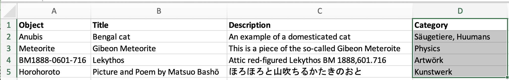
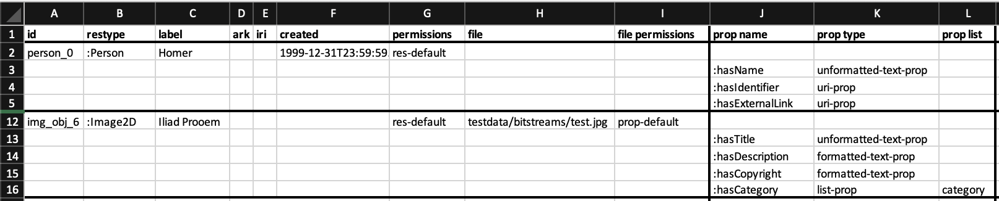
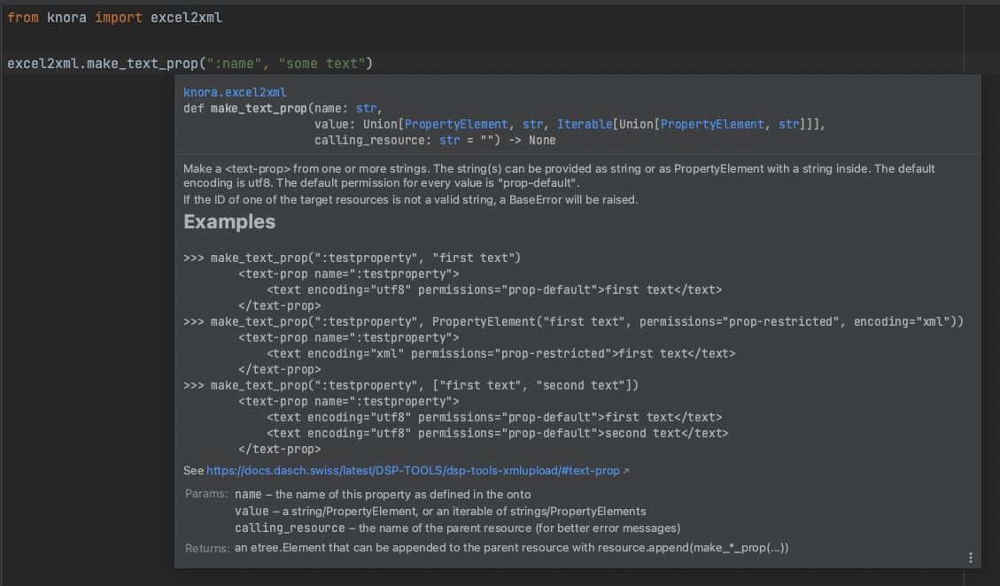

[](https://badge.fury.io/py/dsp-tools)

# The excel2xml Module

!!! warning

    The `excel2xml` module is deprecated in favor of the [`xmllib` library](./xmllib-docs/xmlroot.md).

## Two Use Cases - Two Approaches

There are two kinds of Excel files that can be transformed into an XML file:

| structure        | provenance | tool                    | example screenshot                                       |
| ---------------- | ---------- | ----------------------- | -------------------------------------------------------- |
| custom structure | customer   | module `excel2xml`      |  |
| DSP structure    | DSP server | CLI command `excel2xml` |            |

The first use case is the most frequent: The DaSCH receives a data export from a research project. Every project uses 
different software, so every project will deliver their data in a different structure. The screenshot is just a 
simplified example. For this use case, it is necessary to write a Python script that transforms the data from an 
undefined state X into a DSP-conforming XML file that can be uploaded with `dsp-tools xmlupload`. For this, you need to
import the module `excel2xml` into your Python script.

The second use case is less frequent: In DaSCH we migrate data internally from one server to another. In this case, the 
data already has the correct structure, and can automatically be transformed to XML. 
This can be done with the [CLI command `excel2xml`](./cli-commands.md#excel2xml).

**This page deals only with the first use case, the module `excel2xml`**.


## Module `excel2xml`: Convert a Data Source to XML

To demonstrate the usage of the `excel2xml` module, 
there is a GitHub repository named `00A1-import-scripts`.
It contains:

- a sample JSON project file
- sample data that fits the data model of the JSON project file
- a sample Python script that demonstrates how to use the module `excel2xml`.

Navigate to [https://github.com/dasch-swiss/00A1-import-scripts](https://github.com/dasch-swiss/00A1-import-scripts)
and follow the steps described there. 
The README will teach you some basics that will be necessary to work with `excel2xml`. 
Once you are familiar with the basics, 
return to this page to learn how the sample Python script works. 

This is the simplified pattern how the Python script works:

```python
1  main_df = pd.read_csv("excel2xml_sample_data.csv", dtype="str", sep=",")
2  root = excel2xml.make_root(...)
3  root = excel2xml.append_permissions(root)
4  # if necessary: create list mappings, according to explanation below
5  for index, row in main_df.iterrows():
6      resource = excel2xml.make_resource(...)
7      resource.append(excel2xml.make_text_prop(...))
8      root.append(resource)
9  excel2xml.write_xml(root, "data.xml")
```

```text
1 read in your data source with the pandas library (https://pandas.pydata.org/)  
2 create the root element `<knora>`  
3 append the permissions  
4 if necessary: create list mappings (see below)  
5 iterate through the rows of your data source:  
6     create the `<resource>` tag  
7     append properties to it  
8     append the resource to the root tag `<knora>`  
9 save the finished XML file  
```

<br>
These steps are now explained in-depth:


## 1. Read in Your Data Source

In the first paragraph of the sample script, insert your ontology name, project shortcode, and the path to your data 
source. If necessary, activate one of the lines that are commented out.  


## 2. Create Root Element `<knora>`

Then, the root element is created, which represents the `<knora>` tag of the XML document. 


## 3. Append the Permissions

As first children of `<knora>`, some standard permissions are added. At the end, please carefully check the permissions 
of the finished XML file to ensure that they meet your requirements, and adapt them if necessary.  

The standard permission is `public` 
(read more about this [here](./file-formats/xml-data-file.md#defining-permissions-with-the-permissions-element)). 
If you don't specify it otherwise, all resources and properties get this permission. 

With `excel2xml`, it is not possible to create resources/properties that don't have permissions, because they would be 
invisible for all users except project members. [Read more about permissions 
here](./file-formats/xml-data-file.md#defining-permissions-with-the-permissions-element).


## 4. Create List Mappings

Let's assume that your data source has a column
containing list values named after the "label" of the JSON project list, 
instead of the "name" which is needed for the `dsp-tools xmlupload`. 
You need a way to get the names from the labels.
If your data source uses the labels correctly, 
this is an easy task: 
The function `create_json_list_mapping()` creates a dictionary that maps the labels to the names:  

The list "category" in `00A1-import-scripts/import_project.json` looks as follows:

```json
{
  "name": "category",
  "labels": {"de": "Kategorie", "en": "Category"},
  "comments": {"en": "A list containing categories", "de": "Eine Liste mit Kategorien"},
  "nodes": [
    {
      "name": "artwork",
      "labels": {"de": "Kunstwerk", "en": "Artwork"}
    },
    {
      "name": "nature",
      "labels": {"de": "Natur", "en": "Nature"},
      "nodes": [
        {
          "name": "humans",
          "labels": {"de": "Menschen", "en": "Humans"}
        },
        {"...": "..."}
      ]
    }
  ]
}
```

If you pass this list to `create_json_list_mapping()`, it creates the following dictionary:

```json
{
    "Kunstwerk": "artwork",
    "kunstwerk": "artwork",
    "Menschen": "humans",
    "menschen": "humans",
    "Natur": "nature",
    "natur": "nature",
    "...": "..."
}
```


If, however, your data source has spelling variants, 
you need the more sophisticated approach of `create_json_excel_list_mapping()`: 
This function creates a dictionary 
that maps the list values in your data source 
to their correct JSON project node name. 
This happens based on string similarity. 
Please carefully check the result if there are no false matches!

The column "Category" in `00A1-import-scripts/data_raw.csv` has spelling mistakes:  


The dictionary that results if you call `create_json_excel_list_mapping()`:

```json
{
    "Huumans": "humans",
    "huumans": "humans",
    "Artwörk": "artwork",
    "artwörk": "artwork"
}
```

The sample Python scripts features an example how to call these two functions, 
and how the resulting dictionaries can be used.


## 5. Iterate Through the Rows of Your Data Source

With the help of Pandas, you can then iterate through the rows of your Excel/CSV, and create resources and properties.


### 6. Create the `<resource>` Tag

There are several kinds of resources that can be created: 

| restype        | tag               | function               |
| -------------- | ----------------- | ---------------------- |
| `Resource`     | `<resource>`      | `make_resource()`      |
| `Region`       | `<region>`        | `make_region()`        |
| `LinkObj`      | `<link>`          | `make_link()`          |
| `AudioSegment` | `<audio-segment>` | `make_audio_segment()` |
| `VideoSegment` | `<video-segment>` | `make_video_segment()` |

`<resource>` is the most frequent of them. The others are [explained 
here](./file-formats/xml-data-file.md#dsp-base-resources-and-base-properties-to-be-used-directly-in-the-xml-file). 

#### Resource ID

Special care is needed when the ID of a resource is created. Every resource must have an ID that is unique in the file,
and it must meet the constraints of xsd:ID. You can simply achieve this if you use the function `make_xsd_id_compatible()`.

If later, another resource would like to set a resptr-link to the resource that you are coding now, you must store the 
ID in a dict, so that you can retrieve it later. The example script contains an example of such a dict. 


### 7. Append the Properties

For every property, there is a helper function that explains itself when you hover over it. So you don't need to worry 
anymore how to construct a certain XML value for a certain property. 

Here's how the docstrings assist you:

- function signature: names of the parameters and accepted types
- short explanation how the function behaves
- usage examples
- link to the DSP-TOOLS documentation of this property
- a short description for every parameter
- short description of the returned object. 
    - Note: `etree._Element` is a type annotation of an underlying library. You don't have to care about it, as long as 
      you proceed as described (append the returned object to the parent resource).




#### Fine-Tuning With the `PropertyElement`

There are two possibilities how to create a property: The value can be passed as it is, or as a `PropertyElement`. If it
is passed as it is, the `permissions` are assumed to be `public`, texts are assumed to be encoded as `utf8`, and 
the value won't have a comment:

```python
make_text_prop(":testproperty", "first text")
```

```xml
    <text-prop name=":testproperty">
        <text encoding="utf8" permissions="public">first text</text>
    </text-prop>
```

If you want to change these defaults, you have to use a `PropertyElement` instead:

```python
make_text_prop(
    ":testproperty", 
    PropertyElement(
        value="first text", 
        permissions="private", 
        encoding="xml",
        comment="some comment"
    )
)
```

```xml
    <text-prop name=":testproperty">
        <text encoding="xml" permissions="private" comment="some comment">first text</text>
    </text-prop>
```


#### The Special Properties of `<video-segment>` and `<audio-segment>`

`<video-segment>` and `<audio-segment>` work differently than normal resources.
Firstly, because they are knora-base resources that cannot be subclassed in the custom data model.
So in your JSON file, you must not create a resource class for them. 
Rather, you use them in your XML file directly.

Secondly, because they have a dedicated tag (i.e., different from `<resource>`), 
and their properties also have dedicated tags.

Here's how you can create them in your Python script:

```python
from dsp_tools import excel2xml

segment = excel2xml.make_video_segment("label of my video segment", "segment_1")
segment.append(excel2xml.make_isSegmentOf_prop("video_resource_id"))
segment.append(excel2xml.make_hasSegmentBounds_prop(segment_start=600, segment_end=1200))  # from 0h 10min to 0h 20min
segment.append(excel2xml.make_hasTitle_prop("title of the segment"))
segment.append(excel2xml.make_hasComment_prop("<strong>1st</strong> comment to the segment"))
segment.append(excel2xml.make_hasComment_prop("<strong>2nd</strong> comment to the segment"))
segment.append(excel2xml.make_hasDescription_prop("<strong>1st</strong> description of the segment"))
segment.append(excel2xml.make_hasDescription_prop("<strong>2nd</strong> description of the segment"))
segment.append(excel2xml.make_hasKeyword_prop("keyword 1"))
segment.append(excel2xml.make_hasKeyword_prop("keyword 2"))
segment.append(excel2xml.make_relatesTo_prop("id_of_other_resource"))
```

The audio segment works exactly the same, just with `audio` instead of `video`:

```python
segment = excel2xml.make_audio_segment("label of my audio segment", "segment_1")
segment.append(excel2xml.make_isSegmentOf_prop("audio_resource_id"))
```

Please be aware that the properties have to be provided in exactly this order. 
It is possible to leave out optional properties, but the present ones must fit the order.

See also the [documentation of the resulting XML format](./file-formats/xml-data-file.md#video-segment-and-audio-segment).


#### Supported Boolean Formats

For `make_boolean_prop(cell)`, the following formats are supported:

- true: True, "true", "True", "1", 1, "yes", "Yes"
- false: False, "false", "False", "0", 0, "no", "No"

N/A-like values will raise an Error. 
So if your cell is empty, this function will not count it as false, 
but will raise an Error. 
If you want N/A-like values to be counted as false, 
you may use a construct like this:

```python
if excel2xml.check_notna(cell):
    # the cell contains usable content
    excel2xml.make_boolean_prop(":hasBoolean", cell)
else:
    # the cell is empty: you can decide to count this as "False"
    excel2xml.make_boolean_prop(":hasBoolean", False)
```

#### Special Characters in Text Properties

Depending on the encoding of your text, special characters behave differently. 
Please consult the systematic overview [here](./file-formats/xml-data-file.md#special-characters-overview) 
to fully understand the implications.


### 8. Append the Resource to the Root

At the end of the for-loop, it is important not to forget to append the finished resource to the root. 


## 9. Save the File

At the very end, save the file under a name that you can choose yourself.


## Other Helper Functions

### Check if a Cell Contains a Usable Value

The function `check_notna(cell)` checks a value if it is usable in the context of data archiving. A value is considered 
usable if it is

- a number (integer or float, but not `numpy.nan`)
- a boolean
- a string with at least one Unicode letter (matching the regex ``\\p{L}``) or number, or at least one _, !, or ?
  (The strings "None", "&lt;NA&gt;", "N/A", and "-" are considered invalid.)
- a PropertyElement whose "value" fulfills the above criteria

Examples:

```python
check_notna(0)      == True
check_notna(False)  == True
check_notna("œ")    == True
check_notna("0")    == True
check_notna("_")    == True
check_notna("!")    == True
check_notna("?")    == True
check_notna(None)   == False
check_notna("None") == False
check_notna(<NA>)   == False
check_notna("<NA>") == False
check_notna("-")    == False
check_notna(" ")    == False
```

But why not just checking a cell by its boolean value? Like:

```python
if cell:
    resource.append(make_*_prop(cell))
```

There are many problems that can occur with this simple approach! Often, a cell won't evaluate to the boolean that you 
might expect:

| cell content | return value of `bool(cell)` | You might have expected...                                       |
| ------------ | ---------------------------- | ---------------------------------------------------------------- |
| 0            | False                        | True, because 0 is a valid integer for your integer property     |
| " "          | True                         | False, because an empty string is not usable for a text property |
| `numpy.nan`  | True                         | False, because N/A is not a usable value                         |
| `pandas.NA`  | TypeError (*)                | False, because N/A is not a usable value                         |
| "&lt;NA&gt;" | True                         | False, because this is the string representation of N/A          |
| "-"          | True                         | False, because this is a placeholder in an empty text field      |


(*) TypeError: boolean value of NA is ambiguous

In contrast, `check_notna(cell)` will return the expected value for all cases in the table!


### Calendar Date Parsing

The function `find_dates_in_string(string)` tries to find calendar dates in a string. 
If successful, it returns the DSP-formatted date strings.

This function is a redirection to [`xmllib.find_dates_in_string()`](
https://docs.dasch.swiss/latest/DSP-TOOLS/xmllib-docs/general-functions/#xmllib.general_functions.find_dates_in_string).
See there for more information.
