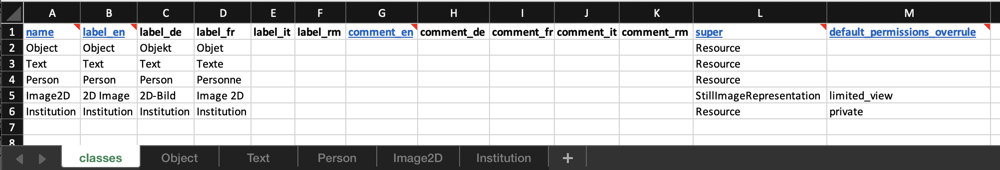
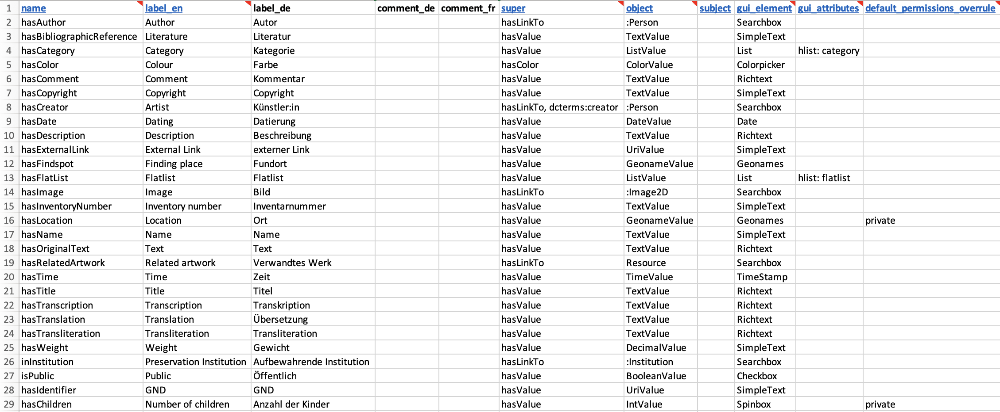

[](https://badge.fury.io/py/dsp-tools)

# Excel File Format to Generate a JSON Project


With the [`excel2json`](../cli-commands.md#excel2json) command, 
a JSON project file can be created from Excel files.

To put it simple, a JSON project consists of

- 1 header section with metadata about the project
- 0-1 "lists" sections
- 1-n "ontologies", each containing
    - 1 "properties" section
    - 1 "resources" section

For each of these 4 sections, one or several Excel files are necessary. The Excel files and their format are described 
below. 

If you want to convert the Excel files to JSON, it is possible to invoke a command for each of these sections 
separately (as described below). 
But it is more convenient to use the command that creates the entire JSON project file.

## The Folder Structure for `excel2json`

The following folder structure has to be used when invoking the `excel2json` command.


```text
data_model_files
├── json_header.xlsx (optional)
├── lists
│   ├── list.xlsx
│   └── grammar_lists.xlsx
└── onto_name (onto_label)
    ├── properties.xlsx
    └── resources.xlsx
```

Conventions for the names:

- The "lists" folder must have exactly this name, if it exists. It can also be omitted.
- The Excel files containing the lists must have the word "list" in the name, otherwise they will be ignored.
- Replace "onto_name" by your ontology's name, and "onto_label" by your ontology's label.
- The only name that can be chosen freely is the name of the topmost folder ("data_model_files" in this example).
- The file "json_header.xlsx" is optional. If it exists, it should be located in the top level folder.

Then, use the following command:

```bash
dsp-tools excel2json data_model_files project.json
```

This will create a file `project.json` with the lists, properties, and resources from the Excel files. 

**If the file "json_header.xlsx" is not provided, the "header" of the resulting JSON file is empty and thus invalid. 
In this case, it is necessary to add the project shortcode, shortname, longname, descriptions, and keywords by hand. 
Likewise, there will be no prefixes, no groups and no users in the resulting JSON file.**

Continue reading the following paragraphs to learn more about the expected structure of the Excel files.


## The Folder Structure for `old-excel2json`

The convention for the folder structure and naming is the same as for `excel2json`.


```text
data_model_files
├── json_header.xlsx (optional)
├── lists
│   ├── en.xlsx
│   └── de.xlsx
└── onto_name (onto_label)
    ├── properties.xlsx
    └── resources.xlsx
```


Then, use the following command:

```bash
dsp-tools old-excel2json data_model_files project.json
```

## The `json_header.xlsx`

The header section can be filled out with the "json_header.xlsx" file.
The file must be in the top level folder, and the name must be an exact match.

It is recommended to use the [template](../assets/data_model_templates/json_header.xlsx).

The sheets should be filled as follows:

- **Prefixes**
    - Both columns (prefixes and URI) are mandatory.
    - At least one prefix has to be declared
- **Project**
    - All columns: shortcode, shortname, longname are mandatory.
    - Only one row may be filled.
- **Description**
    - The langauge options are: en, de, fr, it, rm
    - At least one language has to be filled.
    - Only one row may be filled.
- **Keywords**
    - At least one keyword has to be entered in the column "keywords".
- **Users (Optional)** 
    - This sheet may be omitted or left empty.
    - For each user, all the columns: username, email, givenName, familyName, password, lang and role are mandatory.
    - The lang has to be one of: en, de, fr, it or rm
    - The role has to be one of: projectadmin, projectmember or systemadmin.


## The `resources` Section

With the [`excel2resources`](../cli-commands.md#excel2resources) command, 
the `resources` section used in a data model (JSON) can be created from an Excel file. 
Only `XLSX` files are allowed. 
The `resources` section can be inserted into the ontology file and then be uploaded onto a DSP server.

**An Excel file template can be found [here](../assets/data_model_templates/rosetta%20(rosetta)/resources.xlsx) 
or also in the
[`data_model_files` folder of `00A1-import-scripts`](https://github.com/dasch-swiss/00A1-import-scripts/tree/main/data_model_files).
It is recommended to work from the template.** 

The expected worksheets of the Excel file are:

- `classes`: a table with all resource classes intended to be used in the resulting JSON
- `class1`, `class2`,...: a table for each resource class named after its name. 
  If no cardinality should be provided for a class then the sheet can be left empty or omitted entirely.

The worksheet called `classes` must have the following structure:  


The expected columns are:

- [`name`](./json-project/ontologies.md#resource-name)
  (mandatory): Unique identifier for the resource class
- [`label_en`, `label_de`, `label_fr`, `label_it`, `label_rm`](./json-project/ontologies.md#resource-labels) 
  (one language mandatory): Label of the resource class that will be displayed in DSP-APP. Should be rather short.
- [`comment_en`, `comment_de`, `comment_fr`, `comment_it`, `comment_rm`](./json-project/ontologies.md#resource-comments)
  (optional): Description of the resource class. Can be longer than the label.
- [`super`](./json-project/ontologies.md#resource-super)
  (mandatory): The type of this resource class, 
  i.e. the base resource class/classes that this resource class is derived from.
  Must be one of the values listed in the documentation. 
  If more than one: separated by commas. 

The optional columns may be omitted in the Excel.

All other worksheets, one for each resource class, have the following structure:  


The expected columns are:

- [`Property`](./json-project/ontologies.md#resource-cardinalities) 
  (mandatory): The unique identifier of the property
- [`Cardinality`](./json-project/ontologies.md#resource-cardinalities) 
  (mandatory): Indicates how often the property may occur. The possible values are:
    - `"1"`: exactly once (mandatory one value and only one)
    - `"0-1"`: The value may be omitted, but can occur only once.
    - `"1-n"`: At least one value must be present, but multiple values may be present.
    - `"0-n"`: The value may be omitted, but may also occur multiple times.
- [`gui_order`](./json-project/ontologies.md#resource-cardinalities) 
  (optional): By default, DSP-APP displays the properties in the order how they are listed in the Excel sheet.
  If you prefer another order, you can make a numbering in this column.
  Example: You order the property names alphabetically in the Excel, 
  but they should be displayed in another order in DSP-APP.


## The `properties` Section

With the [`excel2properties`](../cli-commands.md#excel2properties) command, 
the `properties` section used in a data model (JSON) can be created from an Excel file.
Only the first worksheet of the Excel file is considered and only XLSX files are allowed. 
The `properties` section can be inserted into the ontology file and then be uploaded onto a DSP server.

**An Excel file template can be found [here](../assets/data_model_templates/rosetta%20(rosetta)/properties.xlsx) 
or also in the `data_model_files` folder of 
[`00A1-import-scripts`](https://github.com/dasch-swiss/00A1-import-scripts/tree/main/data_model_files). 
It is recommended to work from the template.**

The Excel sheet must have the following structure:  


The expected columns are:

- [`name`](./json-project/ontologies.md#property-name)
  (mandatory): Unique identifier for the property
- [`label_en`, `label_de`, `label_fr`, `label_it`, `label_rm`](./json-project/ontologies.md#property-label):
  (one language mandatory): Label of the property that will be displayed in DSP-APP. 
  Should be rather short.
- [`comment_en`, `comment_de`, `comment_fr`, `comment_it`, `comment_rm`](./json-project/ontologies.md#property-comments)
  (optional): Description of the property. Can be longer than the label.
- [`super`](./json-project/ontologies.md#property-super) 
  (mandatory): The type of this property, i.e. the base property/properties that this property is derived from.
  Must be one of the values listed in the documentation.
  If more than one: separated by commas.
- [`object`](./json-project/ontologies.md#property-object-gui_element-gui_attributes) 
  (mandatory): Target value of this property. 
  Must be one of the values listed in the documentation.
    - If the property is derived from `hasValue`, 
      the type of the property must be further specified by the object it takes, 
      e.g. `TextValue`, `ListValue`, or `IntValue`. 
    - If the property is derived from `hasLinkTo`, 
      the `object` specifies the resource class that this property refers to.
- [`subject`](./json-project/ontologies.md#property-subject)
  (optional): The subject defines the resource class the property can be used on. 
  It has to be provided as prefixed name of the resource class.
- [`gui_element`](./json-project/ontologies.md#property-object-gui_element-gui_attributes) 
  (mandatory): The graphic component, defines how this property should be displayed.
  Depends on the value of `object`: 
  Read the documentation of the respective `object` to learn which `gui_element` can be used.
- [`gui_attributes`](./json-project/ontologies.md#property-object-gui_element-gui_attributes) 
  (only mandatory for lists): Some `gui_element`s need further specifications. 
  Read the documentation of the respective `object` to learn if your `gui_element` needs a `gui_attributes`.
  Form: `attr: value, attr: value`. 

The optional columns may be omitted in the Excel.  

For backwards compatibility, 
files with column titles `hlist`, `en`, `de`, `fr`, `it`, or `rm` are valid, but deprecated.


## The `lists` Section

With the [`excel2lists`](../cli-commands.md#excel2lists) command, 
the `lists` section of a JSON project file can be created from one or several Excel files. 
The lists can then be inserted into a JSON project file and uploaded to a DSP server.

The following example shows how to create the "lists" section 
with Excel files that are located in a directory called `listfolder`.
The Excel files must contain the word "list" in the name. All the files containing that word will be included.
Files that do not contain that word will not be considered.


```bash
dsp-tools excel2lists listfolder lists.json
```

The Excel sheets must have the following structure:


### Formal requirements of the Excel format

- One Excel file may contain several lists.
- Per Excel sheet only one list is allowed. 
  The name of the sheet is not relevant, but must be unique within one Excel file.
- The list name (i.e. the content of the columns `en_list`/`de_list`/...) must be unique in one project.


#### Columns

- `ID (Optional)`
    - Column where a custom ID for the node or list can be entered. 
      This ID will become the `name` of the list/node in the JSON file.
    - The ID must be unique in the entire project.
    - If this field is left empty, an auto-ID will be generated. 
    - In case of duplicate IDs, an auto-ID will be generated, which includes the names of the ancestors of the node. 
      For example:
          - `list1:node1:node1.1` for the node `node1.1` in `list1`
          - `list2:node1:node1.1` for the node `node1.1` in `list2`
- `<language>_comments`: These are optional but recommended at least for the list itself (the second row of the Excel).
  If they are not provided for the list, the labels will be entered in the comments section.
  Nodes will not have comments if not explicitly provided.
  All languages that are used for one list must also be used for the comments.
  It is possible to provide a comment only for some nodes.
- `<language>_list`: At least one column with the name of the list in that language.
- `<language>_number`: At least one column which specifies a node level. 
  It starts with 1 for the highest node hierarchy, and can go on infinitely.


#### Languages

- The allowed language tags are: `de`, `en`, `fr`, `it`, `rm`
- At least one language must be used.
- There is no limit to the number of columns (i.e. node hierarchies).
- Within one list, i.e. Excel sheet, all nodes must be consistently translated into the same languages.
    - Correct:

        

    - Incorrect, because `de_list` is specified, but `de_1` is missing:

        

- Within one list, i.e. Excel sheet, all nodes must be translated into the same languages.
  This example is incorrect, because there is no English translation for `Knoten 1`:
  
    

- The use of language does not have to be consistent across all lists. 
  For example, it is correct if "list1" is translated into English and German, 
  but "list2" is only translated into English.


#### Rows

- Each sheet must contain at least two rows.
- The sheet must be ordered correctly as shown in the example above. 
- The order in the Excel corresponds to the order in the JSON file and the DSP-APP.
  This example is incorrect, because the second column is unordered:

    

- The first row of the sheet, directly under the title, must only contain the information for the list itself. 
  It must not contain anything in the other cells.
    - Each successive row corresponds to one list node. 
      Each node must have its own row.
    - In this example, `Node 1` does not have its own row, which is incorrect. `Node 2` is correctly done.

        


**It is recommended to work from the following template:** [lists.xlsx](../assets/data_model_templates/lists/lists.xlsx)


## The `lists` Section for `old-excel2json` and `old-excel2lists`

With the [`old-excel2lists`](../cli-commands.md#old-excel2lists) command, 
the `lists` section of a JSON project file can be created from one or several Excel files. 
The lists can then be inserted into a JSON project file and uploaded to a DSP server.

The following example shows how to create the "lists" section 
from the two Excel files `de.xlsx` and `en.xlsx` 
which are located in a directory called `listfolder`:

```bash
dsp-tools old-excel2lists listfolder lists.json
```

The Excel sheets must have the following structure:  
  


Some notes:

- The data must be in the first worksheet of each Excel file.
- It is important that all Excel files have the same structure. So, the translation of a label in the second Excel 
  file has to be in the exact same cell as the one in the first Excel file.
- Only Excel files with file extension `.xlsx` are considered. 
- The file name must consist of the language label, e.g. `de.xlsx` / `en.xlsx`. 
- The language has to be one of {`de`, `en`, `fr`, `it`, `rm`}.
- As node name, a simplified version of the English label is taken. If English is not available, one of the other 
  languages is taken.
- If there are two nodes with the same name, an incrementing number is appended to the name.
- After the creation of the list, a validation against the JSON schema for lists is performed. An error message is 
  printed out if the list is not valid.

**It is recommended to work from the following templates:**  

- [en.xlsx](../assets/data_model_templates/lists/en.xlsx): File with the English labels
- [de.xlsx](../assets/data_model_templates/lists/de.xlsx): File with the German labels
- or alternatively from the
  [`data_model_files` folder of `00A1-import-scripts`](https://github.com/dasch-swiss/00A1-import-scripts/tree/main/data_model_files)

The output of the above command, with the template files, is:

```json
{
    "lists": [
        {
            "name": "colors",
            "labels": {
                "de": "Farben",
                "en": "colors"
            },
            "comments": {
                "de": "Farben",
                "en": "colors"
            },
            "nodes": [
                {
                    "name": "red",
                    "labels": {
                        "de": "rot",
                        "en": "red"
                    }
                },
                "..."
            ]
        },
        {
            "name": "category",
            "labels": {
                "de": "Kategorie",
                "en": "category"
            },
            "comments": {
                "de": "Kategorie",
                "en": "category"
            },
            "nodes": [
                {
                    "name": "artwork",
                    "labels": {
                        "de": "Kunstwerk",
                        "en": "artwork"
                    }
                },
                "..."
            ]
        },
        {
            "name": "faculties-of-the-university-of-basel",
            "labels": {
                "de": "Fakultäten der Universität Basel",
                "en": "Faculties of the University of Basel"
            },
            "comments": {
                "de": "Fakultäten der Universität Basel",
                "en": "Faculties of the University of Basel"
            },
            "nodes": [
                {
                    "name": "faculty-of-science",
                    "labels": {
                        "de": "Philosophisch-Naturwissenschaftliche Fakultät",
                        "en": "Faculty of Science"
                    },
                      "comments": {
                          "de": "Auch bekannt als Phil II",
                          "en": "Also known as Phil II"
                      }
                },
                "..."
            ]
        }
    ]
}
```
