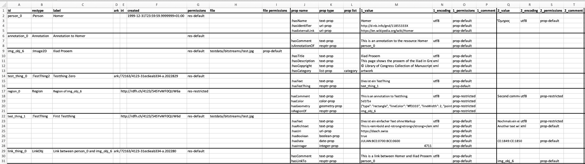

# Excel File Format to Generate an XML Data File

| 
Hint
                                                                                                            |
|:---------------------------------------------------------------------------------------------------------------------------------|
| If you want to convert customer data to XML, you need the [excel2xml module](../excel2xml-module.md) instead of the CLI command. |

With the [`excel2xml`](../cli-commands.md#excel2xml) CLI command, 
an XML data file can be created from an Excel/CSV file.

The Excel/CSV file must be structured as in this image:  

Some notes:

- The special tags `<annotation>`, `<link>`, and `<region>` are represented as resources of the type `Annotation`, 
  `LinkObj`, and `Region`. 
- The columns `ark`, `iri`, and `creation_date` are only used for DaSCH internal data migration.
- If `file` is provided, but no `file permissions`, an attempt will be started to deduce them from the resource 
  permissions. If this attempt is not 
  successful, a `BaseError` will be raised.
