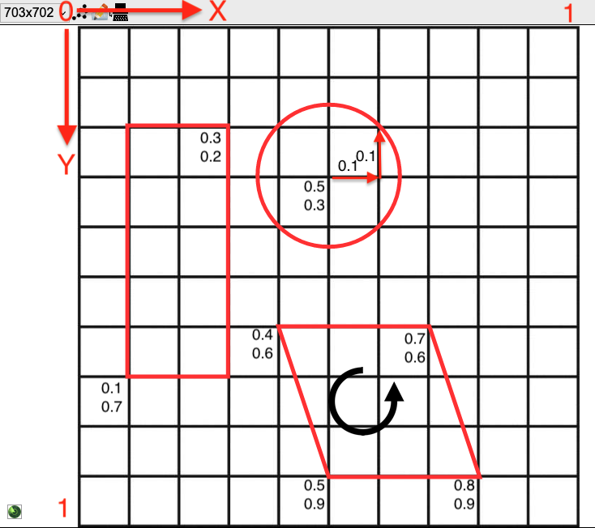

[](https://badge.fury.io/py/dsp-tools)

# The XML File Format for Importing Data

With the [`xmlupload`](../cli-commands.md#xmlupload) command, 
data can be imported into a DSP repository (on a DSP server) from an XML file. 
The import file is a standard XML file as described on this page.
After a successful upload of the data, 
an output file is written (called `id2iri_mapping_[timestamp].json`)
with the mapping from the internal IDs used inside the XML 
to their corresponding IRIs which uniquely identify them inside DSP. 
This file should be kept if a second data delivery is added at a later point of time 
[see here](../special-workflows/incremental-xmlupload.md).

The import file must start with the standard XML header:

```xml
<?xml version='1.0' encoding='utf-8'?>
```


## The Root Element `<knora>`

The `<knora>` element describes all resources that should be imported. It has the following attributes:

- `xmlns`: XML namespace identifier (required, always the same)
- `xmlns:xsi`: URL to the XML Schema instance namespace of W3C (required, always the same)
- `xsi:schemaLocation`: URL to the DSP XML schema, located in the DSP-TOOLS GitHub repository (required, always the same)
- `shortcode`: project shortcode, e.g. "0801" (required, dependent on the project)
- `default-ontology`: name of the ontology (required, dependent on the project)

The `<knora>` element may look as follows:

```xml
<knora
    xmlns="https://dasch.swiss/schema"
    xmlns:xsi="http://www.w3.org/2001/XMLSchema-instance"
    xsi:schemaLocation="https://dasch.swiss/schema https://raw.githubusercontent.com/dasch-swiss/dsp-tools/main/src/dsp_tools/resources/schema/data.xsd"
    shortcode="0806"
    default-ontology="webern">
 ...
</knora>
```

The `<knora>` element can only contain the following sub-elements:

- `<permissions>` (optional)
- `<resource>`


## DSP Permissions

The DSP server provides access control for every resource and every property.


### Groups

The user doesn't hold the permissions directly, but belongs to an arbitrary number of groups which hold the
permissions. There are **built-in groups** and **project specific groups**:

- **Built-in groups**: Every user is automatically in at least one of the following built-in groups:
    - `UnknownUser`: The user is not known to DSP (not logged in).
    - `KnownUser`: The user is logged in, but not a member of the project the data element belongs to.
    - `ProjectMember`: The user belongs to the same project as the data element.
    - `ProjectAdmin`: The user is project administrator in the project the data element belongs to.
    - `Creator`: The user is the owner of the element (created the element).
    - `SystemAdmin`: The user is a system administrator.
- **Project specific groups**: 
    - can be defined in the [JSON project file](./json-project/overview.md#groups)


### Rights

A group can have exactly one of these rights:

- (no right): If no permission is defined for a certain group of users, these users cannot view any resources/values.
- `RV` _restricted view permission_: Same as `V`, 
  but if it is applied to an image, the image is shown with a reduced resolution or with a watermark overlay.
- `V` _view permission_: The user can view a resource or a value, but cannot modify it.
- `M` _modify permission_: The user can modify the element, but cannot mark it as deleted. 
  The original resource or value will be preserved.
- `D` _delete permission_: The user is allowed to mark an element as deleted. 
  The original resource or value will be preserved.
- `CR` _change right permission_: The user can change the permission of a resource or value. 
  The user is also allowed to permanently delete (erase) a resource.

Every right of this row includes all previous rights.


### Defining Permissions With the `<permissions>` Element

The `<permissions>` element defines a _permission ID_ that can subsequently be used in a 
[permissions attribute](#using-permissions-with-the-permissions-attribute) of a `<resource>` or `<xyz-prop>` tag.

It is optional to define permission IDs in the XML. 
If not defined, the project's default permissions are applied, 
so that only project and system administrators can view and edit resources. 
All other users have no rights at all, 
not even view or restricted view permissions.

(The project's default permission default to "restricted", but this can be changed on a per-project-basis via DSP-API.)

If the resources/values in your XML should have permissions 
that are different from the project's defaults,
you have to use the `<permissions>` elements to define permission IDs.

The `<permissions>` element defines which rights are given to which groups.
The canonical standard that we recommend are these 3 permission IDs:

```xml
<permissions id="open">
    <allow group="UnknownUser">V</allow>
    <allow group="KnownUser">V</allow>
    <allow group="ProjectMember">D</allow>
    <allow group="ProjectAdmin">CR</allow>
</permissions>
<permissions id="restricted-view">
    <allow group="UnknownUser">RV</allow>
    <allow group="KnownUser">RV</allow>
    <allow group="ProjectMember">D</allow>
    <allow group="ProjectAdmin">CR</allow>
</permissions>
<permissions id="restricted">
    <allow group="ProjectMember">D</allow>
    <allow group="ProjectAdmin">CR</allow>
</permissions>
```

This means that if a resource/value is marked as `open`,

- users who are not logged in can view the resource/value
- users who are logged in, but not members of your project can view the resource/value
- project members can modify and delete the resource/value
- project admins can modify, delete, and change the rights of the resource/value

If you don't want a group to have access at all, leave it out:
If a resource/value is marked as `restricted`, 
users who are not members of the project have no rights at all, not even view rights.

In addition to the DSP built-in groups, 
[project specific groups](./json-project/overview.md#groups) are supported as well.
A project specific group name has the form `project-shortname:groupname`:

```xml
<permissions id="discouraged-edge-case">
    <allow group="systematic-tp:testgroupEditors">M</allow>
</permissions>
```


### Using Permissions With the `permissions` Attribute

Once defined, the permission IDs can be used as `permissions` attribute
in the `<resource>` and `<xyz-prop>` tags.
It is important to note that a resource doesn't inherit its permissions to its properties. 
Each property must have its own permissions. 
So, in the following example, 
the bitstreams don't inherit the permissions from their resource:

```xml
<permissions id="open">
  <allow group="UnknownUser">V</allow>
  <allow group="KnownUser">V</allow>
  <allow group="ProjectMember">D</allow>
  <allow group="ProjectAdmin">CR</allow>
</permissions>
<permissions id="restricted-view">
  <allow group="UnknownUser">RV</allow>
  <allow group="KnownUser">RV</allow>
  <allow group="ProjectMember">D</allow>
  <allow group="ProjectAdmin">CR</allow>
</permissions>
<resource ...>
    <bitstream permissions="open">images/EURUS015a.jpg</bitstream>
</resource>
<resource ...>
    <bitstream permissions="restricted-view">images/EURUS015a.jpg</bitstream>
</resource>
<resource ...>
    <bitstream>images/EURUS015a.jpg</bitstream>
</resource>
```

So if you upload this data, and then log in as `KnownUser`, i.e. a logged-in user who is not member of the project, 
you will see the following:

- With `permissions="open"`, you have `V` rights on the image: Normal view.
- With `permissions="restricted-view"`, you have `RV` rights on the image: Blurred image.
- With a blank `<bitstream>` tag, you have no rights on the image: No view possible. 
  Only users from `ProjectMember` upwards are able to look at the image.


## Defining the authorships

Every multimedia asset must be accompanied by an authorship,
meaning the natural person who authored the work.
The authorship can be defined in the following way:

```xml
<authorship id="authorship_1">
    <author>Lukas Rosenthaler</author>
</authorship>
<authorship id="authorship_2">
    <author>Nora Ammann</author>
    <author>Johannes Nussbaum</author>
</authorship>
```

These identifiers can later be referenced in the `<bitstream>` and `<iiif-uri>` elements.


## Describing Resources With the `<resource>` Element

A `<resource>` element contains all necessary information to create a resource. It has the following attributes:

- `label` (required): a human-readable, preferably meaningful short name of the resource
- `restype` (required): the resource type as defined within the ontology 
- `id` (required): an arbitrary string providing a unique ID to the resource
  in order to be referenceable by other resources; 
  the ID is only used during the import process 
  and later replaced by the IRI used internally by DSP 
- `permissions` 
  (optional, but if omitted, 
  users who are lower than a `ProjectMember` have no permissions at all,
  not even view rights):
  a reference to a permission ID
- `iri` (optional): a custom IRI, used when migrating existing resources (DaSCH-internal only)
- `ark` (optional): a version 0 ARK, used when migrating existing resources. It is not possible 
  to use `iri` and `ark` in the same resource. When `ark` is used, it overrides `iri` (DaSCH-internal only).
- `creation_date` (optional): the creation date of the resource, used when migrating existing resources.
  It must be formatted according to the constraints of 
  [xsd:dateTimeStamp](https://www.w3.org/TR/xmlschema11-2/#dateTimeStamp), 
  which means that the timezone is required, e.g.: `2005-10-23T13:45:12.502951+02:00` (DaSCH-internal only)

A complete `<resource>` element may look as follows:

```xml
<resource label="EURUS015a"
          restype=":Postcard"
          id="238807"
          permissions="res-def-perm">
   ...
</resource>
```

For every property that the ontology requires, the `<resource>` element contains one property 
element (e.g. `<integer-prop name="property_name>`). The property element contains one or more values.

Example of a property element of type integer with two values:

```xml
<integer-prop name=":hasInteger">
    <integer permissions="open">4711</integer>
    <integer permissions="open">1</integer>
</integer-prop>
```

The following property elements exist:

- `<bitstream>`: contains a path to a file (if the resource is a multimedia resource)
- `<iiif-uri>`: contains a URI to an IIIF image server (resource must be a `StillImageRepresentation`)
- `<boolean-prop>`: contains a boolean value
- `<color-prop>`: contains color values
- `<date-prop>`: contains date values
- `<decimal-prop>`: contains decimal values
- `<geometry-prop>`: contains JSON geometry definitions for a region
- `<geoname-prop>`: contains [geonames.org](https://www.geonames.org/) location codes
- `<list-prop>`: contains list element labels
- `<integer-prop>`: contains integer values
- `<period-prop>`: contains time period values (not yet implemented)
- `<resptr-prop>`: contains links to other resources
- `<text-prop>`: contains text values
- `<time-prop>`: contains time values
- `<uri-prop>`: contains URI values


### `<bitstream>`

The `<bitstream>` element is used for bitstream data. It contains the path to a bitstream object like an image file, a
ZIP container, an audio file etc. It must only be used if the resource is a `StillImageRepresentation`, an
`AudioRepresentation`, a `DocumentRepresentation` etc.

Notes:

- There is only _one_ `<bitstream>` element allowed per representation.
- The `<bitstream>` element must be the first element.
- If a resource has a `<bitstream>` element, it cannot have a `<iiif-uri>` element.
- By default, the path is relative to the working directory where `dsp-tools xmlupload` is executed in. This behavior 
  can be modified with the flag [`--imgdir`](../cli-commands.md#xmlupload). If you keep the default,
  it is recommended to choose the project folder as working directory, `my_project` in the example below:

```text
my_project
├── files
│   ├── data_model.json
│   └── data_file.xml   (<bitstream>images/dog.jpg</bitstream>)
└── images
    ├── dog.jpg
    └── cat.jpg
```

```bash
my_project % dsp-tools xmlupload files/data_file.xml
```

Supported file extensions:

| Representation              | Supported formats                       |
| --------------------------- | --------------------------------------- |
| `ArchiveRepresentation`     | ZIP, TAR, GZ, Z, TAR.GZ, TGZ, GZIP, 7Z  |
| `AudioRepresentation`       | MP3, WAV                                |
| `DocumentRepresentation`    | PDF, DOC, DOCX, XLS, XLSX, PPT, PPTX    |
| `MovingImageRepresentation` | MP4                                     |
| `StillImageRepresentation`  | JPG, JPEG, PNG, TIF, TIFF, JP2          |
| `TextRepresentation`        | TXT, CSV, XML, XSL, XSD, ODD, RNG, JSON |

For more details, please consult the [API docs](https://docs.dasch.swiss/latest/DSP-API/01-introduction/file-formats/).

Attributes:

- `permissions` : Permission ID 
  (optional, but if omitted, users who are lower than a `ProjectMember` have no permissions at all, not even view rights)

Example of a public image inside a `StillImageRepresentation`:

```xml
<resource restype=":Image" id="image_1" label="image_1" permissions="open">
    <bitstream 
        permissions="open" 
        license="http://rdfh.ch/licenses/cc-by-4.0" 
        copyright-holder="DaSCH" 
        authorship-id="authorship_id_defined_at_the_top">
            postcards/images/EURUS015a.jpg
    </bitstream>
</resource>
```

### `<iiif-uri>`

The `<iiif-uri>` element is used for IIIF image server URIs. 
All versions of the IIIF-API standards are supported.

Notes:

- Only _one_ `<iiif-uri>` element is allowed per `StillImageRepresentation`. 
- If a resource has a `<iiif-uri>` element, it cannot have a `<bitstream>` element.

Please consult the official documentation for details regarding the URI syntax:

- [IIIF Image API 1.0](https://iiif.io/api/image/1.0/)
- [IIIF Image API 2.0](https://iiif.io/api/image/2.0/)
- [IIIF Image API 3.0](https://iiif.io/api/image/3.0/)


Attributes:

- `permissions` : Permission ID 
  (optional, but if omitted, users who are lower than a `ProjectMember` have no permissions at all, not even view rights)


Example of a public image inside a `StillImageRepresentation`:

```xml
<resource restype=":Image" id="image_1" label="image_1" permissions="open">
    <iiif-uri 
        permissions="open" 
        license="http://rdfh.ch/licenses/cc-by-4.0" 
        copyright-holder="DaSCH" 
        authorship-id="authorship_id_defined_at_the_top">
            https://iiif.dasch.swiss/0811/1Oi7mdiLsG7-FmFgp0xz2xU.jp2/full/837,530/0/default.jp2
    </iiif-uri>
</resource>
```


### `<boolean-prop>`

The `<boolean-prop>` element is used for boolean values. It must contain exactly one `<boolean>` element.

Attributes:

- `name`: name of the property as defined in the ontology (required)


#### `<boolean>`

The `<boolean>` element must contain the string "true"/"True" or "false"/"False", or the numeral 1 (true) or 0 (false).

Attributes:

- `permissions`: Permission ID 
  (optional, but if omitted, users who are lower than a `ProjectMember` have no permissions at all, not even view rights)
- `comment`: a comment for this specific value (optional)

Example of a public and a hidden boolean property:

```xml
<boolean-prop name=":hasBoolean">
  <boolean permissions="open">true</boolean>
</boolean-prop>
<boolean-prop name=":hasHiddenBoolean">
  <boolean>0</boolean>
</boolean-prop>
```


### `<color-prop>`

The `<color-prop>` element is used for color values. It must contain at least one `<color>` element.

Attributes:

- `name`: name of the property as defined in the ontology (required)


#### `<color>`

The `<color>` element is used to indicate a color value. The color has to be given in web-notation, that is a `#`
followed by 3 or 6 hex numerals.

Attributes:

- `permissions`: Permission ID 
  (optional, but if omitted, users who are lower than a `ProjectMember` have no permissions at all, not even view rights)
- `comment`: a comment for this specific value (optional)

Example of a property with a public and a hidden color value:

```xml
<color-prop name=":hasColor">
    <color permissions="open">#00ff66</color>
    <color>#ff00ff</color>
</color-prop>
```


### `<date-prop>`

The `<date-prop>` element is used for date values. It must contain at least one `<date>` element.

Attributes:

- `name`: name of the property as defined in the ontology (required)


#### `<date>`

The `<date>` element contains a DSP-specific date value. It has the following format:

```text
calendar:epoch:yyyy-mm-dd:epoch:yyyy-mm-dd
```

- `calendar`: "GREGORIAN", "JULIAN" or "ISLAMIC" (optional, default: GREGORIAN)
- `epoch`: either "AD", "BC", "BCE" or "CE" (optional, default CE)
- `yyyy`: year with one to four digits (required)
- `mm`: month with one or two digits (optional, e.g. 01, 02, ..., 12)
- `dd`: day with one or two digits (optional, e.g. 01, 02, ..., 31)

Notes regarding precision:

- If the day is omitted, then the precision is month, if also the month is omitted, the precision is year.
- Internally, a date is always represented as a start and end date. 
- If start and end date match, it's an exact date. 
- If start and end date don't match, it's a range.
- If the end date is omitted, 
  it's a range from the earliest possible beginning of the start date
  to the latest possible end of the start date. 
  For example:
    - "1893" will be expanded to a range from January 1st 1893 to December 31st 1893.
    - "1893-01" will be expanded to a range from January 1st 1893 to January 31st 1893.
    - "1893-01-01" will be expanded to a range from January 1st 1893 **to the entire year 1893**.
- **Therefore, a day-precision date should always be written with start and end date:** 
  `GREGORIAN:CE:1893-01-01:CE:1893-01-01`

Notes regarding calendars:

- DSP stores dates using a calendar-independent,
  astronomical representation, and converts between calendars as needed. 
- The Gregorian and Julian calendars have 12 months with 28-31 days each.
- The Islamic calendar has 12 months with 29 or 30 days each.
- Year 1 of the Islamic calendar began in 622 CE in the Julian calendar.
  Years in the Islamic calendar are shorter than years in the Gregorian/Julian calendar,
  so 2025 CE corresponds to 1446 AH (not 1403 AH).
- Eras of the Islamic calendar (AH: Anno Hegirae; BH: Before Hijra) are not supported yet.

Attributes:

- `permissions`: Permission ID 
  (optional, but if omitted, users who are lower than a `ProjectMember` have no permissions at all, not even view rights)
- `comment`: a comment for this specific value (optional)

Example of a property with a public and a hidden date value:

```xml
<date-prop name=":hasDate">
  <date permissions="open">GREGORIAN:CE:2014-01-31:CE:2014-01-31</date>
  <date>GREGORIAN:CE:1930-09-02:CE:1930-09-03</date>
</date-prop>
```


### `<decimal-prop>`

The `<decimal-prop>` element is used for decimal values.
It must contain at least one `<decimal>` element.

Attributes:

- `name`: name of the property as defined in the ontology (required)


#### `<decimal>`

The `<decimal>` element contains a decimal number, they must be written with a decimal point `.` as a separator.

Attributes:

- `permissions`: Permission ID 
  (optional, but if omitted, users who are lower than a `ProjectMember` have no permissions at all, not even view rights)
- `comment`: a comment for this specific value (optional)

Example of a property with a public and a hidden decimal value:

```xml
<decimal-prop name=":hasDecimal">
    <decimal permissions="open">3.14159</decimal>
    <decimal>2.71828</decimal>
</decimal-prop>
```


### `<geometry-prop>`

The `<geometry-prop>` element is used for a geometric definition of a 2-D region (e.g. a region on an image). It must
contain at least one `<geometry>` element. A `<geometry-prop>` can only be used inside a 
[`<region>` tag](#region). 

Attributes:

- `name`: the only allowed name is `hasGeometry`, because this property is a DSP base property that can only be used in 
  the [`<region>` tag](#region).


#### `<geometry>`

A geometry value is defined as a JSON object. It contains the following data:

- `status`: "active" or "deleted"
- `type`: "circle", "rectangle" or "polygon" (only the rectangle can be displayed in DSP-APP. The others can be 
  looked at in another frontend, e.g. in TANGOH.)
- `lineWidth`: integer number (in pixels)
- `points`: array of coordinate objects of the form `{"x": decimal, "y": decimal}`
- `radius`: coordinate object of the form `{"x": decimal, "y": decimal}`
- In the SALSAH data, there is also a key named `original_index` in the JSON format of all three shapes, but it doesn't 
  seem to have an influence on the shapes that TANGOH displays, so it can be omitted. 

Attributes:

- `permissions`: Permission ID 
  (optional, but if omitted, users who are lower than a `ProjectMember` have no permissions at all, not even view rights)
- `comment`: a comment for this specific value (optional)

Example:

```xml
<geometry-prop name="hasGeometry">
    <geometry permissions="open">
        {
            "status": "active",
            "type": "rectangle",
            "lineWidth": 5,
            "points": [
                {"x":0.1,"y":0.7},
                {"x":0.3,"y":0.2}
            ]
        }
    </geometry>
    <geometry permissions="open">
        {
            "status": "active",
            "type": "circle",
            "lineWidth": 5,
            "points": [{"x":0.5,"y":0.3}],
            "radius": {"x":0.1,"y":0.1}     // vector (0.1, 0.1)
        }
    </geometry>
    <geometry permissions="open">
        {
            "status": "active",
            "type": "polygon",
            "lineWidth": 5,
            "points": [{"x": 0.4, "y": 0.6},
                       {"x": 0.5, "y": 0.9},
                       {"x": 0.8, "y": 0.9},
                       {"x": 0.7, "y": 0.6}]
        }
    </geometry>
</geometry-prop>
```

The underlying grid is a 0-1 normalized top left-anchored grid. The following coordinate system shows the three shapes
that were defined above:  



### `<geoname-prop>`

The `<geoname-prop>` element is used for values that contain a [geonames.org](https://www.geonames.org/) ID. 
It must contain at least one `<geoname>` element.

Attributes:

- `name`: name of the property as defined in the ontology (required)


#### `<geoname>`

Contains a valid [geonames.org](https://www.geonames.org/) ID.

Attributes:

- `permissions`: Permission ID 
  (optional, but if omitted, users who are lower than a `ProjectMember` have no permissions at all, not even view rights)
- `comment`: a comment for this specific value (optional)

Example of a property with a public link to Vienna and a hidden link to Basel:

```xml
<geoname-prop name=":hasLocation">
    <geoname permissions="open">2761369</geoname>
    <geoname>2661604</geoname>
</geoname-prop>
```


### `<integer-prop>`

The `<integer-prop>` element is used for integer values.
It must contain at least one `<integer>` element.

Attributes:

- `name`: name of the property as defined in the ontology (required)


#### `<integer>`

The `<integer>` element contains an integer value, these are whole numbers.

Attributes:

- `permissions`: Permission ID 
  (optional, but if omitted, users who are lower than a `ProjectMember` have no permissions at all, not even view rights)
- `comment`: a comment for this specific value (optional)

Example of a property with a public and a hidden integer value:

```xml
<integer-prop name=":hasInteger">
    <integer permissions="open">4711</integer>
    <integer>1</integer>
</integer-prop>
```


### `<list-prop>`

The `<list-prop>` element is used as entry point into a list (list node). List nodes are identified by their `name`
attribute that was given when creating the list nodes (which must be unique within each list!). It must contain at least
one `<list>` element.

Attributes:

- `name`: name of the property as defined in the ontology (required)
- `list`: name of the list as defined in the ontology (required)


#### `<list>`

The `<list>` element references a node in a (pull-down or hierarchical) list.

Attributes:

- `permissions`: Permission ID 
  (optional, but if omitted, users who are lower than a `ProjectMember` have no permissions at all, not even view rights)
- `comment`: a comment for this specific value (optional)

Example of a property with a public and a hidden list value:

```xml
<list-prop list="category" name=":hasCategory">
    <list permissions="open">physics</list>
    <list>nature</list>
</list-prop>
```

**Referencing Existing List IRIs:**

It is possible to reference existing list IRIs. IRIs can be obtained through API requests or database queries.
Please note that every time a project is created anew, new IRIs are generated.
Therefore, this workflow is intended for projects that already exist on the production server.
To reference the IRI in the XML, 
the `list` attribute must remain empty, but may not be omitted.

```xml
<list-prop name=":hasCategory" list="">
    <list>http://rdfh.ch/lists/0001/uuid</list>
</list-prop>
```


### `<resptr-prop>`

The `<resptr-prop>` element is used to link other resources within DSP. It must contain at least one `<resptr>` element.

Attributes:

- `name`: name of the property as defined in the ontology (required)


#### `<resptr>`

The `<resptr>` element contains either the internal ID of another resource inside the XML or the IRI of an already
existing resource on DSP. 

Attributes:

- `permissions`: Permission ID 
  (optional, but if omitted, users who are lower than a `ProjectMember` have no permissions at all, not even view rights)
- `comment`: a comment for this specific value (optional)

Example of a property with a public link to `<resource id="res_1" ...>` 
and a hidden link to `<resource id="res_2" ...>`:

```xml
<resptr-prop name=":hasReferenceTo">
    <resptr permissions="open">res_1</resptr>
    <resptr>res_2</resptr>
</resptr-prop>
```


### `<text-prop>`

The `<text-prop>` element is used for text values. It must contain at least one `<text>` element.
For details about the formatting of the text [see the ontology documentation](json-project/ontologies.md#textvalue).

Attributes:

- `name`: name of the property as defined in the ontology (required)


#### `<text>`

The `<text>` element has the following attributes:

- `encoding` (required)
    - `utf8`: To be used for `SimpleText` and `Textarea` properties.
    - `xml`: To be used for `Richtext` properties. It must follow the XML format as defined by the
  [DSP standard mapping](https://docs.dasch.swiss/latest/DSP-API/03-endpoints/api-v2/text/standard-standoff/).
- `permissions`: Permission ID 
  (optional, but if omitted, users who are lower than a `ProjectMember` 
  have no permissions at all, not even view rights)
- `comment`: a comment for this specific value (optional)

Example of a public and a hidden text:

```xml
<text-prop name=":hasDescription">
    <text encoding="xml" permissions="open">Probe bei "Wimberger". Lokal in Wien?</text>
    <text encoding="xml">
        <strong>Bold text</strong> and a <a class="salsah-link" href="IRI:obj_0003:IRI">link to an ID</a>.<br/>
        And a <a class="salsah-link" href="http://rdfh.ch/4123/nyOODvYySV2nJ5RWRdmOdQ">link to an IRI</a>.
    </text>
</text-prop>
```

The second text above contains a link to the resource `obj_0003`, which is defined in the same XML file. It also 
contains a link to the resource `http://rdfh.ch/4123/nyOODvYySV2nJ5RWRdmOdQ`, which already exists on the DSP server.

#### `encoding` and `gui_element`

`encoding` must be combined with
`gui_element` ([defined in the ontology](./json-project/ontologies.md#textvalue))
as follows:

| `gui_element`<br/>(JSON ontology) | `encoding`<br/>(XML data) |
| --------------------------------- | ------------------------- |
| `SimpleText`                      | `utf8`                    |
| `Textarea`                        | `utf8`                    |
| `Richtext`                        | `xml`                     |

Handling of pretty-print whitespaces and newlines:

- encoding `utf8`: 
    - leading and trailing whitespaces are removed
    - multiple spaces are replaced by a single space
    - (multiple) tab stops are replaced by a single space
- encoding `xml`:
    - leading and trailing whitespaces are removed
    - whitespaces and newlines don't have a meaning in XML, so they are removed. 
    - newlines can be created with `<br/>`.
    - whitespaces are kept only inside `<code>` and `<pre>` tags.


#### Examples of correct and incorrect formatting

**`SimpleText`**

_Correct:_

```xml
<text encoding="utf8">Single line.</text>
```

<br/>

The following text will be displayed as follows in the APP: "Leading and trailing spaces will be removed."

```xml
<text encoding="utf8">
      Leading and trailing spaces will be removed.
</text>
```

<br/>

_Incorrect:_

This type of entry will result in a validation error.

```xml
<text encoding="utf8">
      Line breaks
      within a text
      are not allowed.
</text>
```

<br/>

This type of entry is not allowed.

```xml
<text encoding="utf8">
      Markup<br/>is not allowed.
</text>
```

<br/>

**`Textarea`**

_Correct:_

The following text will be displayed as follows in the APP: "Leading and trailing spaces will be removed."

```xml
<text encoding="utf8">
      Leading and trailing spaces will be removed.
</text>
```

<br/>

The line breaks between the two sentences will be preserved and displayed in the APP.

```xml
<text encoding="utf8">
      Leading and trailing spaces will be removed.
      But this line break will stay.
</text>
```

<br/>

_Incorrect:_

This type of entry is not allowed.

```xml
<text encoding="utf8">
      Markup<br/> is not allowed.
</text>
```

<br/>

**`Richtext`**

_Correct:_

The following text will be displayed as follows in the APP: "Leading and trailing spaces will be removed."

```xml
<text encoding="xml">
      Leading and trailing spaces will be removed.
</text>
```

<br/>

The following text will be displayed as a single line in the APP.

```xml
<text encoding="xml">
      Leading and trailing spaces will be removed.
      This newline will be replaced by a single space.
</text>
```

<br/>

This will result in a line break in the APP.

```xml
<text encoding="xml">
      Leading and trailing spaces will be removed.<br/>
      Using this tag will result in a line break.
</text>
```

<br/>

_Incorrect:_

This text should be converted into XML using the DSP standard mapping.

```xml
<text encoding="xml">
      # Markdown Title
      - This type of content
      - Is not allowed
</text>
```

#### Special Characters: Overview

Depending on the encoding of your text,
special characters behave differently.
There are two places where this must be taken into account:

- When a string is passed to 
  [`excel2xml.make_text_prop()`](../excel2xml-module.md#special-characters-in-text-properties)
- When a string is written by hand into an XML file

In the tables below,
the second column is the output of the first column,
and the third column is how DSP-APP displays the second column.

Behavior of simple text (`SimpleText`/`Textarea` + `utf8`):

| input to `excel2xml` | XML file      | DSP-APP | Remarks                                      |
| -------------------- | ------------- | ------- | -------------------------------------------- |
| `<`                  | `&lt;`        | &lt;    |                                              |
| `>`                  | `&gt;`        | &gt;    |                                              |
|                      | `<`           | ⛔      | invalid XML                                  |
|                      | `>`           | &gt;    | discouraged by XML standard, but possible    |
| `&`                  | `&amp;`       | &amp;   |                                              |
|                      | `&`           | ⛔      | invalid XML                                  |
| `&gt;`               | ⛔            |         | discouraged: The leading `&` will be escaped |
| `<tag>`              | `&lt;tag&gt;` | `<tag>` | discouraged: Simple text is not rich text    |
|                      | `<tag>`       | ⛔      | forbidden: Simple text is not rich text      |


Behavior of text with markup (`Richtext` + `xml`):

| input to `excel2xml` | XML file               | DSP-APP          | Remarks                                   |
| -------------------- | ---------------------- | ---------------- | ----------------------------------------- |
| `<`                  | `&lt;`                 | `&lt;`           |                                           |
| `>`                  | `&gt;`                 | &gt;             |                                           |
|                      | `<`                    | ⛔               | invalid XML                               |
|                      | `>`                    | &gt;             | discouraged by XML standard, but possible |
| `&lt;`               | `&lt;`                 | &lt;             |                                           |
| `&gt;`               | `&gt;`                 | &gt;             |                                           |
| `&`                  | `&amp;`                | &                |                                           |
|                      | `&`                    | ⛔               | invalid XML                               |
| `&amp;`              | `&amp;`                | &                |                                           |
| `<em>text</em>`      | `<em>text</em>`        | _text_           |                                           |
| `unclosed <tag>`     | `unclosed &lt;tag&gt;` | `unclosed <tag>` |                                           |
|                      | `&lt;not a tag&gt;`    | `<not a tag>`    |                                           |
| `&nbsp;`             | ` `                    | ` `              | <!-- markdownlint-disable-line MD038 -->  |
|                      | `&nbsp;`               | ⛔               | invalid XML                               |


#### Special Characters: Rules

From the systematic analysis above, 
the following rules can be derived:

For input of excel2xml:

- Simple text: Don't use HTML escape sequences.
- Simple text: Don't use tags. (Mathematical comparisons with `<>` are allowed).
- Rich text: The special characters `<`, `>` and `&` are only allowed to construct a tag.
- Rich text: If tags are used, they must result in well-formed XML.
- Rich text: HTML escape sequences can be freely used.

If you write an XML file by hand:

- Simple text: The special characters `<`, `>` and `&` must be escaped.
- Simple text: Don't use tags. (Mathematical comparisons with `<>` are allowed).
- Rich text: The special characters `<`, `>` and `&` must be escaped if they are not part of a valid HTML tag.


### `<time-prop>`

The `<time-prop>` element is used for time values in the Gregorian calendar. 
It must contain at least one `<time>` element.

Attributes:

- `name`: name of the property as defined in the ontology (required)


#### `<time>`

The `<time>` element represents an exact datetime value 
in the form [xsd:dateTimeStamp](https://www.w3.org/TR/xmlschema11-2/#dateTimeStamp), 
which is defined as `yyyy-mm-ddThh:mm:ss.sssssssssssszzzzzz`. 
The following abbreviations describe this form:

- `yyyy`: a four-digit numeral that represents the year. The value cannot start with a minus (-) or a plus (+) sign.
  0001 is the lexical representation of the year 1 of the Common Era (also known as 1 AD). The value cannot be 0000. 
  The calendar is always the Gregorian calendar.
- `mm`: a two-digit numeral that represents the month
- `dd`: a two-digit numeral that represents the day
- `hh`: a two-digit numeral representing the hours. Must be between 0 and 23
- `mm`: a two-digit numeral that represents the minutes
- `ss`: a two-digit numeral that represents the seconds
- `ssssssssssss`: If present, a 1-to-12-digit numeral that represents the fractional seconds (optional)
- `zzzzzz`: represents the time zone (required).

Each part of the datetime value that is expressed as a numeric value is constrained to the maximum value within the 
interval that is determined by the next higher part of the datetime value.
For example, the day value can never be 32 and cannot be 29 for month 02 and year 2002 (February 2002).

The timezone is defined as follows:

- A plus (+) or minus (-) sign that is followed by hh:mm:
    - `+`: Indicates that the specified time instant is in a time zone 
      that is ahead of the UTC time by hh hours and mm minutes.
    - `-`: Indicates that the specified time instant is in a time zone 
      that is behind UTC time by hh hours and mm minutes.
    - `hh`: a two-digit numeral (with leading zeros as required) that represents the hours. 
       The value must be between -14 and +14, inclusive.
    - `mm`: a two-digit numeral that represents the minutes. 
      The value must be zero when hh is equal to 14.
- Z: The literal Z, which represents the time in UTC (Z represents Zulu time, which is equivalent to UTC). 
  Specifying Z for the time zone is equivalent to specifying +00:00 or -00:00.

Attributes:

- `permissions`: Permission ID 
  (optional, but if omitted, users who are lower than a `ProjectMember` have no permissions at all, not even view rights)
- `comment`: a comment for this specific value (optional)

Example of a property with a public and a hidden time value:

```xml
<time-prop name=":hasTime">
    <time permissions="open">2019-10-23T13:45:12Z</time>
    <time>2009-10-10T12:00:00-05:00</time>
</time-prop>
```


### `<uri-prop>`

The `<uri-prop>` represents a [Uniform Resource Identifier](https://en.wikipedia.org/wiki/Uniform_Resource_Identifier).
It must contain at least one `<uri>` element.

Attributes:

- `name`: name of the property as defined in the ontology (required)


#### `<uri>`

The `<uri>` element contains a syntactically valid URI.

Attributes:

- `permissions`: Permission ID 
  (optional, but if omitted, users who are lower than a `ProjectMember` have no permissions at all, not even view rights)
- `comment`: a comment for this specific value (optional)

Example of a property with a public and a hidden URI:

```xml
<uri-prop name=":hasURI">
    <uri permissions="open">http://www.groove-t-gang.ch</uri>
    <uri>http://dasch.swiss</uri>
</uri-prop>
```


## DSP Base Resources and Base Properties to Be Used Directly in the XML File

There is a number of base resources and base properties from which no subclasses can be derived in a project ontology. 
They are directly available in the XML data file. 
Please have in mind that built-in names of the knora-base ontology
must be used without prepended colon.  
See also [the related part of the JSON project documentation](./json-project/caveats.md#dsp-base-resources-and-base-properties-to-be-used-directly-in-the-xml-file)


### `<region>`

A `<region>` resource defines a region of interest (ROI) in an image. It must have the following predefined properties:

- `hasColor` (1)
- `isRegionOf` (1)
- `hasGeometry` (1)
- `hasComment` (0-n)

Example:

```xml
<region label="Rectangle in image" id="region_0" permissions="open">
    <color-prop name="hasColor">
        <color permissions="open">#5d1f1e</color>
    </color-prop>
    <resptr-prop name="isRegionOf">
        <resptr permissions="open">img_1</resptr>
    </resptr-prop>
    <geometry-prop name="hasGeometry">
        <geometry permissions="open">
            {
                "status": "active",
                "type": "rectangle",
                "lineWidth": 5,
                "points": [
                    {"x":0.1,"y":0.7},
                    {"x":0.3,"y":0.2}
                ]
            }
        </geometry>
    </geometry-prop>
    <text-prop name="hasComment">
        <text encoding="utf8" permissions="open">This is a rectangle-formed region of interest.</text>
    </text-prop>
</region>
```

More details about the `<geometry-prop>` are documented [here](./xml-data-file.md#geometry-prop).

Technical note: A `<region>` is in fact a `<resource restype="Region">`. But it is mandatory to use the 
shortcut, so that the XML file can be validated more precisely.


### `<link>`

`<link>` is a resource linking together several other resources of different classes. It must have the following 
predefined properties:

- `hasComment` (0-n)
- `hasLinkTo` (1-n)

Example:

```xml
<link label="Link between three resources" id="link_obj_0" permissions="open">
    <text-prop name="hasComment">
        <text permissions="open" encoding="utf8">
            A link object can link together an arbitrary number of resources from any resource class.
        </text>
    </text-prop>
    <resptr-prop name="hasLinkTo">
        <resptr permissions="open">doc_001</resptr>
        <resptr permissions="open">img_obj_5</resptr>
        <resptr permissions="open">audio_obj_0</resptr>
    </resptr-prop>
</link>
```

Technical note: A `<link>` is in fact a `<resource restype="LinkObj">`. But it is mandatory to use the 
shortcut, so that the XML file can be validated more precisely.


### `<video-segment>` and `<audio-segment>`

`<video-segment>` and `<audio-segment>` represent sections of an audio/video file. 
They can have the following predefined properties:

| prop name          | cardinality | prop type          |
| ------------------ | ----------- | ------------------ |
| `isSegmentOf`      | 1           | link               |
| `hasSegmentBounds` | 1           | interval           |
| `hasTitle`         | 0-1         | text (unformatted) |
| `hasComment`       | 0-n         | text (formatted)   |
| `hasDescription`   | 0-n         | text (formatted)   |
| `hasKeyword`       | 0-n         | text (unformatted) |
| `relatesTo`        | 0-n         | link               |

Please be aware that the properties have to be provided in exactly this order. 
It is possible to leave out optional properties, but the present ones must fit the order.

Example:

<!-- markdownlint-disable MD013 -->

```xml
<video-segment label="Video Segment" id="video_segment_1">
    <isSegmentOf permissions="open">video_thing_1</isSegmentOf>
    <!-- The segment bounds must be entered in seconds. Decimal (for fractions of a second) are allowed, e.g. `1.4`-->
    <hasSegmentBounds permissions="open" segment_start="600" segment_end="1200"/> <!-- from 0h 10min 00s to 0h 20min 00s -->
    <hasTitle permissions="open">Title of video segment</hasTitle>
    <hasComment permissions="open"><strong>Comment</strong> of video segment</hasComment>
    <hasDescription permissions="open"><strong>Description</strong> of video segment</hasDescription>
    <hasKeyword permissions="open">Keyword of video segment</hasKeyword>
    <relatesTo permissions="open">audio_segment_1</relatesTo>
</video-segment>
```

<!-- markdownlint-enable MD013 -->

Allowed attributes in these property tags: `permissions`, `comment`. 
Example: `<hasTitle permissions="open" comment="Comment to my title">Title of video segment</hasTitle>`

Technical notes: 

- `<video-segment>` / `<audio-segment>` are in fact a 
  `<resource restype="VideoSegment">` / `<resource restype="AudioSegment">`. 
  But it is mandatory to use the shortcut, so that the XML file can be validated more precisely.
- `isSegmentOf` is a knora-base super-property that cannot be used directly. 
  In the background, DSP-TOOLS converts it to `isVideoSegmentOf` / `isAudioSegmentOf`.


## Complete Example

DaSCH provides you with two example repositories that contain everything which is necessary to create a project and 
upload data. Both of them also contain an XML data file. You can find them here:

- [https://github.com/dasch-swiss/00A1-import-scripts](https://github.com/dasch-swiss/00A1-import-scripts)
- [https://github.com/dasch-swiss/082E-rosetta-scripts](https://github.com/dasch-swiss/082E-rosetta-scripts)

In addition, there is another complete example of an XML data file here:

```xml
<?xml version='1.0' encoding='utf-8'?>
<knora 
    xmlns="https://dasch.swiss/schema"
    xmlns:xsi="http://www.w3.org/2001/XMLSchema-instance"
    xsi:schemaLocation="https://dasch.swiss/schema https://raw.githubusercontent.com/dasch-swiss/dsp-tools/main/src/dsp_tools/resources/schema/data.xsd"
    shortcode="0001"
    default-ontology="anything">

    <!-- permissions: see https://docs.dasch.swiss/latest/DSP-API/02-knora-ontologies/knora-base/#permissions -->
    <permissions id="open">
        <allow group="UnknownUser">V</allow>
        <allow group="KnownUser">V</allow>
        <allow group="ProjectMember">D</allow>
        <allow group="ProjectAdmin">CR</allow>
    </permissions>
    <permissions id="restricted-view">
        <allow group="UnknownUser">RV</allow>
        <allow group="KnownUser">RV</allow>
        <allow group="ProjectMember">D</allow>
        <allow group="ProjectAdmin">CR</allow>
    </permissions>
    <permissions id="restricted">
        <allow group="ProjectMember">D</allow>
        <allow group="ProjectAdmin">CR</allow>
    </permissions>
    <resource label="obj_inst1"
              restype=":BlueThing"
              id="obj_0001"
              permissions="open">
        <list-prop list="treelistroot" name=":hasListItem">
            <list permissions="open">Tree list node 02</list>
        </list-prop>
        <list-prop list="treelistroot" name=":hasOtherListItem">
            <list permissions="open">Tree list node 03</list>
        </list-prop>
        <text-prop name=":hasRichtext">
            <text permissions="open" encoding="xml">
                The <strong>third</strong> object and a <a class="salsah-link" href="IRI:obj_0003:IRI">link to an ID</a>
                and a <a class="salsah-link" href="http://rdfh.ch/4123/nyOODvYySV2nJ5RWRdmOdQ">link to an IRI</a>.
            </text>
        </text-prop>
        <text-prop name=":hasText">
            <text permissions="open" encoding="utf8">Dies ist ein einfacher Text ohne Markup</text>
            <text permissions="restricted" encoding="utf8">Nochmals ein einfacher Text</text>
        </text-prop>
        <date-prop name=":hasDate">
            <date permissions="open">JULIAN:CE:1401-05-17:CE:1402-01</date>
        </date-prop>
        <integer-prop name=":hasInteger">
            <integer permissions="open">4711</integer>
        </integer-prop>
        <decimal-prop name=":hasDecimal">
            <decimal permissions="open" comment="Eulersche Zahl">2.718281828459</decimal>
        </decimal-prop>
        <boolean-prop name=":hasBoolean">
            <boolean permissions="open">true</boolean>
        </boolean-prop>
        <uri-prop name=":hasUri">
            <uri permissions="open">http://dasch.swiss/gaga</uri>
        </uri-prop>
        <color-prop name=":hasColor">
            <color permissions="open">#00ff00</color>
        </color-prop>
        <geoname-prop name=":hasGeoname">
            <geoname permissions="open" comment="A sacred place for railroad fans">5416656</geoname>
        </geoname-prop>
        <resptr-prop name=":hasBlueThing">
            <resptr permissions="open">obj_0002</resptr>
        </resptr-prop>
    </resource>

    <resource label="obj_inst2"
              restype=":BlueThing"
              id="obj_0002"
              permissions="open">
        <list-prop list="treelistroot" name=":hasListItem">
            <list permissions="open">Tree list node 10</list>
        </list-prop>
        <list-prop list="treelistroot" name=":hasOtherListItem">
            <list permissions="open">Tree list node 11</list>
        </list-prop>
        <text-prop name=":hasRichtext">
            <text permissions="open" encoding="xml">What is this <em>bold</em> thing?</text>
        </text-prop>
        <text-prop name=":hasText">
            <text permissions="open" encoding="utf8">aa bbb cccc ddddd</text>
        </text-prop>
        <date-prop name=":hasDate">
            <date permissions="open">1888</date>
        </date-prop>
        <integer-prop name=":hasInteger">
            <integer permissions="open">42</integer>
        </integer-prop>
        <decimal-prop name=":hasDecimal">
            <decimal permissions="open" comment="Die Zahl PI">3.14159</decimal>
        </decimal-prop>
        <boolean-prop name=":hasBoolean">
            <boolean permissions="open">false</boolean>
        </boolean-prop>
        <uri-prop name=":hasUri">
            <uri permissions="open">http://unibas.ch/gugus</uri>
        </uri-prop>
        <color-prop name=":hasColor">
            <color permissions="open">#33ff77</color>
        </color-prop>
        <geoname-prop name=":hasGeoname">
            <geoname permissions="open" comment="A sacred place for railroad fans">5416656</geoname>
        </geoname-prop>
        <resptr-prop name=":hasBlueThing">
            <resptr permissions="open">obj_0003</resptr>
        </resptr-prop>
    </resource>

    <resource label="obj_inst3"
              restype=":BlueThing"
              id="obj_0003"
              permissions="open">
        <list-prop list="treelistroot" name=":hasListItem">
            <list permissions="open">Tree list node 01</list>
        </list-prop>
        <list-prop list="treelistroot" name=":hasOtherListItem">
            <list permissions="open">Tree list node 02</list>
        </list-prop>
        <text-prop name=":hasRichtext">
            <text permissions="open" encoding="xml">This is <em>italicized and <strong>bold</strong></em> text!</text>
        </text-prop>
        <text-prop name=":hasText">
            <text permissions="open" encoding="utf8">aa bbb cccc ddddd</text>
        </text-prop>
        <date-prop name=":hasDate">
            <date permissions="open">1888</date>
        </date-prop>
        <integer-prop name=":hasInteger">
            <integer permissions="open">42</integer>
        </integer-prop>
        <decimal-prop name=":hasDecimal">
            <decimal permissions="open" comment="Die Zahl PI">3.14159</decimal>
        </decimal-prop>
        <boolean-prop name=":hasBoolean">
            <boolean permissions="open">false</boolean>
        </boolean-prop>
        <uri-prop name=":hasUri">
            <uri permissions="open">http://unibas.ch/gugus</uri>
        </uri-prop>
        <color-prop name=":hasColor">
            <color permissions="open">#33ff77</color>
        </color-prop>
        <geoname-prop name=":hasGeoname">
            <geoname permissions="open" comment="A sacred place for railroad fans">5416656</geoname>
        </geoname-prop>
    </resource>

    <resource label="obj_inst4"
              restype=":ThingPicture"
              id="obj_0004"
              permissions="open">
        <bitstream>gaga.tif</bitstream>
        <text-prop name=":hasPictureTitle">
            <text permissions="open" encoding="utf8">This is the famous Lena</text>
        </text-prop>
    </resource>

</knora>

```
