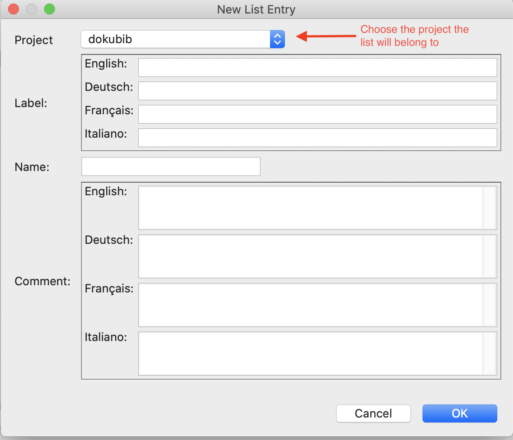
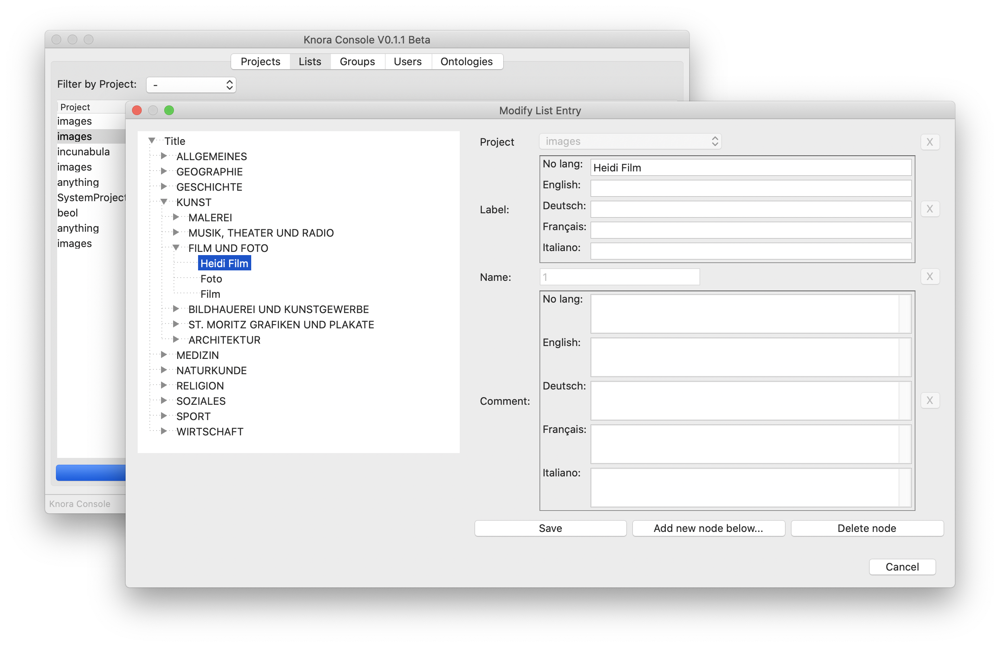
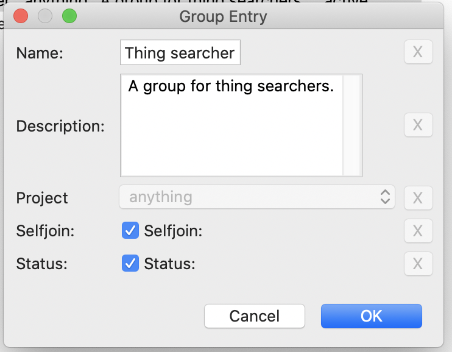

# knora-console

## Introduction
The `knora-console-app` is a small, gui-based app to manipulate projects, users, groups and data models (ontologies).
Many of the fields allow to enter data for different languages (en, de, fr, it). In these cases at least one language
field should be provided with the appropriae data. _The field "No lang" should not be used!_ It is only provided for
backwards compatibility.

The command `knora-console` launches a GUI based app that allows to manipulate a data model on a live server:

## Connection to server

In order to open the connection to a server, select from the menu `Connection -> Open connection...` and enter
the server and credentials:

The app then connects to the server and loads the data.

## Project Tab

The project tab lists all available project. Below the list, there ate three buttons:

- `edit`: allows to edit the metadata of the selected project
- `new`: allows to create a new project
- `delete`: delete an existing project. This button just marks the project as "not active", but does not erase the
  project data from the server!
  
### Project Metadata
The project metadata consists of the following fields:

- _Shortcode_: A short code consisting of 4 hexadecimal number assigned by DaSCH to the project
- _Shortname_: A short name (acronym) of the project (must be unique), e.g. "mls"
- _Longname_: A long(er) title of he project, e.g. "Musikalischs Lexikon der Schweiz"
- _Description_: A description of the project describing the context of the data. Please note that the description
  should be assigned to at least one language, but more than one language is supported! The field "No lang" should
  not be used (is there for backwards compatibility). 
- _Keywords_: Comma separated list of keywords.
- _Selfjoin_: If checked, selfjoin of users is allowd
- _Status_: If checked, the status is "active"

### Edit / New project

Modifying an existing or creating a new project use the same dialog window with the same fields.

If a field is changed the [X]-Button on the right side becomes active. Pressing this button restores the original
value of the field.

Fields that are grayed out cannot be modifyed (blocked by the Knora backend)

## List Tab
Lists represent hierarchical taxonomies and are defined within the context of a specific class. Each entry is
represented by a node that can have children nodes. The root node holds the list name and description
The list tab displays all lists available. The display can be filtered by project to show only the lists defined
by one specific project.  

### New List
In order to create a new list, ou have first to create a new root note. Click in the List-tab the `new` button to open
the dialog window for entering the data of the new list root node:

The dialog has the following fields:

- _Project_: Select the project the list belongs to
- _Label_: The name of the list as given to the human reader
- _Name_: A name that will be used referencing the list programmatically (upload scripts, tools etc.)
- _Comment_: Additional information about the list 

The next step is to add nodes. Close the dialog, select the new list and then click onto the `edit` button

### Edit List

Clicking on the `edit` button opens the dialog to modify and/or add nodes. The dialog consists of two parts:

- On the _left_ side, the hierarchical structure of the list is displayed as tree. Each node can be selected.
- on the _right_ side, the metadata of the selected node is shown

There are two options:

#### Modify Node

Modify or complete the data of the selected list node and then press the `Save` button:

#### Add Node Below

In order to add a child node, select the _parent_ node. Then click on the `Add new node below..` button. A new node
entry dialog will open to be filled out.

## Groups Tab
Groups are used for the permission concept of knora. A group is associated with permissions, and users are
part of one or many groups (or may not be part of any group). A group is always associated with a specific project.

To add or modify a group, the group dialog is used:

The group dialog has the following fields:

- _Name_: Name of the group 
- _Description_: A short description of the purpose of the group
- _Project_: The project the group is associated with _(Cannot be changed after creation)_.
- _Selfjoin_: If checked, a user may join a group on it's own
- _Status_: Check for making the group active

