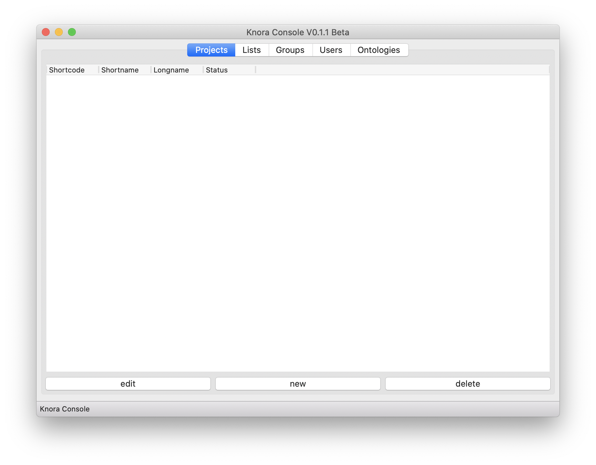
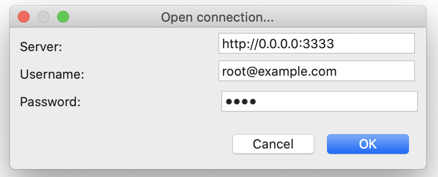
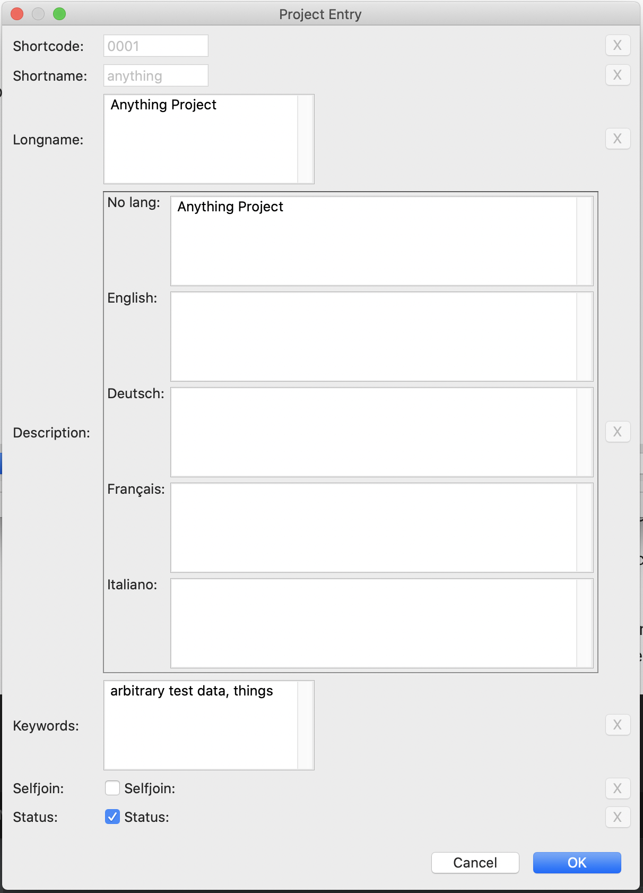

# knora-console

`knora-console` launches a GUI based app that allows to manipulate a data model on a live server:

## Connection to server

In order to open the connection to a server, select from the menu `Connection -> Open connection...` and enter
the server and credentials:

The app then connects to the server and loads the data.

## Project Tab

The project tab lists all available project. Below the list, there ate three buttons:

- `edit`: allows to edit the metadata of the selected project
- `new`: allows to create a new project
- `delete`: delete an existing project. This button just marks the project as "not active", but does not erase the
  project data from the server!
  
### Project Metadata
The project metadata consists of the following fields:

- _Shortcode_: A short code consisting of 4 hexadecimal number assigned by DaSCH to the project
- _Shortname_: A short name (acronym) of the project (must be unique), e.g. "mls"
- _Longname_: A long(er) title of he project, e.g. "Musikalischs Lexikon der Schweiz"
- _Description_: A description of the project describing the context of the data. Please note that the description
  should be assigned to at least one language, but more than one language is supported! The field "No lang" should
  not be used (is there for backwards compatibility). 
- _Keywords_: Comma separated list of keywords.
- _Selfjoin_: If checked, selfjoin of users is allowd
- _Status_: If checked, the status is "active"

### Edit / New project

Modifying an existing or creating a new project use the same dialog window with the same fields.

If a field is changed the [X]-Button on the right side becomes active. Pressing this button restores the original
value of the field.

Fields that are grayed out cannot be modifyed (blocked by the Knora backend)

## List Tab
Lists represent hierarchical taxonomies and are definied within the context of a specific class. Each entry is
represented by a node that can have children nodes. The root node holds the list name and description
The list tab displays all lists available. The display can be filtered by project to show only the lists defined
by one specific project.  

### New list

